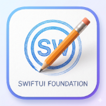
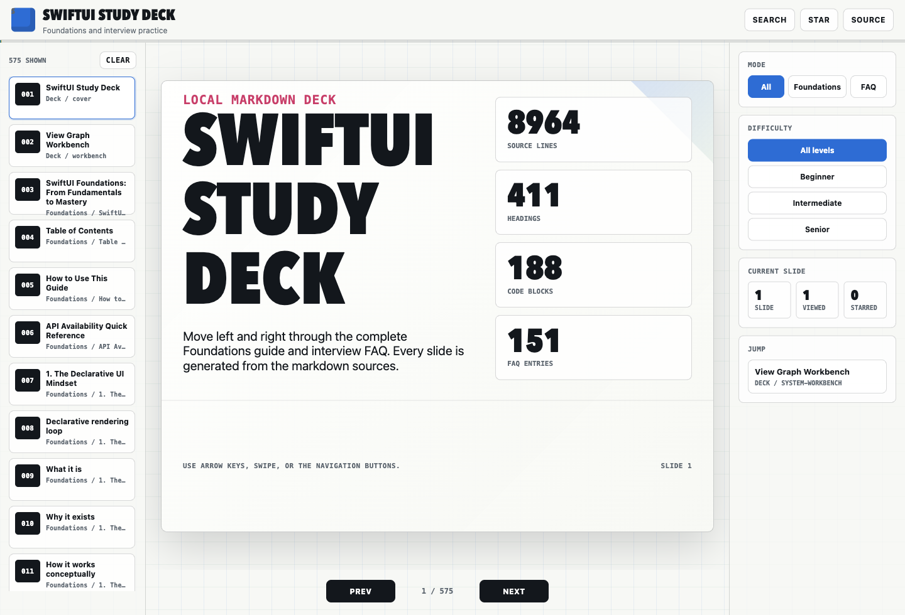

#  🚀 SwiftUI Mastery & Study Deck

[](https://swiftui-mastery.vercel.app/)
[](https://swiftui-mastery.vercel.app/)
[](https://developer.mozilla.org/en-US/docs/Web)

> An interactive, beautifully designed, local-first web slide deck generated dynamically from Markdown sources, focused on the **SwiftUI Foundations guide** and **iOS/SwiftUI interview FAQ**.

✨ **[Experience the live interactive deck here!](https://swiftui-mastery.vercel.app/)** ✨



## 📖 What is this project?

**SwiftUI Mastery** is a comprehensive educational resource designed to help iOS developers master SwiftUI concepts and prepare for technical interviews. Instead of reading long, static markdown files, this project parses raw Markdown documentation and dynamically turns them into a slick, presentation-style **Study Deck**. 

It acts as both a **learning tool** and an **interview prep guide**, offering bite-sized, navigable slides covering everything from SwiftUI architecture (@State, @Binding) to advanced layout strategies and common interview questions.

## 🎯 What does it do?

- ⚡️ **Dynamic Parsing**: Automatically reads and converts the `docs/*.md` files into a 500+ slide presentation in real-time in the browser.
- 🎛️ **Interactive Controls**: Supports keyboard shortcuts, touch swipes, and full-screen modes for an optimal studying experience.
- 🔍 **Global Search & Filters**: Filter slides by topic (Foundations vs FAQ) or difficulty (Beginner, Intermediate, Senior), and instantly search the entire deck.
- 🛠️ **Deep Dive Capability**: Allows you to expand code blocks, tables, and even Mermaid diagrams to study complex concepts without losing context.
- 🚀 **Static & Fast**: Deploys seamlessly as a static site (e.g., on Vercel) while keeping the content easily editable via Markdown.

---

## 🛠️ Quick Start (Local Development)

If you'd prefer to run the project locally on your machine instead of using the live link, follow these steps:

```bash
# Start a local web server (Python)
cd /Users/sendo.tjiamis/Workspaces/SwiftUI-Foundation
python3 -m http.server 4173
```

Then open your browser to:
```text
http://localhost:4173/site/
```

*Note: A local server is required because modern browsers block JavaScript `fetch()` calls for local files (`file://` protocol) due to security restrictions.*

## ⌨️ Interactive Controls

<details open>
<summary><strong>Study Controls</strong></summary>

- `Left` / `Right`: Previous or next slide
- `/`: Open search
- `S`: Star the current slide
- `Esc`: Close search or source modal
- **Source filters:** All slides, Foundations only, or FAQ only
- **Difficulty filters:** Beginner, Intermediate, Senior
- **Full source:** Opens the complete markdown block for the current slide
- **Expand:** Opens wide code blocks, tables, or diagrams in a focused view

</details>

<details>
<summary><strong>Content Coverage</strong></summary>

The deck treats the markdown files in `docs/` as canonical data sources:

- `docs/swiftui-foundations.md`
- `docs/swift-ios-swiftui-interview-faq.md`

The source files are parsed into over 575 slides. Long sections seamlessly become continuation slides instead of being truncated.
</details>

<details>
<summary><strong>Project Structure</strong></summary>

```text
docs/
  swiftui-foundations.md
  swiftui-foundations.pdf
  swift-ios-swiftui-interview-faq.md
  swift-ios-swiftui-interview-faq.pdf

site/
  index.html
  assets/css/deck.css
  assets/js/deck-parser.js
  assets/js/deck-app.js
  assets/images/deck-preview.png
  tools/content-audit.js
  tools/layout-audit.js
  tools/capture-deck-preview.js
```
</details>

## 🧪 Verification & Auditing

For development checks on the parser and UI:

```bash
node --check site/assets/js/deck-parser.js
node --check site/assets/js/deck-app.js
node site/tools/content-audit.js
```

For rendered layout checks, start Chrome with remote debugging, then run the audit:

```bash
'/Applications/Google Chrome.app/Contents/MacOS/Google Chrome' \
  --remote-debugging-port=9222 \
  --user-data-dir=/private/tmp/swiftui-deck-chrome-profile \
  --no-first-run \
  --no-default-browser-check \
  http://localhost:4173/site/

node site/tools/layout-audit.js
```

## 📸 Regenerate Preview

With the local server and debug Chrome running, run the following to capture a new preview screenshot:

```bash
node site/tools/capture-deck-preview.js
```

This automatically updates `site/assets/images/deck-preview.png`.

---
*Generated with AI coding assistant*
