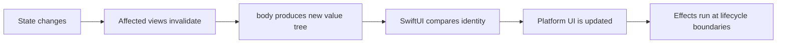
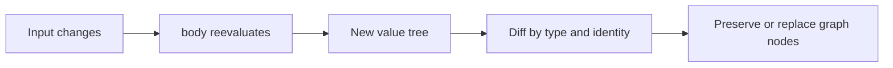
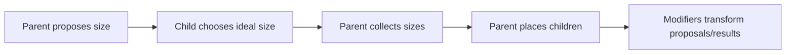
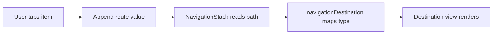
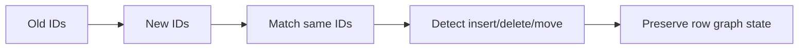
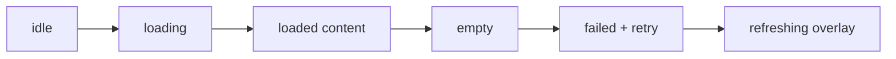
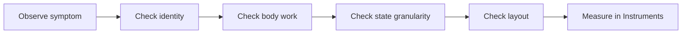
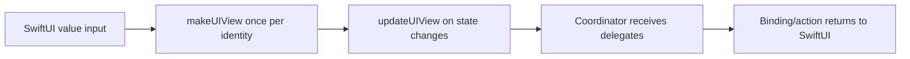
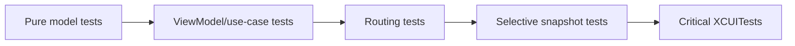

# SwiftUI Core Concepts

## SwiftUI Core

### [Beginner] What is a SwiftUI `View`?
**Interview answer:**  
A SwiftUI `View` is a value that describes part of the UI. Its `body` returns another view describing the current UI for the current state.

**Deep explanation:**  
SwiftUI views are not the rendered pixels or platform view objects. They are lightweight descriptions that SwiftUI evaluates, diffs, and uses to update an internal render tree.

**Why it matters:**  
Many SwiftUI misunderstandings come from treating views like UIKit views. In SwiftUI, you do not hold and mutate view objects directly; you change state and let the framework update the UI.

**How it works:**  
The `View` protocol has an associated `Body` type. The `body` property builds a view description. SwiftUI tracks dependencies and identity to decide what to update.

**Use cases:**  
Building screens declaratively, composing UI pieces, previews, reusable components, and platform-agnostic UI.

**Common mistakes:**  
Putting imperative side effects in `body`. Assuming a view struct has stable lifetime. Storing business logic directly in a view.

**Best practices:**  
Keep views cheap and declarative. Move business logic to view models or use cases. Treat `body` as a function of state.

**Red flag answers:**  
"A SwiftUI View is like a UIView." It is more like a description used to produce/update rendered UI.

**Code example:**  
```swift
struct ProfileHeader: View {
    let name: String

    var body: some View {
        Text(name)
            .font(.title)
            .bold()
    }
}
```

**Possible follow-up questions:**  
Why is `body` `some View`? Is `body` stored? How often can `body` run?

### [Beginner] Why are SwiftUI views structs?
**Interview answer:**  
SwiftUI views are structs because they are lightweight value descriptions of UI. Recreating them is cheap, and value semantics make UI a predictable function of state.

**Deep explanation:**  
SwiftUI separates view descriptions from persistent rendering/storage. The struct can be recreated often while framework-managed storage holds state and platform resources.

**Why it matters:**  
It explains why you should not rely on view init/body lifetime for side effects and why state wrappers exist.

**How it works:**  
The view struct is evaluated to produce a tree. SwiftUI stores persistent state outside the transient struct, keyed by view identity.

**Use cases:**  
Frequent UI recomputation, previews, state-driven rendering, and lightweight composition.

**Common mistakes:**  
Adding stored mutable properties to a view and expecting them to persist. Running network calls from `init` or `body`.

**Best practices:**  
Use property wrappers for state. Use `.task`, `onAppear`, or view models for side effects. Keep view initialization cheap.

**Red flag answers:**  
"Views are structs for performance only." Performance is part of it, but the deeper reason is declarative value semantics.

**Code example:**  
```swift
struct CounterView: View {
    @State private var count = 0

    var body: some View {
        Button("Count: \(count)") {
            count += 1
        }
    }
}
```

**Possible follow-up questions:**  
Where is `@State` stored if the view is a struct? Can a view have a class dependency?

### [Intermediate] Is `body` the actual rendered UI?
**Interview answer:**  
No. `body` is a computed description of UI for current state. SwiftUI uses that description to update its internal view graph and platform rendering.

**Deep explanation:**  
`body` may be recomputed many times. It should be deterministic and cheap. The rendered UI is managed by SwiftUI, not by your view struct directly.

**Why it matters:**  
It prevents bad patterns like starting network calls in `body`, relying on body call counts, or doing expensive work there.

**How it works:**  
State changes invalidate dependent views. SwiftUI asks for new descriptions and reconciles them with previous identity/type structure.

**Use cases:**  
Conditional UI, state-driven modifiers, dynamic lists, and adaptive layout.

**Common mistakes:**  
Printing in `body` and assuming each print means a full screen redraw. Doing sorting, date formatting, or image processing in `body`.

**Best practices:**  
Precompute expensive data in models or view models. Keep `body` declarative. Use computed properties only when cheap.

**Red flag answers:**  
"Every body call redraws the screen." SwiftUI can recompute descriptions without necessarily repainting everything.

**Code example:**  
```swift
struct UserList: View {
    let users: [User]

    var body: some View {
        List(users) { user in
            Text(user.name)
        }
    }
}
```

**Possible follow-up questions:**  
What causes body recomputation? How does SwiftUI know what changed?

### [Intermediate] What is view identity vs data identity?
**Interview answer:**  
View identity tells SwiftUI whether a view is the same UI node across updates. Data identity identifies model elements, especially in collections. Stable identity lets SwiftUI preserve state, animations, focus, and scroll behavior.

**Deep explanation:**  
SwiftUI identity comes from structural position, type, and explicit IDs. In lists, each row's data ID helps SwiftUI match old rows to new rows. If identity changes unnecessarily, SwiftUI destroys and recreates state.

**Why it matters:**  
Identity mistakes cause rows to flicker, animations to reset, text fields to lose focus, navigation to pop, and tasks to restart.

**How it works:**  
SwiftUI reconciles old and new view trees. It compares identity to decide whether to update an existing node or create a new one.

**Use cases:**  
`ForEach`, `List`, `.id()`, dynamic forms, navigation paths, matched geometry, and row state.

**Common mistakes:**  
Using `UUID()` inline as an ID. Using array indices as IDs for mutable lists. Applying `.id()` to force refresh and accidentally resetting state.

**Best practices:**  
Use stable model IDs. Use `.id()` only when you intentionally want identity reset or scroll targeting.

**Red flag answers:**  
"ID is only for making ForEach compile." ID controls preservation and diffing behavior.

**Code example:**  
```swift
struct Message: Identifiable {
    let id: UUID
    var text: String
}

List(messages) { message in
    Text(message.text)
}
```

**Possible follow-up questions:**  
When can array indices be safe IDs? How can `.id()` fix or break behavior?

### [Senior] How does SwiftUI know what changed?
**Interview answer:**  
SwiftUI tracks state dependencies and reconciles new view descriptions against the previous view graph using type, identity, and invalidation information. It updates affected parts of the UI rather than requiring manual mutation.

**Deep explanation:**  
SwiftUI does not require you to tell a label to change text. You mutate state, and SwiftUI invalidates views that depend on that state. With Observation, SwiftUI can track property-level reads more precisely for observable models.

**Why it matters:**  
Understanding this helps write efficient SwiftUI: stable identity, clear state ownership, and minimal invalidation.

**How it works:**  
Property wrappers and observable models connect state changes to view invalidation. SwiftUI reevaluates view bodies and performs reconciliation/diffing to update the render tree.

**Use cases:**  
State-driven screens, forms, list updates, model observation, animations, and data flow debugging.

**Common mistakes:**  
Assuming SwiftUI deep-compares all views. Using broad observable objects where every change invalidates too much. Creating unstable identity.

**Best practices:**  
Keep state close to where it is used. Split large views along state boundaries. Use Observation on iOS 17+ for finer-grained model tracking.

**Red flag answers:**  
"SwiftUI just rerenders everything." It recomputes descriptions as needed and reconciles updates; the actual rendering pipeline is more selective.

**Code example:**  
```swift
@Observable
final class ProfileModel {
    var name = ""
    var avatarURL: URL?
}

struct NameView: View {
    let model: ProfileModel

    var body: some View {
        Text(model.name) // Tracks this property read.
    }
}
```

**Possible follow-up questions:**  
How does Observation differ from `ObservableObject`? How do you reduce invalidation?

### [Intermediate] Why does SwiftUI use `some View`?
**Interview answer:**  
SwiftUI uses `some View` to hide the exact concrete view type while preserving static type information and performance.

**Deep explanation:**  
The concrete type of a SwiftUI body can be deeply nested, like modified tuples of views. Exposing that type would be unusable. `some View` lets the implementation return one concrete type without naming it.

**Why it matters:**  
It avoids type erasure and keeps SwiftUI efficient. It also explains why branches must produce compatible types unless a result builder handles them.

**How it works:**  
The compiler knows the concrete return type, but callers only know it conforms to `View`. The concrete type must be consistent for that function/property.

**Use cases:**  
Every SwiftUI `body`, reusable view factories, computed view properties.

**Common mistakes:**  
Trying to store `some View` in a property without initialization constraints. Thinking it permits any view type dynamically.

**Best practices:**  
Return `some View` from view-building functions. Use `@ViewBuilder` for conditional branches. Avoid `AnyView` unless necessary.

**Red flag answers:**  
"`some View` is type erasure." It is opaque typing, not existential erasure.

**Code example:**  
```swift
var body: some View {
    VStack {
        Text("Inbox")
        Divider()
        MessageList()
    }
}
```

**Possible follow-up questions:**  
Why does `if` sometimes work in `body`? How does `AnyView` differ?

### [Senior] When should you use `AnyView`, and why can it hurt performance?
**Interview answer:**  
Use `AnyView` only when you need type erasure for storage or API boundaries. It can hurt performance because it hides concrete view structure from SwiftUI, reducing optimization and diffing precision.

**Deep explanation:**  
SwiftUI relies on static type structure to understand view trees. `AnyView` boxes the underlying view behind a uniform type. That can be useful, but overuse removes information SwiftUI could use.

**Why it matters:**  
In large lists or frequently updated views, unnecessary type erasure can increase work and make identity behavior less predictable.

**How it works:**  
`AnyView` stores a boxed view. SwiftUI sees `AnyView` instead of the original concrete type chain.

**Use cases:**  
Heterogeneous view arrays, plugin-rendered UI, APIs that must return runtime-selected views, legacy abstraction boundaries.

**Common mistakes:**  
Wrapping every conditional branch in `AnyView` instead of using `@ViewBuilder`. Using `AnyView` to silence compiler errors from overly complex view code.

**Best practices:**  
Prefer `@ViewBuilder`, enums, generic view parameters, or separate view structs. Erase only at the boundary that needs erasure.

**Red flag answers:**  
"AnyView is always bad." It is a tool with a cost; the issue is unnecessary or hot-path use.

**Code example:**  
```swift
@ViewBuilder
func accessory(for state: LoadState) -> some View {
    switch state {
    case .loading:
        ProgressView()
    case .failed:
        Image(systemName: "exclamationmark.triangle")
    case .loaded:
        Image(systemName: "checkmark")
    }
}
```

**Possible follow-up questions:**  
How would you design a heterogeneous SwiftUI plugin API? What alternatives exist to `AnyView`?

### [Intermediate] How do view modifiers work, and why does modifier order matter?
**Interview answer:**  
A modifier returns a new view that wraps or transforms the previous view. Order matters because each modifier applies to the result of the modifiers before it.

**Deep explanation:**  
SwiftUI modifiers are compositional. `.padding().background()` means the background sees the padded size. `.background().padding()` means padding sits outside the background.

**Why it matters:**  
Modifier order affects layout, hit testing, animation, styling, accessibility, and performance.

**How it works:**  
Each modifier creates a new generic view type in the chain. SwiftUI evaluates the chain to produce layout and rendering behavior.

**Use cases:**  
Reusable styles, layout composition, custom controls, animations, and accessibility.

**Common mistakes:**  
Applying `.frame`, `.padding`, `.background`, and `.clipShape` in the wrong order. Expecting modifiers to mutate the original view object.

**Best practices:**  
Read modifier chains from top to bottom as transformations. Extract repeated chains into custom modifiers or view extensions.

**Red flag answers:**  
"Modifiers are just styling." Many modifiers affect layout, identity, tasks, gestures, and accessibility.

**Code example:**  
```swift
Text("Pay")
    .padding(.horizontal, 16)
    .padding(.vertical, 10)
    .background(Color.blue)
    .foregroundStyle(.white)
    .clipShape(Capsule())
```

**Possible follow-up questions:**  
Why does `.background` sometimes not fill the expected area? How do custom `ViewModifier`s work?

### [Intermediate] What is a custom `ViewModifier`?
**Interview answer:**  
A custom `ViewModifier` packages reusable view transformations into a named type.

**Deep explanation:**  
View modifiers keep styling consistent and reduce repeated chains. They can read environment values and accept parameters.

**Why it matters:**  
Reusable modifiers improve maintainability and design consistency in large SwiftUI apps.

**How it works:**  
A `ViewModifier` implements `body(content:)`, receives the original content, and returns a modified view.

**Use cases:**  
Button styles, card surfaces, error banners, accessibility traits, skeleton loading, and conditional styling.

**Common mistakes:**  
Putting business logic in modifiers. Creating modifiers that hide too much layout behavior.

**Best practices:**  
Name modifiers after their semantic role. Keep them focused and composable.

**Red flag answers:**  
"Use a modifier for every repeated line." Sometimes a custom view or style protocol is more appropriate.

**Code example:**  
```swift
struct PrimaryCardModifier: ViewModifier {
    func body(content: Content) -> some View {
        content
            .padding(16)
            .background(.background)
            .clipShape(RoundedRectangle(cornerRadius: 8))
            .shadow(radius: 2)
    }
}

extension View {
    func primaryCard() -> some View {
        modifier(PrimaryCardModifier())
    }
}
```

**Possible follow-up questions:**  
How is a `ViewModifier` different from a custom `View`? Can modifiers have state?

### [Intermediate] What are environment values and `EnvironmentObject`?
**Interview answer:**  
`@Environment` reads values supplied by the SwiftUI environment, such as color scheme, locale, dismiss action, or custom keys. `@EnvironmentObject` reads an observable object injected into the environment.

**Deep explanation:**  
Environment is a dependency propagation mechanism for values that many descendants need. It avoids passing the same dependency through every initializer. `EnvironmentObject` is older SwiftUI's way to share observable reference models by type.

**Why it matters:**  
Used well, environment reduces boilerplate. Used poorly, it hides dependencies and creates runtime crashes when objects are missing.

**How it works:**  
SwiftUI stores environment values in the view tree. Descendants read the nearest value for a key or object type.

**Use cases:**  
Theme, locale, calendar, dismiss, managed object context, app session, feature flags, and shared navigation model.

**Common mistakes:**  
Using environment for feature-specific dependencies that should be initializer-injected. Forgetting to inject `EnvironmentObject`, causing runtime failure.

**Best practices:**  
Use environment for cross-cutting UI context. Prefer explicit init dependencies for required feature dependencies. Avoid multiple environment objects of the same type unless carefully scoped.

**Red flag answers:**  
"EnvironmentObject is dependency injection for everything." It is global-ish tree injection and should be used carefully.

**Code example:**  
```swift
private struct AnalyticsKey: EnvironmentKey {
    static let defaultValue: AnalyticsTracking = NoopAnalytics()
}

extension EnvironmentValues {
    var analytics: AnalyticsTracking {
        get { self[AnalyticsKey.self] }
        set { self[AnalyticsKey.self] = newValue }
    }
}

struct PayButton: View {
    @Environment(\.analytics) private var analytics

    var body: some View {
        Button("Pay") {
            analytics.track("pay_tapped")
        }
    }
}
```

**Possible follow-up questions:**  
When would you avoid `EnvironmentObject`? How do custom environment keys work?

### [Senior] What are `PreferenceKey` and anchor preferences?
**Interview answer:**  
`PreferenceKey` lets child views send values up the view tree. Anchor preferences send layout anchors, such as bounds, that ancestors can resolve in a coordinate space.

**Deep explanation:**  
SwiftUI data normally flows down. Preferences are an escape hatch for child-to-parent communication, especially layout information that only children know.

**Why it matters:**  
Some layouts need parent decisions based on child size or position: tab indicators, sticky headers, scroll offset, custom overlays, and matched decorations.

**How it works:**  
A child sets a preference. Ancestors observe or transform preferences. A preference key defines a default value and a reduce function to combine multiple child values.

**Use cases:**  
Measuring child size, custom segmented controls, overlay alignment, reading scroll position, and tooltip positioning.

**Common mistakes:**  
Using preferences for ordinary state communication. Creating feedback loops where layout changes update state and trigger endless layout.

**Best practices:**  
Use preferences for layout metadata only. Keep reduced values small and stable.

**Red flag answers:**  
"PreferenceKey is like Binding upward." It is not a general state mutation channel.

**Code example:**  
```swift
struct SizePreferenceKey: PreferenceKey {
    static var defaultValue: CGSize = .zero

    static func reduce(value: inout CGSize, nextValue: () -> CGSize) {
        value = nextValue()
    }
}

extension View {
    func readSize(_ onChange: @escaping (CGSize) -> Void) -> some View {
        background {
            GeometryReader { proxy in
                Color.clear.preference(key: SizePreferenceKey.self, value: proxy.size)
            }
        }
        .onPreferenceChange(SizePreferenceKey.self, perform: onChange)
    }
}
```

**Possible follow-up questions:**  
How do anchor preferences differ from normal preferences? How can preferences cause layout loops?

### [Intermediate] What is `CoordinateSpace`?
**Interview answer:**  
`CoordinateSpace` defines the coordinate system used to interpret a view's frame or gestures: local, global, or named.

**Deep explanation:**  
Geometry is meaningless without knowing which coordinate system it belongs to. SwiftUI lets you ask for frames relative to local view bounds, the global screen/window context, or a named ancestor.

**Why it matters:**  
Custom layouts, scroll effects, drag gestures, overlays, and sticky headers need consistent coordinate interpretation.

**How it works:**  
`GeometryProxy.frame(in:)` converts the view's frame into a coordinate space. Named spaces are attached to ancestors with `.coordinateSpace(name:)`.

**Use cases:**  
Reading scroll offset, positioning popovers, drag-to-reorder, parallax headers, and custom gestures.

**Common mistakes:**  
Using `.global` when a named scroll view coordinate space is more stable. Comparing frames from different spaces.

**Best practices:**  
Use named coordinate spaces for components. Keep coordinate calculations isolated in layout/helper views.

**Red flag answers:**  
"GeometryReader always gives screen coordinates." It gives geometry relative to the coordinate space you ask for.

**Code example:**  
```swift
ScrollView {
    GeometryReader { proxy in
        let minY = proxy.frame(in: .named("feedScroll")).minY
        Color.clear
            .onChange(of: minY) { _, value in
                print(value)
            }
    }
    .frame(height: 0)

    FeedContent()
}
.coordinateSpace(name: "feedScroll")
```

**Possible follow-up questions:**  
When should you avoid `GeometryReader`? How does coordinate space affect gestures?

### [Senior] What are `EquatableView` and `.equatable()`?
**Interview answer:**  
`EquatableView` and `.equatable()` tell SwiftUI it can skip updating a view's body when its equatable input has not changed.

**Deep explanation:**  
They are performance tools for views where equality is cheaper than recomputing the body and where the view output truly depends only on equatable input.

**Why it matters:**  
Used correctly, they reduce work. Used incorrectly, they can hide real changes and make UI stale.

**How it works:**  
SwiftUI compares the new and old equatable values. If equal, it can avoid reevaluating that view subtree.

**Use cases:**  
Expensive row rendering, charts, complex static formatting, and views backed by stable value models.

**Common mistakes:**  
Applying `.equatable()` to views with hidden dependencies, environment changes, animations, or external observed state.

**Best practices:**  
Use after profiling. Ensure equality covers all input that affects rendering.

**Red flag answers:**  
"Add `.equatable()` to make SwiftUI faster." It is not a blanket optimization.

**Code example:**  
```swift
struct ScoreBadge: View, Equatable {
    let score: Int
    let level: String

    var body: some View {
        Text("\(level): \(score)")
            .font(.headline)
    }
}

ScoreBadge(score: score, level: level)
    .equatable()
```

**Possible follow-up questions:**  
What hidden inputs can break `.equatable()`? How would you profile whether it helps?


## SwiftUI Navigation and Presentation

### [Intermediate] NavigationStack vs NavigationView?
**Interview answer:**  
`NavigationStack` is the modern navigation API introduced in iOS 16. It supports value-driven navigation and `NavigationPath`. `NavigationView` is older and should generally be avoided in new iOS 16+ code.

**Deep explanation:**  
`NavigationView` was view-link driven and often awkward for programmatic navigation. `NavigationStack` models navigation as data, which is better for deep linking, restoration, and testability.

**Why it matters:**  
Modern interviews expect value-driven navigation patterns, especially for SwiftUI apps.

**How it works:**  
`NavigationLink(value:)` appends a value to the navigation stack. `navigationDestination(for:)` maps values to destination views.

**Use cases:**  
Hierarchical flows, settings screens, detail navigation, deep links, and state restoration.

**Common mistakes:**  
Mixing old and new APIs. Using hidden `NavigationLink`s for programmatic navigation in new code. Storing whole view models in paths.

**Best practices:**  
Use route enums or stable IDs in paths. Keep navigation state separate from destination view construction.

**Red flag answers:**  
"NavigationStack is just renamed NavigationView." It is a more data-driven API.

**Code example:**  
```swift
enum Route: Hashable {
    case profile(User.ID)
    case settings
}

struct RootView: View {
    @State private var path: [Route] = []

    var body: some View {
        NavigationStack(path: $path) {
            List {
                Button("Settings") {
                    path.append(.settings)
                }
            }
            .navigationDestination(for: Route.self) { route in
                switch route {
                case .profile(let id):
                    ProfileView(userID: id)
                case .settings:
                    SettingsView()
                }
            }
        }
    }
}
```

**Possible follow-up questions:**  
How would you deep link into a NavigationStack? What should go into a NavigationPath?

### [Senior] What is NavigationPath and when would you use it?
**Interview answer:**  
`NavigationPath` is a type-erased stack of hashable navigation values. Use it when a stack can contain multiple route types or needs dynamic path manipulation.

**Deep explanation:**  
For simple apps, `[Route]` is often clearer and more type-safe. `NavigationPath` is useful for heterogeneous stacks, but type erasure makes it easier to lose compile-time clarity.

**Why it matters:**  
Navigation state is app state. A robust path model enables deep linking, restoration, and deterministic navigation tests.

**How it works:**  
The path stores `Hashable` values. SwiftUI matches each value type to a registered destination.

**Use cases:**  
Deep links, restoration, heterogeneous routes, large apps with modular destinations.

**Common mistakes:**  
Using `NavigationPath` when a route enum is simpler. Putting non-stable data into the path.

**Best practices:**  
Prefer route enums until heterogeneity requires `NavigationPath`. Store IDs/routes, not full views.

**Red flag answers:**  
"NavigationPath stores views." It stores navigation data values.

**Code example:**  
```swift
@State private var path = NavigationPath()

func handleDeepLink(_ link: AppLink) {
    path.removeLast(path.count)
    path.append(Route.profile(link.userID))
    path.append(Route.order(link.orderID))
}
```

**Possible follow-up questions:**  
How do you restore a path? How do route enums improve testability?

### [Intermediate] How do sheets, fullScreenCover, popovers, alerts, and confirmation dialogs differ?
**Interview answer:**  
They are presentation APIs for different UX intents. Sheets are modal partial flows, full-screen covers are immersive modal flows, popovers are contextual floating UI, alerts communicate urgent information, and confirmation dialogs present action choices.

**Deep explanation:**  
Presentation should be state-driven. A boolean or optional item controls whether UI is presented. Optional item presentation is often safer because it carries the data needed for the destination.

**Why it matters:**  
Bad presentation state causes duplicate sheets, wrong item content, and inconsistent dismissal.

**How it works:**  
SwiftUI attaches presentation modifiers to a view. When bound state becomes active, SwiftUI presents. When dismissed, SwiftUI updates the binding.

**Use cases:**  
Edit forms, onboarding, destructive confirmations, share menus, contextual actions, and error display.

**Common mistakes:**  
Multiple competing sheet booleans. Presenting alerts from stale async results. Keeping presentation state in the wrong child view.

**Best practices:**  
Use enum or identifiable item state for complex presentations. Keep presentation state near the owner of the flow.

**Red flag answers:**  
"Use alerts for all errors." Many errors are better as inline state, banners, or retry UI.

**Code example:**  
```swift
struct UserListView: View {
    @State private var selectedUser: User?
    @State private var isConfirmingDelete = false

    var body: some View {
        List(users) { user in
            Button(user.name) {
                selectedUser = user
            }
        }
        .sheet(item: $selectedUser) { user in
            UserDetailView(user: user)
        }
        .confirmationDialog("Delete user?", isPresented: $isConfirmingDelete) {
            Button("Delete", role: .destructive) {}
        }
    }
}
```

**Possible follow-up questions:**  
Why is item-based sheet presentation useful? How do you coordinate multiple modals?

### [Intermediate] What are toolbars and menus in SwiftUI?
**Interview answer:**  
`toolbar` adds actions and content to platform-specific toolbar areas, while `Menu` presents a compact list of actions or options.

**Deep explanation:**  
Toolbars adapt to navigation bars, bottom bars, keyboard toolbars, and macOS toolbars. Menus are good for secondary actions that should not dominate the main UI.

**Why it matters:**  
Good action placement affects usability and platform feel.

**How it works:**  
`ToolbarItem` placement tells SwiftUI where the item belongs. `Menu` builds actions lazily from a view builder.

**Use cases:**  
Navigation actions, edit buttons, keyboard Done button, overflow actions, sorting, filtering, and contextual commands.

**Common mistakes:**  
Putting primary actions only inside overflow menus. Using toolbar placements that behave differently across platforms without testing.

**Best practices:**  
Keep the primary action visible. Use menus for secondary or grouped actions. Test compact and regular size classes.

**Red flag answers:**  
"Toolbar is just a top bar." It is a platform-adaptive command surface.

**Code example:**  
```swift
.toolbar {
    ToolbarItem(placement: .primaryAction) {
        Button("Save") {
            save()
        }
    }

    ToolbarItem(placement: .secondaryAction) {
        Menu("Sort") {
            Button("Newest", action: sortNewest)
            Button("Oldest", action: sortOldest)
        }
    }
}
```

**Possible follow-up questions:**  
How do toolbar placements differ? How do you add keyboard toolbar actions?


## SwiftUI Layout

### [Beginner] How do HStack, VStack, and ZStack work?
**Interview answer:**  
`HStack` lays children horizontally, `VStack` vertically, and `ZStack` overlays children along the z-axis. They propose sizes to children, collect child sizes, and position them based on alignment and spacing.

**Deep explanation:**  
SwiftUI layout is a proposal/response system. Parents propose a size. Children choose their size. Parents place children. Stacks are basic layout containers implementing this negotiation.

**Why it matters:**  
Understanding layout negotiation prevents hacks with fixed frames and GeometryReader.

**How it works:**  
Stacks measure children in order, account for spacing, alignment, layout priority, and flexible frames, then choose final size and placement.

**Use cases:**  
Rows, columns, overlays, badges, cards, form groups, and simple screen composition.

**Common mistakes:**  
Using fixed frames to force layout. Assuming `Spacer` has intrinsic size. Misunderstanding alignment vs padding.

**Best practices:**  
Prefer flexible layout. Use alignment and layout priority before hard-coded sizes. Test Dynamic Type.

**Red flag answers:**  
"Stacks are just Auto Layout stack views." They are declarative layout containers with SwiftUI's proposal system.

**Code example:**  
```swift
HStack(alignment: .firstTextBaseline, spacing: 12) {
    Image(systemName: "person.crop.circle")
    VStack(alignment: .leading) {
        Text("Ari")
        Text("iOS Engineer").font(.subheadline)
    }
    Spacer()
}
```

**Possible follow-up questions:**  
What is layout priority? How does Spacer work?

### [Intermediate] List, Grid, LazyVStack, and Lazy grids: how do you choose?
**Interview answer:**  
Use `List` for platform-native rows with built-in editing, swipe actions, sections, accessibility, and cell reuse behavior. Use `ScrollView` plus lazy stacks/grids for custom layouts. Use `Grid` for two-dimensional non-lazy layout; lazy grids for large scrollable grids.

**Deep explanation:**  
`List` is opinionated and platform-adaptive. Lazy containers create child views as needed, but they are not a complete replacement for all `List` features.

**Why it matters:**  
Wrong container choice causes styling fights, performance issues, or missing platform behavior.

**How it works:**  
Lazy stacks/grids defer child creation. `List` has additional platform-backed behavior and row management. `Grid` lays out all cells and is better for finite grids.

**Use cases:**  
Settings: `List`. Pinterest-like grid: `LazyVGrid`. Custom feed: `ScrollView` + `LazyVStack`. Dashboard matrix: `Grid`.

**Common mistakes:**  
Using `VStack` inside `ScrollView` for thousands of rows. Fighting `List` styling for highly custom layouts. Assuming lazy means free.

**Best practices:**  
Choose based on UX and data size. Profile large lists. Keep row views cheap.

**Red flag answers:**  
"List is always faster." It depends on content, platform, modifiers, and behavior needed.

**Code example:**  
```swift
let columns = [
    GridItem(.adaptive(minimum: 140), spacing: 12)
]

ScrollView {
    LazyVGrid(columns: columns, spacing: 12) {
        ForEach(products) { product in
            ProductTile(product: product)
        }
    }
    .padding()
}
```

**Possible follow-up questions:**  
How do lazy containers affect `onAppear`? How would you debug a slow list?

### [Intermediate] What are alignment guides?
**Interview answer:**  
Alignment guides let a child tell its parent where a specific alignment line should be, enabling custom alignment beyond default leading, center, trailing, or baseline behavior.

**Deep explanation:**  
SwiftUI alignment is not only about a parent's setting. Children can customize alignment positions using guide closures.

**Why it matters:**  
Alignment guides solve precise layout problems without hard-coded offsets.

**How it works:**  
The guide closure receives view dimensions and returns the coordinate SwiftUI should use for the selected alignment.

**Use cases:**  
Aligning labels and icons, custom baselines, timeline layouts, badges, and mixed-size content.

**Common mistakes:**  
Using offsets for alignment. Offsets move drawing but often do not affect layout size or parent placement as expected.

**Best practices:**  
Use alignment guides when the relationship is layout-level. Use offset for visual effects, not structural alignment.

**Red flag answers:**  
"Alignment guide is just padding." It participates in parent alignment calculation.

**Code example:**  
```swift
HStack(alignment: .top) {
    Image(systemName: "exclamationmark.circle")
        .alignmentGuide(.top) { dimensions in
            dimensions[VerticalAlignment.center]
        }

    Text("Important message that may wrap onto multiple lines.")
}
```

**Possible follow-up questions:**  
How are custom alignments defined? Offset vs alignment guide?

### [Intermediate] What is GeometryReader and when should you avoid it?
**Interview answer:**  
`GeometryReader` gives access to parent-proposed size and coordinate-space frames. Avoid using it as a default layout tool because it expands to available space and can make layouts harder to reason about.

**Deep explanation:**  
GeometryReader is useful for measurement and coordinate calculations, not for ordinary spacing. Many uses are better solved with stacks, `ViewThatFits`, custom `Layout`, or container-relative APIs.

**Why it matters:**  
Overusing GeometryReader causes unexpected full-size containers, layout loops, and fragile device-specific code.

**How it works:**  
GeometryReader receives a `GeometryProxy`. Its content can query size, safe area, and frames.

**Use cases:**  
Scroll offset, responsive drawing, custom effects, anchor resolution, and container measurements.

**Common mistakes:**  
Using screen width for all responsive layout. Reading geometry and writing state every layout pass. Assuming proxy size is final child size.

**Best practices:**  
Prefer modern layout tools first. If measuring, isolate GeometryReader in a background or overlay when possible.

**Red flag answers:**  
"Use GeometryReader whenever layout is hard." It often makes layout harder.

**Code example:**  
```swift
Text("Progress")
    .background {
        GeometryReader { proxy in
            Color.clear
                .preference(key: SizePreferenceKey.self, value: proxy.size)
        }
    }
```

**Possible follow-up questions:**  
Why does GeometryReader expand? What alternatives exist in iOS 16/17?

### [Intermediate] How do safe area and keyboard avoidance work in SwiftUI?
**Interview answer:**  
SwiftUI automatically respects safe areas for most containers. You can customize with `safeAreaInset`, `ignoresSafeArea`, and scroll/form behavior. Keyboard avoidance is often automatic in scrollable containers, but custom layouts may need focus-aware scrolling or safe-area insets.

**Deep explanation:**  
Safe areas represent system UI and device constraints. Keyboard appearance changes available space. SwiftUI containers adapt differently depending on whether content is scrollable, fixed, or ignoring safe areas.

**Why it matters:**  
Poor safe area handling causes clipped buttons, hidden text fields, and inaccessible bottom actions.

**How it works:**  
SwiftUI proposes layout within safe bounds unless told otherwise. `safeAreaInset` reserves space for custom bars. Keyboard changes layout environment.

**Use cases:**  
Bottom call-to-action bars, chat input bars, full-bleed images, login forms, and custom tab bars.

**Common mistakes:**  
Using `.ignoresSafeArea()` too broadly. Hard-coding bottom padding. Not testing Dynamic Type and keyboard.

**Best practices:**  
Use `safeAreaInset` for persistent bottom controls. Use `ScrollViewReader` or focus management for complex forms.

**Red flag answers:**  
"Just add 34 points of padding." Safe areas vary by device, orientation, and context.

**Code example:**  
```swift
ScrollView {
    FormContent()
}
.safeAreaInset(edge: .bottom) {
    Button("Continue", action: submit)
        .buttonStyle(.borderedProminent)
        .padding()
        .background(.bar)
}
```

**Possible follow-up questions:**  
When should a background ignore safe area but content not? How do you keep a focused text field visible?

### [Senior] What is the Layout protocol?
**Interview answer:**  
The `Layout` protocol lets you build custom SwiftUI layout containers by measuring subviews and placing them yourself. It is available from iOS 16.

**Deep explanation:**  
Before `Layout`, custom layout often required GeometryReader/preferences. `Layout` gives a first-class API for implementing layout negotiation.

**Why it matters:**  
Senior SwiftUI engineers should know when to move from layout hacks to explicit custom layout.

**How it works:**  
A layout implements `sizeThatFits(proposal:subviews:cache:)` and `placeSubviews(in:proposal:subviews:cache:)`.

**Use cases:**  
Flow layouts, custom grids, tag wrapping, radial layouts, adaptive controls, and performance-sensitive custom containers.

**Common mistakes:**  
Not respecting proposed size. Measuring subviews multiple times unnecessarily. Ignoring spacing and layout direction.

**Best practices:**  
Keep layout deterministic. Use cache for expensive calculations. Test with Dynamic Type and right-to-left languages.

**Red flag answers:**  
"Use GeometryReader for all custom layouts." `Layout` is usually cleaner for reusable custom containers.

**Code example:**  
```swift
struct EqualWidthHStack: Layout {
    func sizeThatFits(
        proposal: ProposedViewSize,
        subviews: Subviews,
        cache: inout ()
    ) -> CGSize {
        let sizes = subviews.map { $0.sizeThatFits(.unspecified) }
        let maxWidth = sizes.map(\.width).max() ?? 0
        let maxHeight = sizes.map(\.height).max() ?? 0
        return CGSize(width: maxWidth * CGFloat(subviews.count), height: maxHeight)
    }

    func placeSubviews(
        in bounds: CGRect,
        proposal: ProposedViewSize,
        subviews: Subviews,
        cache: inout ()
    ) {
        let width = bounds.width / CGFloat(max(subviews.count, 1))
        for (index, subview) in subviews.enumerated() {
            subview.place(
                at: CGPoint(x: bounds.minX + CGFloat(index) * width, y: bounds.minY),
                proposal: ProposedViewSize(width: width, height: bounds.height)
            )
        }
    }
}
```

**Possible follow-up questions:**  
How does `Layout` compare with alignment guides? What should go in layout cache?

### [Intermediate] What are `ViewThatFits` and `containerRelativeFrame`?
**Interview answer:**  
`ViewThatFits` chooses the first child that fits the proposed space. `containerRelativeFrame` sizes a view relative to a container, useful in scroll views and adaptive layouts.

**Deep explanation:**  
These APIs reduce manual geometry calculations. `ViewThatFits` supports graceful fallback UI. `containerRelativeFrame` lets child views size themselves based on container dimensions.

**Why it matters:**  
They help build responsive SwiftUI without hard-coded device checks.

**How it works:**  
`ViewThatFits` evaluates children in order against the proposal. `containerRelativeFrame` derives dimensions from the nearest relevant container.

**Use cases:**  
Compact vs expanded labels, responsive cards, carousel items, adaptive buttons, and dynamic type fallback.

**Common mistakes:**  
Putting expensive alternatives in `ViewThatFits`. Using these APIs when simple layout priority is enough.

**Best practices:**  
Order `ViewThatFits` from preferred to fallback. Keep alternatives semantically equivalent.

**Red flag answers:**  
"Responsive design means checking screen width." Prefer layout-driven adaptation.

**Code example:**  
```swift
ViewThatFits {
    Label("Download Invoice", systemImage: "arrow.down.doc")
    Image(systemName: "arrow.down.doc")
}
```

**Possible follow-up questions:**  
How does Dynamic Type affect `ViewThatFits`? When would you use layout priority instead?

### [Intermediate] What is `ScrollViewReader`?
**Interview answer:**  
`ScrollViewReader` gives a proxy that can programmatically scroll to child views with stable IDs.

**Deep explanation:**  
SwiftUI scrolling is usually user-driven. When app logic needs to reveal a selected row, focused field, or new message, `ScrollViewReader` bridges state to scroll position.

**Why it matters:**  
Programmatic scrolling is common in chat, forms, deep links, validation errors, and onboarding.

**How it works:**  
Child views must have `.id(...)`. The proxy calls `scrollTo(id, anchor:)`.

**Use cases:**  
Chat autoscroll, jump to validation error, index navigation, focused field reveal.

**Common mistakes:**  
Using unstable IDs. Calling `scrollTo` before the target exists. Overusing it to fight layout issues.

**Best practices:**  
Use stable IDs and trigger scrolling after data/state updates. Consider animation carefully.

**Red flag answers:**  
"ScrollViewReader can scroll to any view." It scrolls to views with known IDs in its scroll content.

**Code example:**  
```swift
ScrollViewReader { proxy in
    ScrollView {
        ForEach(messages) { message in
            MessageRow(message: message)
                .id(message.id)
        }
    }
    .onChange(of: messages.last?.id) { _, id in
        guard let id else { return }
        withAnimation {
            proxy.scrollTo(id, anchor: .bottom)
        }
    }
}
```

**Possible follow-up questions:**  
How do you avoid fighting the user's scroll position in chat? What happens if IDs change?

### [Senior] What Dynamic Type layout issues do you watch for?
**Interview answer:**  
I watch for clipped text, fixed-height containers, horizontal-only layouts that cannot wrap, icon/text overlap, inaccessible hit targets, and custom controls that ignore font scaling.

**Deep explanation:**  
Dynamic Type changes intrinsic sizes. Layouts must adapt by wrapping, stacking, scrolling, or showing alternative UI.

**Why it matters:**  
Accessibility is part of production quality and often legally/business critical.

**How it works:**  
Text sizes come from environment dynamic type size. SwiftUI relayouts views based on changed intrinsic sizes.

**Use cases:**  
Forms, settings, buttons, tabular content, cards, and dense dashboards.

**Common mistakes:**  
Fixed heights. `lineLimit(1)` on important content. Small tap targets. Text inside decorative containers with no room to grow.

**Best practices:**  
Test large accessibility sizes. Use flexible stacks, `ViewThatFits`, scroll containers, and minimum hit targets.

**Red flag answers:**  
"We can just reduce the font size to fit." Users chose larger text for a reason.

**Code example:**  
```swift
ViewThatFits(in: .horizontal) {
    HStack {
        Text(title)
        Spacer()
        Text(value)
    }

    VStack(alignment: .leading) {
        Text(title)
        Text(value).bold()
    }
}
```

**Possible follow-up questions:**  
How do you test Dynamic Type? How would you handle complex tables?


## SwiftUI Lists and Collections

### [Beginner] What is `ForEach` and why do stable IDs matter?
**Interview answer:**  
`ForEach` creates views for a collection. Stable IDs let SwiftUI match data elements across updates so it can preserve row state, animate changes, and diff correctly.

**Deep explanation:**  
SwiftUI needs to know whether an item is the same logical item after insertion, deletion, sorting, or update. Stable identity should come from the domain model, not transient position.

**Why it matters:**  
Bad IDs cause wrong row updates, broken animations, lost focus, and corrupted local row state.

**How it works:**  
`ForEach` uses `Identifiable` or an explicit `id` key path. SwiftUI reconciles child views by ID.

**Use cases:**  
Lists, grids, menus, forms, and dynamic sections.

**Common mistakes:**  
Using `\.self` for mutable values. Using indices as IDs when the array can reorder. Creating `UUID()` in `body`.

**Best practices:**  
Use stable model identifiers. If data has no ID, create one when data is loaded, not during rendering.

**Red flag answers:**  
"Use `id: \.self` whenever possible." It is safe only for stable, unique, value-identity items.

**Code example:**  
```swift
ForEach(viewModel.messages) { message in
    MessageRow(message: message)
}
```

**Possible follow-up questions:**  
When is `\.self` acceptable? Why are index IDs risky?

### [Intermediate] What is SwiftUI diffing in lists?
**Interview answer:**  
Diffing is how SwiftUI determines inserts, deletes, moves, and updates between old and new collection states using identity and structure.

**Deep explanation:**  
SwiftUI does not mutate row views manually. It receives a new list description and reconciles it against the old one. Stable IDs make this reconciliation meaningful.

**Why it matters:**  
Correct diffing enables smooth animations and state preservation. Bad diffing creates visual bugs.

**How it works:**  
Framework internals compare old/new identity and view structure. The exact algorithm is private, but stable IDs and consistent view types are key inputs.

**Use cases:**  
Animated insertions, deletion, drag reorder, filtering, sorting, and live updates.

**Common mistakes:**  
Changing IDs when content changes. Using `.id()` to force reloads. Wrapping rows in `AnyView` unnecessarily.

**Best practices:**  
Keep identity separate from display content. Use Equatable models where helpful. Avoid row side effects based on body calls.

**Red flag answers:**  
"Diffing compares every property deeply." Identity and view structure are central; do not rely on deep comparison.

**Code example:**  
```swift
struct Todo: Identifiable, Equatable {
    let id: UUID
    var title: String
    var isDone: Bool
}
```

**Possible follow-up questions:**  
How does `.id()` affect diffing? How do animations use identity?

### [Intermediate] How do swipe actions, pull to refresh, search, and sections work?
**Interview answer:**  
SwiftUI provides list modifiers for common platform behavior: `swipeActions`, `refreshable`, `searchable`, and `Section`. They work best with `List` and state-driven data.

**Deep explanation:**  
These APIs integrate with platform conventions, accessibility, and system gestures. They are preferable to custom reimplementations unless design requirements are truly custom.

**Why it matters:**  
Interviewers look for platform-native judgment, not just custom UI ability.

**How it works:**  
Modifiers attach behavior to rows or containers. `refreshable` runs async work. `searchable` binds search text. `Section` groups content semantically.

**Use cases:**  
Mail-like lists, settings, inboxes, searchable catalogs, grouped forms, refreshable feeds.

**Common mistakes:**  
Doing destructive work without confirmation. Not handling refresh cancellation/errors. Filtering data destructively instead of deriving filtered state.

**Best practices:**  
Keep search query as state and derive results. Make refresh idempotent. Use roles for destructive actions.

**Red flag answers:**  
"Build custom swipe actions for full control first." Native behavior is usually better unless requirements demand custom interaction.

**Code example:**  
```swift
List {
    Section("Unread") {
        ForEach(unreadMessages) { message in
            MessageRow(message: message)
                .swipeActions {
                    Button("Archive") {
                        archive(message)
                    }
                    .tint(.blue)
                }
        }
    }
}
.searchable(text: $query)
.refreshable {
    await viewModel.reload()
}
```

**Possible follow-up questions:**  
How do you avoid duplicate refresh calls? How do you test searchable filtering?


## SwiftUI Animation and Gestures

### [Intermediate] Implicit vs explicit animation?
**Interview answer:**  
Implicit animation attaches animation to state changes through `.animation(_:value:)`. Explicit animation wraps the state mutation in `withAnimation`.

**Deep explanation:**  
SwiftUI animations are state transitions. You do not animate properties directly; you change state and SwiftUI interpolates animatable values between old and new UI descriptions.

**Why it matters:**  
Understanding this prevents misplaced animation modifiers and unexpected global animations.

**How it works:**  
SwiftUI uses transactions to carry animation context during state updates. Animatable values interpolate over time.

**Use cases:**  
Expanding rows, toggles, matched transitions, onboarding, loading states, and gesture-driven movement.

**Common mistakes:**  
Using deprecated broad `.animation(_:)`. Animating too much by attaching animation high in the tree. Expecting non-animatable changes to animate.

**Best practices:**  
Use `.animation(_:value:)` scoped to specific values. Use `withAnimation` around intentional mutations.

**Red flag answers:**  
"Animation changes the view directly." State changes; SwiftUI animates the transition.

**Code example:**  
```swift
@State private var isExpanded = false

VStack {
    Button("Toggle") {
        withAnimation(.spring()) {
            isExpanded.toggle()
        }
    }

    if isExpanded {
        DetailsView()
            .transition(.opacity.combined(with: .move(edge: .top)))
    }
}
```

**Possible follow-up questions:**  
What is a transaction? Why does an animation affect unexpected children?

### [Senior] What are Transactions and transitions?
**Interview answer:**  
A transaction carries animation and update context through a SwiftUI state change. A transition defines how a view is inserted or removed from the hierarchy.

**Deep explanation:**  
Animations describe interpolation. Transitions describe enter/exit behavior when identity changes and a view appears or disappears.

**Why it matters:**  
Senior SwiftUI work often involves debugging why a transition does not run or why an animation leaks into unrelated updates.

**How it works:**  
`withAnimation` creates a transaction with animation. `.transaction` can customize or disable animation in a subtree. A transition applies when SwiftUI detects insertion/removal of a view identity.

**Use cases:**  
Toasts, expandable sections, overlays, route changes, conditional controls, and disabling animations for specific updates.

**Common mistakes:**  
Adding `.transition` without animating the state change. Expecting transition to run when a view is merely updated, not inserted/removed.

**Best practices:**  
Pair transitions with stable identity and animated state mutations. Scope transaction changes narrowly.

**Red flag answers:**  
"Transition is just animation." Transition is specifically insertion/removal behavior.

**Code example:**  
```swift
content
    .transaction { transaction in
        if reduceMotionEnabled {
            transaction.animation = nil
        }
    }
```

**Possible follow-up questions:**  
Why does a transition not fire? How do you disable animation in one subtree?

### [Senior] What is `matchedGeometryEffect`?
**Interview answer:**  
`matchedGeometryEffect` animates geometry changes between two views that represent the same logical element in the same namespace.

**Deep explanation:**  
It creates a visual continuity effect between different view positions, sizes, or containers. The views are not literally the same instance; SwiftUI matches their geometry by namespace and ID.

**Why it matters:**  
It enables polished transitions like grid-to-detail hero animations.

**How it works:**  
SwiftUI records geometry for matched IDs and interpolates between source and destination frames during an animated state change.

**Use cases:**  
Hero image transitions, tab indicators, card expansion, selected item highlights.

**Common mistakes:**  
Using unstable IDs. Having multiple active sources. Expecting it to work across unrelated view hierarchies without shared namespace/state.

**Best practices:**  
Keep matched elements simple. Ensure one clear source/destination pair. Test interruptible transitions.

**Red flag answers:**  
"It moves the actual view object." It animates geometry between matched descriptions.

**Code example:**  
```swift
@Namespace private var namespace
@State private var selected: Photo?

// In grid and detail:
Image(uiImage: photo.image)
    .matchedGeometryEffect(id: photo.id, in: namespace)
```

**Possible follow-up questions:**  
How do you handle multiple matched elements? Why can layout changes break the effect?

### [Intermediate] How do SwiftUI gestures compose?
**Interview answer:**  
Gestures are values attached to views. You can compose them with `simultaneousGesture`, `highPriorityGesture`, `sequenced`, and `exclusively` to control recognition behavior.

**Deep explanation:**  
Gesture composition determines whether gestures compete, run together, or wait for each other. This matters in scroll views, draggable cards, long press menus, and custom controls.

**Why it matters:**  
Gesture conflicts are common in production SwiftUI.

**How it works:**  
Gesture values produce callbacks like `onChanged`, `updating`, and `onEnded`. SwiftUI coordinates recognition based on composition.

**Use cases:**  
Drag-to-dismiss, long-press selection, pinch-to-zoom, custom sliders, and reorder interactions.

**Common mistakes:**  
Breaking scroll gestures with a high-priority drag. Updating permanent state during every drag instead of using gesture state.

**Best practices:**  
Use `@GestureState` for transient gesture values. Keep gesture interactions accessible and provide non-gesture alternatives for important actions.

**Red flag answers:**  
"Attach a DragGesture and it will just work." Gesture priority and container interactions matter.

**Code example:**  
```swift
@GestureState private var dragOffset: CGSize = .zero
@State private var position: CGSize = .zero

let drag = DragGesture()
    .updating($dragOffset) { value, state, _ in
        state = value.translation
    }
    .onEnded { value in
        position.width += value.translation.width
        position.height += value.translation.height
    }

Circle()
    .offset(x: position.width + dragOffset.width, y: position.height + dragOffset.height)
    .gesture(drag)
```

**Possible follow-up questions:**  
When use `@GestureState`? How do you combine long press and drag?


## SwiftUI Lifecycle and Tasks

### [Intermediate] What are `.onAppear` and `.onDisappear`?
**Interview answer:**  
They run closures when SwiftUI considers a view appeared or disappeared. They are not equivalent to UIKit view controller lifecycle and can run multiple times.

**Deep explanation:**  
SwiftUI views are value descriptions and can appear/disappear due to scrolling, conditional rendering, navigation, or identity changes. Lifecycle callbacks are useful but should not be treated as one-time constructors/destructors.

**Why it matters:**  
Incorrect assumptions cause duplicate network calls, repeated analytics, and missing cleanup.

**How it works:**  
SwiftUI invokes callbacks based on view graph insertion/removal and platform visibility decisions.

**Use cases:**  
Light analytics, starting/stopping simple work, row visibility, playback pause/resume.

**Common mistakes:**  
Starting non-idempotent network calls in `onAppear` without guarding. Assuming `onDisappear` always means deallocation.

**Best practices:**  
Prefer `.task` for async loading. Make appearance work idempotent. Keep lifecycle side effects small.

**Red flag answers:**  
"onAppear is like viewDidLoad." It can fire multiple times.

**Code example:**  
```swift
.onAppear {
    analytics.track("profile_appeared")
}
```

**Possible follow-up questions:**  
Why can `onAppear` fire in a lazy list? How do you avoid duplicate loads?

### [Intermediate] What is `.task` and `.task(id:)`?
**Interview answer:**  
`.task` starts async work tied to a view's lifecycle. `.task(id:)` restarts the task when the ID changes and cancels the previous task.

**Deep explanation:**  
This is the preferred SwiftUI mechanism for view-scoped async work. It gives cancellation for free when the view disappears or the ID changes.

**Why it matters:**  
It avoids manual task storage for many screen-loading and search scenarios.

**How it works:**  
SwiftUI creates a task when the view appears. It cancels the task when the view disappears or when the ID changes for `.task(id:)`.

**Use cases:**  
Initial data load, search query changes, refresh on selected account change, async setup.

**Common mistakes:**  
Ignoring cancellation. Doing non-view-scoped work in `.task`. Triggering duplicate tasks through unstable identity.

**Best practices:**  
Use `.task(id:)` for state-dependent async work. Handle `CancellationError` as neutral.

**Red flag answers:**  
"`.task` runs once." It runs according to view lifecycle and identity.

**Code example:**  
```swift
struct SearchResultsView: View {
    let query: String
    @State private var results: [Item] = []

    var body: some View {
        List(results) { Text($0.title) }
            .task(id: query) {
                results = (try? await SearchService().search(query)) ?? []
            }
    }
}
```

**Possible follow-up questions:**  
How does `.task(id:)` cancel stale work? What makes an ID unstable?

### [Senior] How do you avoid duplicate network calls in SwiftUI?
**Interview answer:**  
Make loading idempotent, tie work to stable view identity, use `.task(id:)` carefully, cache or deduplicate in the data layer, and avoid starting work in `body` or unstable row lifecycle callbacks.

**Deep explanation:**  
SwiftUI may recreate views and call lifecycle hooks multiple times. Network deduplication should not depend only on view lifecycle because scrolling, navigation, and state changes can retrigger views.

**Why it matters:**  
Duplicate calls waste bandwidth, drain battery, create inconsistent state, and can double-submit user actions.

**How it works:**  
State changes cause recomputation. Lifecycle-triggered work may restart. Data services can track in-flight requests and return existing results.

**Use cases:**  
Feed loading, image loading, detail screens, search, checkout submit, and pagination.

**Common mistakes:**  
Calling `Task { await load() }` in `body`. Using `onAppear` for row fetches without caching. Not cancelling stale searches.

**Best practices:**  
Use view models/services to own loading state. Protect submit actions with `isSubmitting`. Cache in-flight image requests.

**Red flag answers:**  
"Use a boolean in every view." Local booleans help but do not solve shared data or in-flight deduplication.

**Code example:**  
```swift
@MainActor
@Observable
final class DetailModel {
    enum LoadState {
        case idle
        case loading
        case loaded(Item)
        case failed(Error)
    }

    private(set) var state: LoadState = .idle

    func load(id: Item.ID) async {
        guard case .idle = state else { return }
        state = .loading
        do {
            state = .loaded(try await ItemService().item(id: id))
        } catch {
            state = .failed(error)
        }
    }
}
```

**Possible follow-up questions:**  
Where should request deduplication live? How do you handle pull-to-refresh differently from initial load?


## SwiftUI Performance and Debugging

### [Intermediate] Why can `body` be recomputed often, and how do you handle it?
**Interview answer:**  
`body` can be recomputed whenever dependent state changes or SwiftUI needs a fresh description. Keep body cheap, deterministic, and free of side effects.

**Deep explanation:**  
Body recomputation is normal, not automatically a performance bug. The issue is expensive work inside body or broad state invalidation.

**Why it matters:**  
Heavy body work causes scrolling stutter and battery drain.

**How it works:**  
State invalidation triggers body reevaluation. SwiftUI then reconciles the resulting view tree.

**Use cases:**  
Lists, dynamic forms, animations, observable models, and frequently changing state.

**Common mistakes:**  
Sorting, filtering, date formatting, image decoding, or network calls inside body. Logging body calls and assuming full redraw.

**Best practices:**  
Precompute expensive values. Split views. Use stable identity. Profile before adding optimizations.

**Red flag answers:**  
"Prevent body from running." You generally design body to be safe to run often.

**Code example:**  
```swift
struct FeedView: View {
    let sections: [FeedSection] // Already prepared by model/view model.

    var body: some View {
        List(sections) { section in
            Section(section.title) {
                ForEach(section.items) { item in
                    FeedRow(item: item)
                }
            }
        }
    }
}
```

**Possible follow-up questions:**  
How do you identify expensive body work? How does Observation help?

### [Senior] How do you diagnose slow SwiftUI lists?
**Interview answer:**  
Check row identity, row body cost, image loading/decoding, excessive state invalidation, `onAppear` work, type erasure, layout complexity, and main-thread blocking. Use Instruments and targeted simplification.

**Deep explanation:**  
Slow lists are usually a combination of unstable IDs, expensive row construction, asynchronous image churn, and too much state changing at the list level.

**Why it matters:**  
Lists are among the most common high-performance surfaces in iOS apps.

**How it works:**  
Scrolling needs rapid layout and rendering. Any main-thread work, repeated decoding, or large invalidation can miss frames.

**Use cases:**  
Feeds, chats, search results, settings, marketplaces, and media galleries.

**Common mistakes:**  
Starting network calls directly in every row. Recomputing formatters in row body. Using index IDs. Applying heavy shadows/masks to many rows.

**Best practices:**  
Cache images. Preformat data. Keep rows small. Use stable IDs. Profile Time Profiler, SwiftUI instruments, Allocations, and Main Thread Checker.

**Red flag answers:**  
"Replace everything with UIKit." Sometimes needed, but first identify the actual bottleneck.

**Code example:**  
```swift
struct MessageRowModel: Identifiable, Equatable {
    let id: UUID
    let title: String
    let subtitle: String
    let formattedDate: String
}
```

**Possible follow-up questions:**  
How does image loading affect scrolling? What Instruments template would you use?

### [Intermediate] How do you debug SwiftUI layout and rendering issues?
**Interview answer:**  
Isolate the view, add temporary borders/backgrounds, inspect sizes with GeometryReader carefully, test Dynamic Type and device sizes, and simplify modifiers until the issue is clear.

**Deep explanation:**  
SwiftUI layout bugs often come from modifier order, fixed frames, GeometryReader expansion, safe-area handling, or conflicting priorities.

**Why it matters:**  
Debugging layout by guesswork leads to fragile device-specific fixes.

**How it works:**  
SwiftUI layout is a size proposal and response system. Visual debugging helps reveal which parent or modifier is changing size.

**Use cases:**  
Clipping, unexpected spacing, invisible views, overlays, scroll problems, and adaptive layout.

**Common mistakes:**  
Adding random frames/padding. Using `.fixedSize()` without understanding consequences. Ignoring accessibility text sizes.

**Best practices:**  
Work from parent to child. Verify modifier order. Use previews with multiple sizes and dynamic type.

**Red flag answers:**  
"SwiftUI layout is unpredictable." It is deterministic, but the rules differ from Auto Layout.

**Code example:**  
```swift
extension View {
    func debugBorder(_ color: Color = .red) -> some View {
        overlay(Rectangle().stroke(color, lineWidth: 1))
    }
}
```

**Possible follow-up questions:**  
How does `.fixedSize()` work? Why does modifier order affect size?

### [Senior] How can `.id()` fix or break behavior?
**Interview answer:**  
`.id()` changes a view's explicit identity. It can force SwiftUI to treat a view as new, which can reset state or trigger transitions. It can fix stale identity problems but break state preservation if misused.

**Deep explanation:**  
Identity controls lifecycle. Changing ID destroys old state and creates new state. That is useful for resetting forms or reloading a view, but harmful if accidental.

**Why it matters:**  
Misused `.id()` causes disappearing focus, scroll resets, task restarts, animation glitches, and lost local state.

**How it works:**  
SwiftUI includes explicit ID in reconciliation. A different ID means different view identity.

**Use cases:**  
Resetting a form after switching accounts, scroll targets, forcing a new web view, restarting an animation intentionally.

**Common mistakes:**  
Using `.id(UUID())` in body. Applying `.id()` high in the tree to "refresh" everything. Changing IDs based on display text.

**Best practices:**  
Use stable IDs for identity and deliberate changed IDs for resets. Keep `.id()` scope narrow.

**Red flag answers:**  
"`.id()` just labels a view." It affects lifecycle and state.

**Code example:**  
```swift
ProfileEditor(userID: selectedUserID)
    .id(selectedUserID) // Intentionally reset editor state when user changes.
```

**Possible follow-up questions:**  
How does `.id()` affect `.task`? How does it interact with transitions?


## UIKit and SwiftUI Interoperability

### [Intermediate] What are `UIViewRepresentable` and `UIViewControllerRepresentable`?
**Interview answer:**  
They wrap UIKit views or view controllers so they can be used in SwiftUI.

**Deep explanation:**  
SwiftUI does not replace every UIKit control. Representables bridge APIs such as maps, web views, text views, camera controllers, or custom legacy components.

**Why it matters:**  
Most real apps are hybrid. Senior engineers need clean interop patterns.

**How it works:**  
You implement creation and update methods. SwiftUI creates the UIKit object and calls update when SwiftUI state changes. A Coordinator can bridge delegates and callbacks.

**Use cases:**  
`WKWebView`, `MKMapView`, `UITextView`, camera/image picker, custom UIKit controls, legacy modules.

**Common mistakes:**  
Creating the UIKit view repeatedly in update. Not syncing state both ways. Forgetting coordinator lifetime and delegate retention.

**Best practices:**  
Keep `make` for construction, `update` for state synchronization. Use Coordinator for delegate callbacks. Avoid storing source of truth inside UIKit view when SwiftUI owns it.

**Red flag answers:**  
"Just put UIKit code in SwiftUI body." The representable lifecycle exists for a reason.

**Code example:**  
```swift
struct WebView: UIViewRepresentable {
    let url: URL

    func makeUIView(context: Context) -> WKWebView {
        WKWebView()
    }

    func updateUIView(_ webView: WKWebView, context: Context) {
        if webView.url != url {
            webView.load(URLRequest(url: url))
        }
    }
}
```

**Possible follow-up questions:**  
When is `makeUIView` called? How do you avoid reload loops?

### [Senior] What is the Coordinator pattern in SwiftUI representables?
**Interview answer:**  
A Coordinator is an object that bridges UIKit delegate/data source callbacks to SwiftUI state and actions.

**Deep explanation:**  
UIKit often communicates through delegates, target-action, or notifications. SwiftUI representables are structs, so a stable reference object is needed for delegate identity and callback coordination.

**Why it matters:**  
Without a coordinator, data flow between UIKit and SwiftUI becomes fragile or leaks.

**How it works:**  
`makeCoordinator()` creates a coordinator retained by SwiftUI for the representable's lifecycle. The context passes it to `make` and `update`.

**Use cases:**  
Text view delegate, map annotations, scroll view offset, image picker result, web navigation delegate.

**Common mistakes:**  
Coordinator strongly retaining parent objects unnecessarily. Updating SwiftUI state recursively during UIKit updates.

**Best practices:**  
Use coordinator as a bridge, not a dumping ground. Make feedback loops explicit and guard repeated updates.

**Red flag answers:**  
"Coordinator is just optional boilerplate." It is essential for delegate-heavy UIKit components.

**Code example:**  
```swift
struct TextView: UIViewRepresentable {
    @Binding var text: String

    func makeCoordinator() -> Coordinator {
        Coordinator(text: $text)
    }

    func makeUIView(context: Context) -> UITextView {
        let view = UITextView()
        view.delegate = context.coordinator
        return view
    }

    func updateUIView(_ view: UITextView, context: Context) {
        if view.text != text {
            view.text = text
        }
    }

    final class Coordinator: NSObject, UITextViewDelegate {
        var text: Binding<String>

        init(text: Binding<String>) {
            self.text = text
        }

        func textViewDidChange(_ textView: UITextView) {
            text.wrappedValue = textView.text
        }
    }
}
```

**Possible follow-up questions:**  
How do you prevent update loops? Who owns the coordinator?

### [Intermediate] What is `UIHostingController`?
**Interview answer:**  
`UIHostingController` hosts SwiftUI content inside UIKit.

**Deep explanation:**  
It is the bridge for adopting SwiftUI in existing UIKit apps. UIKit owns the hosting controller lifecycle; SwiftUI renders the root view inside it.

**Why it matters:**  
Most production apps migrate incrementally, not all at once.

**How it works:**  
Create `UIHostingController(rootView:)` and present, push, embed, or assign it like any view controller.

**Use cases:**  
New SwiftUI screen in UIKit navigation, SwiftUI cells/headers, settings screens, feature modules.

**Common mistakes:**  
Not managing sizing when embedding as child. Replacing root view to push data instead of using observable state. Ignoring environment injection.

**Best practices:**  
Define clear data flow from UIKit to SwiftUI. Use hosting configuration for cells when appropriate on modern iOS.

**Red flag answers:**  
"You cannot mix UIKit and SwiftUI." You can, but lifecycle boundaries matter.

**Code example:**  
```swift
let screen = ProfileView(userID: userID)
let hostingController = UIHostingController(rootView: screen)
navigationController?.pushViewController(hostingController, animated: true)
```

**Possible follow-up questions:**  
How do you pass UIKit callbacks into SwiftUI? How do you embed a hosting controller as a child?


## SwiftUI Accessibility

### [Intermediate] What accessibility basics should every SwiftUI view handle?
**Interview answer:**  
Provide meaningful labels, values, hints when needed, traits, actions, logical VoiceOver order, Dynamic Type support, Reduce Motion alternatives, and sufficient color contrast.

**Deep explanation:**  
Accessibility is not only labels. It includes navigation order, semantics, motion sensitivity, hit targets, contrast, text scaling, and alternative actions for gestures.

**Why it matters:**  
Accessible apps are higher quality for everyone and required by many organizations.

**How it works:**  
SwiftUI exposes accessibility modifiers that map view semantics to assistive technologies.

**Use cases:**  
Custom controls, icon-only buttons, charts, gestures, dynamic content, and forms.

**Common mistakes:**  
Labeling decorative images. Using color alone to convey status. Adding verbose hints everywhere. Breaking VoiceOver order with visual-only layout.

**Best practices:**  
Test with VoiceOver. Use native controls when possible. Make important icon buttons explicit.

**Red flag answers:**  
"SwiftUI handles accessibility automatically." It helps, but custom UI still needs semantic work.

**Code example:**  
```swift
Button {
    favorite.toggle()
} label: {
    Image(systemName: favorite ? "heart.fill" : "heart")
}
.accessibilityLabel(favorite ? "Remove from favorites" : "Add to favorites")
.accessibilityHint("Updates this item in your favorites list.")
```

**Possible follow-up questions:**  
How do you test VoiceOver order? How do you support Reduce Motion?

### [Senior] How do you make custom gestures accessible?
**Interview answer:**  
Provide an equivalent accessible action, clear labels/values, and avoid making essential functionality only available through complex gestures.

**Deep explanation:**  
A drag, pinch, or long press may be unavailable or difficult for VoiceOver, Switch Control, or motor-impaired users. Accessibility actions expose the same capability semantically.

**Why it matters:**  
Gesture-only UI can block users from core workflows.

**How it works:**  
SwiftUI's `.accessibilityAction` adds named actions that assistive technologies can invoke.

**Use cases:**  
Swipe-to-delete alternatives, reorder controls, rating sliders, custom media scrubbers, map controls.

**Common mistakes:**  
Assuming swipe actions are enough. No visible fallback. Missing accessibility value updates.

**Best practices:**  
Use native controls where possible. For custom controls, expose label, value, adjustable actions, and named actions.

**Red flag answers:**  
"Users can just use the gesture." Not all users can.

**Code example:**  
```swift
RatingView(value: rating)
    .accessibilityLabel("Rating")
    .accessibilityValue("\(rating) out of 5")
    .accessibilityAdjustableAction { direction in
        switch direction {
        case .increment:
            rating = min(rating + 1, 5)
        case .decrement:
            rating = max(rating - 1, 0)
        @unknown default:
            break
        }
    }
```

**Possible follow-up questions:**  
What is an adjustable accessibility action? How do you test Switch Control?


## SwiftUI Testing and Previews

### [Intermediate] How do you test SwiftUI screens?
**Interview answer:**  
Test business logic in view models/use cases, use previews with mock dependencies for visual states, use snapshot tests where appropriate, and use XCUITest for critical user flows.

**Deep explanation:**  
SwiftUI views are declarative and hard to unit test directly without relying on implementation details. The testable surface should be state transformation and user-visible behavior.

**Why it matters:**  
Good test strategy catches regressions without brittle tests that break on harmless layout refactors.

**How it works:**  
View models expose state and actions. Previews render different states. UI tests interact through accessibility identifiers/labels.

**Use cases:**  
Loading/error/success states, forms, navigation, accessibility, purchase flows, onboarding.

**Common mistakes:**  
Testing private view hierarchy. Depending only on previews. Overusing snapshot tests for dynamic content.

**Best practices:**  
Inject dependencies. Keep view models deterministic. Add accessibility identifiers for UI tests when labels are insufficient.

**Red flag answers:**  
"You do not test SwiftUI." You test the logic and critical UI behavior around it.

**Code example:**  
```swift
@MainActor
@Test
func loadDisplaysName() async throws {
    let repository = StubUserRepository(user: User(id: UUID(), name: "Ari"))
    let viewModel = ProfileViewModel(repository: repository)

    await viewModel.load(id: repository.user.id)

    #expect(viewModel.name == "Ari")
}
```

**Possible follow-up questions:**  
When do snapshots add value? How do you make previews realistic?

### [Intermediate] What is preview-driven development?
**Interview answer:**  
Preview-driven development uses SwiftUI previews to build and verify UI states quickly with mock data and dependencies.

**Deep explanation:**  
Previews are not tests, but they speed feedback. A strong preview setup shows loading, empty, error, success, long text, Dynamic Type, dark mode, and localization variants.

**Why it matters:**  
It improves UI quality and catches edge cases before simulator testing.

**How it works:**  
Preview providers or `#Preview` instantiate views with controlled state and dependencies.

**Use cases:**  
Component libraries, state-heavy screens, accessibility checks, design review.

**Common mistakes:**  
Only previewing the happy path. Using live network dependencies. Letting previews bit-rot.

**Best practices:**  
Create mock fixtures. Preview edge cases. Keep preview dependencies local and deterministic.

**Red flag answers:**  
"If preview looks good, the app works." Previews complement tests; they do not replace runtime verification.

**Code example:**  
```swift
#Preview("Error") {
    ProfileView(
        model: .preview(state: .failed("Unable to load profile."))
    )
}
```

**Possible follow-up questions:**  
How do you inject mock dependencies into previews? What preview states do you always add?


## UIKit and iOS Fundamentals

### [Beginner] What is the UIViewController lifecycle?
**Interview answer:**  
Key lifecycle methods include `viewDidLoad`, `viewWillAppear`, `viewDidAppear`, `viewWillDisappear`, and `viewDidDisappear`. `viewDidLoad` is for one-time view setup; appearance methods are for work tied to visibility.

**Deep explanation:**  
UIKit view controllers have reference identity and lifecycle callbacks driven by containment, presentation, navigation, and view loading.

**Why it matters:**  
Many iOS apps still use UIKit. SwiftUI interop also requires understanding UIKit lifecycle.

**How it works:**  
The view loads lazily. Appearance callbacks may run multiple times as screens appear/disappear.

**Use cases:**  
Setup UI, start/stop observers, analytics, refresh visible content, manage child controllers.

**Common mistakes:**  
Doing layout before views have final bounds. Starting duplicate network work in `viewWillAppear`. Forgetting to remove observers.

**Best practices:**  
Use `viewDidLoad` for setup, `viewWillAppear` for refresh, `viewDidLayoutSubviews` for frame-dependent adjustments, and explicit cancellation for tasks.

**Red flag answers:**  
"viewDidLoad runs every time the screen appears." It runs when the view is loaded, not every appearance.

**Code example:**  
```swift
final class ProfileViewController: UIViewController {
    override func viewDidLoad() {
        super.viewDidLoad()
        view.backgroundColor = .systemBackground
    }

    override func viewWillAppear(_ animated: Bool) {
        super.viewWillAppear(animated)
        refreshIfNeeded()
    }
}
```

**Possible follow-up questions:**  
When does `viewDidLayoutSubviews` run? How does containment affect lifecycle?

### [Intermediate] What is the app lifecycle?
**Interview answer:**  
The app lifecycle describes transitions such as launch, active, inactive, background, and termination. Modern apps usually manage scenes through `UISceneDelegate` or SwiftUI's `Scene` API.

**Deep explanation:**  
iOS apps can have multiple scenes/windows. App-level lifecycle and scene-level lifecycle are related but not identical.

**Why it matters:**  
Lifecycle affects saving state, background tasks, deep links, notifications, and resource management.

**How it works:**  
The system sends delegate callbacks or SwiftUI scene phase updates. Apps respond by pausing work, saving state, or refreshing data.

**Use cases:**  
Persist drafts on background, refresh on active, handle URLs, manage background uploads.

**Common mistakes:**  
Assuming one window/scene. Doing heavy work during launch. Not handling background expiration.

**Best practices:**  
Keep launch fast. Use scene phase for SwiftUI. Save critical state proactively.

**Red flag answers:**  
"AppDelegate handles everything." Modern iOS separates app and scene responsibilities.

**Code example:**  
```swift
@Environment(\.scenePhase) private var scenePhase

.onChange(of: scenePhase) { _, phase in
    if phase == .background {
        draftStore.save()
    }
}
```

**Possible follow-up questions:**  
What is the difference between AppDelegate and SceneDelegate? How do background tasks work?

### [Beginner] What are delegates and NotificationCenter?
**Interview answer:**  
Delegates are one-to-one callback relationships, often weak. NotificationCenter broadcasts events to many observers without tight coupling.

**Deep explanation:**  
Delegation is explicit and type-safe when modeled with protocols. NotificationCenter is useful for cross-cutting events but can become hard to trace.

**Why it matters:**  
UIKit uses delegation heavily. Choosing between delegate, closure, notification, Combine, or async stream affects architecture.

**How it works:**  
A delegate property points to an object implementing a protocol. NotificationCenter posts named notifications to observers.

**Use cases:**  
Delegates: table view events, coordinator callbacks, child-to-parent communication. Notifications: app-wide system events, keyboard, logout broadcast.

**Common mistakes:**  
Strong delegates. Using notifications for request/response flows. Forgetting observer cleanup in old APIs.

**Best practices:**  
Use delegates for direct ownership relationships. Use notifications sparingly for broadcast events.

**Red flag answers:**  
"NotificationCenter is simpler than dependency injection." It often hides dependencies.

**Code example:**  
```swift
protocol LoginViewControllerDelegate: AnyObject {
    func loginViewControllerDidFinish(_ controller: LoginViewController)
}

final class LoginViewController: UIViewController {
    weak var delegate: LoginViewControllerDelegate?
}
```

**Possible follow-up questions:**  
Why are delegates weak? When would you use Combine instead?

### [Intermediate] What are Combine basics relevant to iOS interviews?
**Interview answer:**  
Combine is Apple's reactive framework using publishers, subscribers, operators, and cancellables to model asynchronous streams of values.

**Deep explanation:**  
Even with Swift Concurrency, Combine remains in many apps, especially for `ObservableObject`, event streams, and older reactive architectures.

**Why it matters:**  
You may need to maintain Combine code or bridge it to async/await.

**How it works:**  
A publisher emits values/completion. Operators transform streams. A subscriber receives values. `AnyCancellable` controls subscription lifetime.

**Use cases:**  
Search debouncing, form validation, notification streams, `@Published` view model state, legacy reactive pipelines.

**Common mistakes:**  
Not storing cancellables. Creating retain cycles in `sink`. Updating UI off main thread.

**Best practices:**  
Store cancellables intentionally. Use `[weak self]` in sinks where needed. Use `receive(on:)` for UI updates in non-main contexts.

**Red flag answers:**  
"Combine and async/await are the same." Combine models streams; async/await models asynchronous operations. AsyncSequence bridges some stream use cases.

**Code example:**  
```swift
searchTextPublisher
    .debounce(for: .milliseconds(300), scheduler: RunLoop.main)
    .removeDuplicates()
    .sink { [weak self] query in
        self?.search(query)
    }
    .store(in: &cancellables)
```

**Possible follow-up questions:**  
How do you bridge Combine to async/await? What is backpressure?

### [Intermediate] UIKit vs SwiftUI: how do you choose?
**Interview answer:**  
Use SwiftUI for modern declarative UI, rapid iteration, previews, and state-driven screens. Use UIKit when you need mature imperative control, specific components, advanced collection behavior, or existing codebase consistency.

**Deep explanation:**  
This is not a religion. Many apps are hybrid. The right choice depends on deployment target, team experience, component complexity, and long-term maintenance.

**Why it matters:**  
Senior engineers make trade-offs, not blanket framework claims.

**How it works:**  
SwiftUI describes UI as values and state. UIKit builds object hierarchies and mutates them directly.

**Use cases:**  
SwiftUI: settings, forms, simple-to-medium screens, new features. UIKit: complex collection layouts, mature custom controls, legacy modules, highly tuned interactions.

**Common mistakes:**  
Forcing SwiftUI into places where UIKit would be simpler. Rebuilding UIKit patterns imperatively inside SwiftUI.

**Best practices:**  
Use the framework that best fits the feature and team. Keep boundaries clean through representables and hosting controllers.

**Red flag answers:**  
"SwiftUI replaces UIKit completely." Real apps still use both.

**Code example:**  
```swift
// UIKit app presenting a SwiftUI feature:
let controller = UIHostingController(rootView: SettingsView())
navigationController?.pushViewController(controller, animated: true)
```

**Possible follow-up questions:**  
What SwiftUI limitations have you hit? How do you migrate incrementally?

### [Intermediate] What are Auto Layout, UITableView, and UICollectionView core concepts?
**Interview answer:**  
Auto Layout defines constraints between views. UITableView and UICollectionView display reusable cells for large data sets; collection views are more flexible and power grids/custom layouts.

**Deep explanation:**  
UIKit layout is constraint- or frame-based. Table/collection views rely on cell reuse, data sources, delegates, and layout objects to efficiently display scrolling content.

**Why it matters:**  
UIKit fundamentals remain common interview topics and production requirements.

**How it works:**  
Auto Layout solves constraints to produce frames. Table/collection views ask data sources for cell counts and cells, reuse offscreen cells, and delegate user interactions.

**Use cases:**  
Legacy feeds, complex grids, compositional layouts, high-performance lists, custom interactions.

**Common mistakes:**  
Creating new cells manually instead of dequeuing. Ambiguous constraints. Doing heavy work during cell configuration.

**Best practices:**  
Keep cells reusable and stateless. Use diffable data sources for modern UIKit lists. Precompute view models for cells.

**Red flag answers:**  
"SwiftUI means I do not need UIKit knowledge." Many apps and frameworks still rely on UIKit.

**Code example:**  
```swift
let registration = UICollectionView.CellRegistration<UICollectionViewListCell, Item> { cell, _, item in
    var content = cell.defaultContentConfiguration()
    content.text = item.title
    cell.contentConfiguration = content
}
```

**Possible follow-up questions:**  
What is cell reuse? How does diffable data source work?

### [Beginner] What are localization basics?
**Interview answer:**  
Localization adapts user-facing text, dates, numbers, plurals, layout direction, and resources for different languages/regions.

**Deep explanation:**  
Localization is more than translating strings. It includes formatting, pluralization, right-to-left layout, text expansion, and cultural expectations.

**Why it matters:**  
Poor localization breaks UI and user trust in global apps.

**How it works:**  
Use localized string resources, formatters, and environment locale. SwiftUI automatically responds to some locale/layout direction changes.

**Use cases:**  
App strings, currency, dates, measurements, plural messages, onboarding, error messages.

**Common mistakes:**  
String concatenation. Hard-coded date formats. Not testing long translations or RTL. Putting user-facing text in code without localization.

**Best practices:**  
Use string catalogs where available. Use formatters. Test pseudolocalization and RTL.

**Red flag answers:**  
"Localization is just Localizable.strings." It is a full product quality concern.

**Code example:**  
```swift
Text("checkout.items.count \(itemCount)")
```

**Possible follow-up questions:**  
How do you handle plurals? What UI issues appear in German or Arabic?


## Additional Deep-Dive FAQs for Missing Interview Topics

### [Beginner] What does declarative UI mean in SwiftUI?
**Interview answer:**  
Declarative UI means you describe what the UI should look like for a given state, not the step-by-step mutations needed to get there. In SwiftUI, the view is a function of state: change the state, and SwiftUI updates the UI.

**Deep explanation:**  
UIKit code often says "find this label and set its text." SwiftUI code says "if state is loading, show a spinner; if loaded, show content." The framework owns the update process. Your job is to model state clearly and render it consistently.

**Why it matters:**  
This is the core mindset shift from UIKit to SwiftUI. Without it, developers put side effects in `body`, mutate views directly, or duplicate state.

**How it works:**  
SwiftUI evaluates view descriptions from current state, tracks dependencies, and reconciles those descriptions against the previous view graph.

**Use cases:**  
Loading states, form validation, feature flags, conditional navigation, empty states, and error banners.

**Common mistakes:**  
Trying to hold references to views. Imperatively hiding/showing subviews. Updating state inside `body`. Treating `body` as a lifecycle callback.

**Best practices:**  
Model UI states explicitly. Keep `body` deterministic. Move effects into `.task`, actions, view models, or use cases.

**Red flag answers:**  
"Declarative UI means less code." Sometimes it does, but the real point is state-driven rendering.

**Code example:**  
```swift
enum ScreenState {
    case loading
    case loaded([Message])
    case failed(String)
}

struct InboxView: View {
    let state: ScreenState

    var body: some View {
        switch state {
        case .loading:
            ProgressView()
        case .loaded(let messages):
            List(messages) { Text($0.title) }
        case .failed(let message):
            ContentUnavailableView("Error", systemImage: "exclamationmark.triangle", description: Text(message))
        }
    }
}
```

**Possible follow-up questions:**  
How does declarative UI change testing? Why should `body` avoid side effects?

### [Intermediate] What is the difference between structured and unstructured concurrency?
**Interview answer:**  
Structured concurrency scopes child tasks to a parent operation, so cancellation, priority, and errors flow predictably. Unstructured concurrency creates work whose lifetime is not tied to the current scope, such as `Task {}` stored or launched from synchronous code.

**Deep explanation:**  
Structured concurrency makes async lifetimes visible in code. `async let` and task groups cannot outlive their scope. Unstructured tasks can be useful at UI boundaries, but they need explicit lifecycle and cancellation.

**Why it matters:**  
Unstructured tasks are a common cause of duplicate work, leaked work, stale UI updates, and hard-to-debug cancellation behavior.

**How it works:**  
Child tasks are attached to parent tasks. Unstructured tasks are scheduled independently, though `Task {}` may inherit priority and actor context from the creation point. `Task.detached` does not inherit actor isolation in the same way.

**Use cases:**  
Structured: parallel loading inside one async function. Unstructured: starting work from a button tap or UIKit delegate method.

**Common mistakes:**  
Using `Task {}` inside an async function instead of `async let` or a task group. Forgetting to store/cancel view-scoped tasks. Using `Task.detached` to escape actor rules.

**Best practices:**  
Prefer structured concurrency inside async code. Use unstructured tasks only at boundaries and give them clear ownership.

**Red flag answers:**  
"Unstructured means bad." It is not bad; it is just easier to misuse.

**Code example:**  
```swift
func loadScreen() async throws -> ScreenData {
    async let profile = api.profile()
    async let settings = api.settings()
    return try await ScreenData(profile: profile, settings: settings)
}

final class LegacyController: UIViewController {
    private var loadTask: Task<Void, Never>?

    func reloadTapped() {
        loadTask?.cancel()
        loadTask = Task { await reload() }
    }
}
```

**Possible follow-up questions:**  
When would you use `Task.detached`? How does cancellation propagate through task groups?

### [Senior] What are common Swift concurrency mistakes in iOS apps?
**Interview answer:**  
Common mistakes include updating UI off the main actor, launching unstructured tasks without cancellation, ignoring cancellation, sharing mutable non-Sendable state, using `Task.detached` unnecessarily, blocking async code with semaphores, and assuming actors solve logical races.

**Deep explanation:**  
Swift Concurrency improves safety, but it does not remove the need for ownership and lifecycle design. Many bugs come from mixing old callback/GCD code with async code without clear boundaries.

**Why it matters:**  
Concurrency bugs are often intermittent and production-only. Interviewers want to know you can prevent them, not just explain syntax.

**How it works:**  
Tasks suspend and resume. Actors serialize isolated state but can be reentrant. Cancellation is cooperative. Sendable checking prevents some unsafe transfers but does not validate all business invariants.

**Use cases:**  
Search-as-you-type, image loading, checkout submit, token refresh, shared caches, and analytics pipelines.

**Common mistakes:**  
Using `DispatchQueue.main.async` inside `@MainActor` code. Swallowing `CancellationError` as a failure. Mutating shared arrays from multiple tasks. Starting a new task on every body recomputation.

**Best practices:**  
Mark UI models `@MainActor`. Use structured concurrency. Make cancellation explicit. Use actors for shared mutable state. Return values from child tasks instead of mutating shared state.

**Red flag answers:**  
"Just wrap it in a Task." That may hide the real lifecycle problem.

**Code example:**  
```swift
@MainActor
@Observable
final class SearchModel {
    var results: [Item] = []
    private var task: Task<Void, Never>?

    func search(_ query: String) {
        task?.cancel()
        task = Task {
            do {
                results = try await service.search(query)
            } catch is CancellationError {
                // Neutral outcome.
            } catch {
                results = []
            }
        }
    }
}
```

**Possible follow-up questions:**  
Why is blocking with semaphores dangerous in async code? How can actor reentrancy still create bugs?

### [Intermediate] What is `deinit`, and how does it help with memory debugging?
**Interview answer:**  
`deinit` runs before a class instance is deallocated. It is useful for cleanup and for confirming whether objects such as view controllers, coordinators, or view models are actually released.

**Deep explanation:**  
Value types do not have `deinit`; reference types do. In iOS debugging, adding temporary `deinit` logs can reveal retained screens, but it does not tell you why the object is retained.

**Why it matters:**  
If `deinit` never runs after leaving a flow, there may be a retain cycle, pending task, timer, notification observer, or long-lived owner.

**How it works:**  
ARC calls `deinit` when the strong reference count reaches zero. Stored properties are released after `deinit` begins.

**Use cases:**  
Invalidating timers, closing resources, ending observation, debug logs, and verifying screen lifetime.

**Common mistakes:**  
Relying on `deinit` for critical business work. Assuming missing `deinit` always means a leak; the object may still have legitimate ownership.

**Best practices:**  
Use `deinit` for cleanup and debugging, not core app behavior. Pair `deinit` checks with Memory Graph or Instruments.

**Red flag answers:**  
"If `deinit` does not print immediately, there is definitely a leak." Navigation controllers, caches, tasks, and transitions can legitimately extend lifetime.

**Code example:**  
```swift
final class CheckoutCoordinator {
    deinit {
        print("CheckoutCoordinator deallocated")
    }
}
```

**Possible follow-up questions:**  
Why do structs not have `deinit`? What keeps a view controller alive after dismissal?

### [Intermediate] What should you know about Instruments for leaks and performance?
**Interview answer:**  
Instruments gives evidence about allocations, leaks, CPU, hangs, time spent on the main thread, and rendering performance. For leaks, use Leaks, Allocations, and Memory Graph together. For SwiftUI performance, use Time Profiler, Allocations, Hangs, and SwiftUI-related templates where available.

**Deep explanation:**  
Instruments helps distinguish real leaks from caches, and real performance bottlenecks from harmless body recomputation. The key is to reproduce a small flow repeatedly and compare before/after behavior.

**Why it matters:**  
Senior engineers do not guess at performance and memory problems; they measure.

**How it works:**  
Instruments samples or tracks runtime behavior while the app runs. Different instruments answer different questions: "what allocated?", "what stayed alive?", "what consumed CPU?", "what blocked the main thread?"

**Use cases:**  
Leaked view controllers, slow scrolling lists, image decoding spikes, launch performance, memory pressure, and animation hitches.

**Common mistakes:**  
Looking only at one snapshot. Treating all retained memory as a leak. Profiling only on simulator. Ignoring device class and release builds.

**Best practices:**  
Profile on device when possible. Reproduce the same flow multiple times. Keep notes of baseline, hypothesis, change, and result.

**Red flag answers:**  
"I would just add weak self everywhere." That is not evidence-based debugging.

**Code example:**  
```swift
// Temporary diagnostic only.
deinit {
    os_log("Profile screen deallocated")
}
```

**Possible follow-up questions:**  
How do Leaks and Allocations differ? How would you profile a slow SwiftUI list?

### [Senior] What are SwiftUI view lifecycle misconceptions?
**Interview answer:**  
The biggest misconception is treating SwiftUI views like long-lived UIKit view objects. SwiftUI view structs are transient descriptions; `body`, `init`, `onAppear`, and `onDisappear` can run more often or differently than UIKit lifecycle methods.

**Deep explanation:**  
SwiftUI manages persistent identity and state separately from the view struct. A view can be recreated without losing `@State`, or lose state when identity changes. Lazy containers can trigger appearance callbacks as rows enter and leave the visible region.

**Why it matters:**  
Misunderstanding lifecycle leads to duplicate network calls, repeated analytics, lost state, and unexpected task cancellation.

**How it works:**  
SwiftUI inserts, updates, and removes nodes in its view graph. Lifecycle modifiers correspond to graph/visibility behavior, not object lifetime.

**Use cases:**  
Screen loading, row prefetching, video playback, analytics, form state, and navigation.

**Common mistakes:**  
Starting network calls in `init` or `body`. Assuming `.onAppear` runs once. Assuming `.onDisappear` means deallocation.

**Best practices:**  
Use `.task` for view-scoped async work. Make loading idempotent. Store durable state in an owned model, not in incidental view lifetime.

**Red flag answers:**  
"`onAppear` is SwiftUI's `viewDidLoad`." It is not.

**Code example:**  
```swift
DetailView(id: id)
    .task(id: id) {
        await model.load(id: id)
    }
```

**Possible follow-up questions:**  
Why can lazy list rows call `onAppear` many times? How does `.id()` affect lifecycle?

### [Senior] How does task cancellation work when SwiftUI views disappear?
**Interview answer:**  
Tasks created by `.task` are view-scoped. SwiftUI cancels them when the view disappears or when a `.task(id:)` value changes. The task still has to cooperate with cancellation.

**Deep explanation:**  
Cancellation is not a crash or forced thread kill. It marks the task as cancelled. Awaited APIs may throw `CancellationError`, and your own loops should check cancellation.

**Why it matters:**  
View-scoped cancellation prevents stale network results, battery waste, and UI updates after navigation.

**How it works:**  
SwiftUI owns the task lifetime. When identity changes or the view leaves the graph, the framework requests cancellation. If your code ignores cancellation, work may continue longer than intended.

**Use cases:**  
Search screens, detail loading, image loading, async validation, and pagination.

**Common mistakes:**  
Treating cancellation as an error alert. Updating state with stale results. Starting unstructured tasks inside `.task` and losing cancellation benefits.

**Best practices:**  
Use `.task(id:)` for state-dependent async work. Handle `CancellationError` separately. Check cancellation after expensive awaits or inside loops.

**Red flag answers:**  
"SwiftUI kills the task immediately." Cancellation is cooperative.

**Code example:**  
```swift
.task(id: query) {
    do {
        let results = try await searchService.search(query)
        try Task.checkCancellation()
        model.results = results
    } catch is CancellationError {
        // Ignore stale query.
    } catch {
        model.errorMessage = "Search failed."
    }
}
```

**Possible follow-up questions:**  
What happens if you start `Task {}` inside `.task`? How do you prevent stale search results?

### [Senior] How do you decide parent vs child state ownership in SwiftUI?
**Interview answer:**  
The owner should be the closest component that needs to make authoritative decisions about the state. If only the child cares, use local `@State`. If parent and child both care, lift state to the parent and pass a binding or action.

**Deep explanation:**  
SwiftUI works best with one source of truth. Parent-owned state is useful for coordination, persistence, navigation, and business decisions. Child-owned state is useful for local UI details such as expansion, focus, or temporary animation.

**Why it matters:**  
Incorrect ownership causes stale copies, unexpected resets, conflicting updates, and hard-to-test flows.

**How it works:**  
`@State` stores state for a view identity. `@Binding` lets a child edit state owned elsewhere. Observable models can own feature-level state across multiple views.

**Use cases:**  
Forms, sheet presentation, selected row, filters, tabs, child controls, and reusable components.

**Common mistakes:**  
Initializing child `@State` from a parent prop and expecting it to stay synced. Passing bindings through many layers for domain actions. Giving every row its own source of truth for shared selection.

**Best practices:**  
Lift state only as high as needed. Use bindings for simple edits. Use actions for meaningful business events.

**Red flag answers:**  
"Put all state at the top." That creates broad invalidation and over-coupling.

**Code example:**  
```swift
struct Parent: View {
    @State private var selectedID: Item.ID?

    var body: some View {
        ItemList(selectedID: $selectedID)
    }
}

struct ItemList: View {
    @Binding var selectedID: Item.ID?
}
```

**Possible follow-up questions:**  
When should a child not receive a binding? How do you model derived state?

### [Intermediate] How do you implement programmatic navigation in SwiftUI?
**Interview answer:**  
Use `NavigationStack` with route values and a bound path. Programmatic navigation means mutating route state, not pushing a view object directly.

**Deep explanation:**  
SwiftUI navigation is most robust when represented as data. A route enum lets you append, pop, replace, or deep link into a stack in a testable way.

**Why it matters:**  
Programmatic navigation is needed for login redirects, deep links, form completion, notifications, and coordinator-style flows.

**How it works:**  
`NavigationStack(path:)` binds to an array or `NavigationPath`. `navigationDestination(for:)` maps route values to views. Mutating the path updates navigation.

**Use cases:**  
Deep links, wizard flows, push after save, notification routing, settings subpages.

**Common mistakes:**  
Storing destination views in the path. Using many hidden `NavigationLink`s. Mutating navigation state from random child views without a clear owner.

**Best practices:**  
Store stable route data such as IDs. Keep route definitions small and Hashable. Centralize navigation mutations for complex flows.

**Red flag answers:**  
"I push a SwiftUI view like UIKit." SwiftUI pushes route data, and the destination builder creates the view.

**Code example:**  
```swift
enum AppRoute: Hashable {
    case order(Order.ID)
    case settings
}

@State private var path: [AppRoute] = []

NavigationStack(path: $path) {
    HomeView(openOrder: { path.append(.order($0)) })
        .navigationDestination(for: AppRoute.self) { route in
            switch route {
            case .order(let id): OrderView(id: id)
            case .settings: SettingsView()
            }
        }
}
```

**Possible follow-up questions:**  
When would you use `NavigationPath` instead of `[Route]`? How do you pop to root?

### [Senior] How do you handle deep linking in a SwiftUI app?
**Interview answer:**  
Parse the incoming URL or notification into app routes, validate required data, update app/session state if needed, and then mutate navigation state such as `NavigationStack` path or selected tab.

**Deep explanation:**  
Deep linking is not just navigation. It may require authentication, feature availability, data preloading, error fallback, and routing across tabs or modal flows.

**Why it matters:**  
Real apps handle links from push notifications, universal links, widgets, email, and shortcuts. A strong answer shows you can route safely.

**How it works:**  
The app receives a URL through SwiftUI `onOpenURL`, scene delegate, app delegate, or notification handling. A router converts it to route state.

**Use cases:**  
Open order details, join invite, payment result, promo page, reset password, support conversation.

**Common mistakes:**  
Parsing URLs inside views. Assuming the user is authenticated. Pushing a route before the root UI is ready. Ignoring invalid or unsupported links.

**Best practices:**  
Create a dedicated deep-link parser/router. Route by stable IDs. Make failure states user-visible and safe.

**Red flag answers:**  
"Just append the destination to the path." That ignores authentication, validation, and app readiness.

**Code example:**  
```swift
enum DeepLink {
    case order(Order.ID)
}

func handle(_ url: URL) {
    guard let link = DeepLinkParser().parse(url) else { return }
    switch link {
    case .order(let id):
        selectedTab = .orders
        path = [.order(id)]
    }
}
```

**Possible follow-up questions:**  
How do you deep link into a tab? What if required data is missing?

### [Intermediate] When should you use `LazyVStack` and `LazyHStack`?
**Interview answer:**  
Use lazy stacks inside scroll views when you need custom scrollable layouts with many children and do not need all of `List`'s platform behavior. `LazyVStack` scrolls vertically; `LazyHStack` is useful for horizontal carousels.

**Deep explanation:**  
Lazy stacks defer creating views until they are needed, which helps with large collections. They are still SwiftUI containers, not cell reuse APIs identical to `UITableView`.

**Why it matters:**  
Choosing between `List`, lazy stacks, and grids affects performance, styling, accessibility, and built-in behaviors.

**How it works:**  
Children are produced lazily as they approach the visible region. Identity still matters for state preservation and diffing.

**Use cases:**  
Custom feeds, horizontal product shelves, chat-like layouts, carousels, and mixed-content screens.

**Common mistakes:**  
Using `VStack` for thousands of rows. Starting expensive work in every row `onAppear`. Assuming lazy means no memory/performance concerns.

**Best practices:**  
Keep row views cheap. Use stable IDs. Cache images. Prefer `List` when you need native row behavior.

**Red flag answers:**  
"Lazy stacks are always better than List." They provide flexibility, but not every platform feature.

**Code example:**  
```swift
ScrollView(.horizontal) {
    LazyHStack(spacing: 12) {
        ForEach(products) { product in
            ProductCard(product: product)
        }
    }
    .padding(.horizontal)
}
```

**Possible follow-up questions:**  
How do lazy stacks affect `onAppear`? When would you choose `List` instead?

### [Intermediate] How do you build sectioned lists in SwiftUI?
**Interview answer:**  
Use `Section` inside `List` or lazy containers when content is grouped by a meaningful category. A section can have a header, footer, and rows.

**Deep explanation:**  
Sectioning is both visual and semantic. In `List`, sections integrate with platform styling and accessibility. In custom scroll views, sections are just view composition unless you add behavior.

**Why it matters:**  
Settings, forms, grouped search results, transaction history, and inboxes are commonly sectioned in interviews and production apps.

**How it works:**  
SwiftUI renders each `Section` according to the container and style. In `List`, section headers may become sticky depending on platform/style.

**Use cases:**  
Settings groups, date-grouped messages, categorized search results, profile forms, and grouped notifications.

**Common mistakes:**  
Using visual headings without semantic sections. Giving section rows unstable IDs. Over-customizing `List` when a custom scroll layout is more appropriate.

**Best practices:**  
Model section data explicitly. Give sections and rows stable IDs. Test VoiceOver navigation through sections.

**Red flag answers:**  
"A section is just a Text heading." In `List`, it carries container semantics and styling.

**Code example:**  
```swift
struct MessageSection: Identifiable {
    let id: Date
    let title: String
    let messages: [Message]
}

List(sections) { section in
    Section(section.title) {
        ForEach(section.messages) { message in
            MessageRow(message: message)
        }
    }
}
```

**Possible follow-up questions:**  
How do sticky headers work? How do you preserve row identity across sections?

### [Intermediate] How does `.searchable` work in SwiftUI?
**Interview answer:**  
`.searchable` adds platform search UI bound to search text. The view should derive filtered results from that query or ask a model/service to perform debounced async search.

**Deep explanation:**  
Search is state. For local data, filtering can be derived from the query. For remote data, the query should trigger cancellable async work, usually with `.task(id:)` or model-level task management.

**Why it matters:**  
Search screens often reveal stale-result, cancellation, and performance bugs.

**How it works:**  
SwiftUI binds user input to a `String`. The placement and UI style adapt to platform/container.

**Use cases:**  
Lists, settings, contacts, orders, help center, product catalogs.

**Common mistakes:**  
Filtering destructively by replacing the original data. Firing a network request for every keystroke without debounce/cancellation. Showing stale results after query changes.

**Best practices:**  
Keep original data separate from filtered results. Debounce remote search where appropriate. Treat cancellation as neutral.

**Red flag answers:**  
"Searchable automatically filters the list." It provides UI and binding; filtering is your logic.

**Code example:**  
```swift
@State private var query = ""

var filteredItems: [Item] {
    guard !query.isEmpty else { return items }
    return items.filter { $0.title.localizedCaseInsensitiveContains(query) }
}

List(filteredItems) { item in
    Text(item.title)
}
.searchable(text: $query)
```

**Possible follow-up questions:**  
How do you debounce remote search? How do you avoid stale async results?

### [Intermediate] What does `withAnimation` do?
**Interview answer:**  
`withAnimation` wraps a state mutation in an animation transaction. SwiftUI then animates animatable changes caused by that state update.

**Deep explanation:**  
You are not animating a view object directly. You change state, and SwiftUI interpolates between the old and new rendered values when possible.

**Why it matters:**  
It explains why animations sometimes do not run: there may be no animatable value, no identity change for transitions, or the mutation happened outside an animation transaction.

**How it works:**  
`withAnimation` sets animation context for updates performed inside the closure. SwiftUI propagates that context through the affected view tree.

**Use cases:**  
Expand/collapse, route transitions, row insertion, banners, selected states, and matched geometry.

**Common mistakes:**  
Wrapping asynchronous work instead of the final state mutation. Expecting every property to animate. Applying animation too high in the tree.

**Best practices:**  
Animate the smallest meaningful state change. Use `.transaction` to disable or tune animation in a subtree.

**Red flag answers:**  
"`withAnimation` animates this block of code." It animates UI changes resulting from state mutations in the transaction.

**Code example:**  
```swift
Button("Show details") {
    withAnimation(.spring(response: 0.35, dampingFraction: 0.85)) {
        isExpanded.toggle()
    }
}
```

**Possible follow-up questions:**  
Why would a transition not animate? How does Reduce Motion affect animation choices?

### [Intermediate] What is `MagnificationGesture` or `MagnifyGesture`?
**Interview answer:**  
It is a SwiftUI gesture for pinch-to-zoom interactions. In modern SwiftUI, `MagnifyGesture` is the newer API; older code often uses `MagnificationGesture`.

**Deep explanation:**  
Pinch gestures produce a scale value. You usually keep transient gesture scale separate from committed scale so the view feels smooth during interaction and persists the final value on end.

**Why it matters:**  
It tests whether you understand gesture state, not just tap buttons.

**How it works:**  
The gesture reports magnification changes. SwiftUI updates transient gesture state during the gesture and lets you commit final state in `onEnded`.

**Use cases:**  
Photo viewer, map-like content, canvas, document preview, image cropper.

**Common mistakes:**  
Accumulating scale incorrectly so zoom jumps. Not clamping min/max scale. Making zoom-only interactions inaccessible.

**Best practices:**  
Use `@GestureState` for transient scale. Clamp committed scale. Provide accessibility alternatives.

**Red flag answers:**  
"Pinch is enough for zoom." You still need state management, limits, and accessibility.

**Code example:**  
```swift
@State private var scale: CGFloat = 1
@GestureState private var gestureScale: CGFloat = 1

Image(uiImage: image)
    .resizable()
    .scaledToFit()
    .scaleEffect(scale * gestureScale)
    .gesture(
        MagnificationGesture()
            .updating($gestureScale) { value, state, _ in
                state = value
            }
            .onEnded { value in
                scale = min(max(scale * value, 1), 4)
            }
    )
```

**Possible follow-up questions:**  
How do you combine pinch and drag? How do you make zoom accessible?

### [Intermediate] What is `LongPressGesture` used for?
**Interview answer:**  
`LongPressGesture` recognizes a press held for a minimum duration. It is useful for secondary actions, selection mode, previews, and gesture sequences.

**Deep explanation:**  
A long press often changes interaction mode rather than performing a primary action. It can be combined with drag for reorder or press-and-hold behavior.

**Why it matters:**  
Interviewers may use it to test gesture composition and accessibility thinking.

**How it works:**  
The gesture succeeds after the configured duration and movement tolerance. SwiftUI can call handlers during pressing and at completion.

**Use cases:**  
Context actions, reorder handles, press-to-record, preview reveal, multi-select mode.

**Common mistakes:**  
Hiding essential actions behind long press only. Conflicting with scroll gestures. Not giving visual feedback while pressing.

**Best practices:**  
Provide visible or accessible alternatives. Use gesture priority carefully inside scroll views. Give press feedback.

**Red flag answers:**  
"Long press is a replacement for menus." It can reveal menus, but the action should remain discoverable.

**Code example:**  
```swift
Text(message.title)
    .onLongPressGesture(minimumDuration: 0.5) {
        selectedMessage = message
        isShowingActions = true
    }
```

**Possible follow-up questions:**  
How do you combine long press then drag? How do you expose the action to VoiceOver?

### [Senior] How do you avoid unnecessary state changes in SwiftUI?
**Interview answer:**  
Avoid writing state when the value has not logically changed, keep state scoped to the smallest owner, derive values instead of storing duplicates, and avoid broad observable objects that invalidate large view trees.

**Deep explanation:**  
Every state write can invalidate views that depend on it. The goal is not to prevent updates entirely; it is to make updates meaningful and scoped.

**Why it matters:**  
Unnecessary state changes cause janky lists, repeated tasks, broken animations, and battery drain.

**How it works:**  
SwiftUI tracks dependencies and invalidates affected views. Coarse objects or top-level state can cause more recomputation than needed.

**Use cases:**  
Search fields, timers, scroll tracking, forms, async loading, live dashboards.

**Common mistakes:**  
Storing derived values as mutable state. Writing state inside layout callbacks every pass. Publishing from a huge view model for unrelated changes.

**Best practices:**  
Compare before assigning when updates are noisy. Split state by feature. Use derived computed values for cheap transformations.

**Red flag answers:**  
"Body recomputation is always the problem." Often the problem is expensive work or broad invalidation, not recomputation itself.

**Code example:**  
```swift
func updateQuery(_ newValue: String) {
    guard query != newValue else { return }
    query = newValue
}
```

**Possible follow-up questions:**  
How can Observation reduce invalidation? When is `.equatable()` appropriate?

### [Senior] How do you use Instruments to debug SwiftUI performance?
**Interview answer:**  
I start by reproducing the slow interaction on device, then inspect main-thread time, allocations, layout/rendering cost, image decoding, and state update frequency. I change one hypothesis at a time and re-profile.

**Deep explanation:**  
SwiftUI performance problems can come from many layers: model updates, view recomputation, layout, rendering, image work, or system controls. Instruments helps locate the expensive layer.

**Why it matters:**  
Senior SwiftUI work requires performance proof, not superstition.

**How it works:**  
Time Profiler shows CPU hot spots. Allocations shows churn. Hangs and animation/rendering tools show main-thread stalls. Signposts can mark app-specific flows.

**Use cases:**  
Slow feeds, animation hitches, launch stalls, repeated image decoding, heavy charts, complex forms.

**Common mistakes:**  
Profiling only on simulator. Blaming `body` prints. Changing architecture before measuring. Ignoring image sizes.

**Best practices:**  
Profile release-like builds on device. Add signposts around important flows. Precompute and cache expensive row data.

**Red flag answers:**  
"AnyView is slow, so remove it." It might help, but profiling should identify the bottleneck.

**Code example:**  
```swift
let log = OSLog(subsystem: "com.example.app", category: "performance")
os_signpost(.begin, log: log, name: "FeedRender")
// Work being measured.
os_signpost(.end, log: log, name: "FeedRender")
```

**Possible follow-up questions:**  
What would you check first in a slow list? How do signposts help?

### [Intermediate] How do you test SwiftUI screens with XCUITest?
**Interview answer:**  
Use XCUITest for critical user-visible flows: launch the app in a known state, interact through accessibility identifiers or labels, and assert visible outcomes.

**Deep explanation:**  
UI tests should cover integration behavior that unit tests cannot: navigation, form entry, accessibility wiring, system keyboards, and end-to-end flows. They are slower and more brittle, so keep them focused.

**Why it matters:**  
Interviewers expect judgment about the test pyramid, not just "test everything in UI tests."

**How it works:**  
XCUITest runs the app as a black box. Test code queries accessibility elements and performs taps, swipes, and text input.

**Use cases:**  
Login, checkout, onboarding, deep links, critical navigation, accessibility identifiers.

**Common mistakes:**  
Depending on arbitrary sleeps. Testing every small UI detail. Using labels that change with localization as the only selectors.

**Best practices:**  
Use deterministic launch arguments. Prefer waiting for expectations over sleeps. Add stable identifiers for non-obvious elements.

**Red flag answers:**  
"UI tests replace unit tests." They complement unit tests.

**Code example:**  
```swift
func testLoginSuccessShowsInbox() {
    let app = XCUIApplication()
    app.launchArguments = ["UITestMode", "LoginSuccess"]
    app.launch()

    app.textFields["emailField"].tap()
    app.textFields["emailField"].typeText("user@example.com")
    app.secureTextFields["passwordField"].tap()
    app.secureTextFields["passwordField"].typeText("password")
    app.buttons["loginButton"].tap()

    XCTAssertTrue(app.staticTexts["Inbox"].waitForExistence(timeout: 3))
}
```

**Possible follow-up questions:**  
How do you make UI tests less flaky? What should be unit-tested instead?

### [Intermediate] What is snapshot testing?
**Interview answer:**  
Snapshot testing compares a rendered UI or output against a recorded reference. It is useful for visual regression checks, but it should be used selectively because snapshots can be brittle.

**Deep explanation:**  
A snapshot test does not prove business correctness. It proves that output did not change unexpectedly. It is strongest for design-system components, stable states, and layout edge cases.

**Why it matters:**  
SwiftUI interviews often ask how to verify UI beyond view model tests.

**How it works:**  
The test renders a view in a controlled environment, captures an image or textual representation, and compares it to a stored baseline.

**Use cases:**  
Design system controls, empty/error states, Dynamic Type variants, dark mode, localized layouts.

**Common mistakes:**  
Snapshotting too many screens. Recording baselines without review. Ignoring device, OS, font, and scale differences.

**Best practices:**  
Snapshot stable components and key states. Use deterministic data. Review diffs carefully.

**Red flag answers:**  
"Snapshot tests guarantee the UI works." They catch visual changes, not interaction correctness.

**Code example:**  
```swift
// Conceptual example; exact API depends on the snapshot library.
let view = ProfileHeader(name: "Ari", role: "iOS Engineer")
assertSnapshot(matching: view, as: .image(layout: .device(config: .iPhone13)))
```

**Possible follow-up questions:**  
What makes snapshots flaky? What should you not snapshot?

### [Intermediate] How do you accessibility-test a SwiftUI screen?
**Interview answer:**  
Test with VoiceOver or Accessibility Inspector, verify labels/values/hints/actions, check Dynamic Type, Reduce Motion, color contrast, focus order, and ensure gesture-only actions have accessible alternatives.

**Deep explanation:**  
Accessibility testing combines automated checks, manual assistive-tech testing, and design review. SwiftUI provides many defaults, but custom controls require explicit semantics.

**Why it matters:**  
Accessibility is user experience, quality, and often compliance. It is a senior signal in interviews.

**How it works:**  
SwiftUI maps accessibility modifiers to the platform accessibility tree. Assistive technologies navigate that tree, not the visual hierarchy directly.

**Use cases:**  
Custom buttons, charts, gesture controls, forms, modals, dynamic content, lists.

**Common mistakes:**  
Using color alone for status. Missing labels on icon-only buttons. Bad VoiceOver order. Clipped Dynamic Type text. No Reduce Motion alternative.

**Best practices:**  
Use native controls where possible. Test large accessibility text sizes. Add accessibility actions for custom gestures.

**Red flag answers:**  
"The compiler will handle accessibility." It helps, but it cannot infer every product meaning.

**Code example:**  
```swift
Image(systemName: "exclamationmark.triangle.fill")
    .foregroundStyle(.yellow)
    .accessibilityLabel("Warning")

Text(errorMessage)
    .accessibilityHint("Resolve this issue before continuing.")
```

**Possible follow-up questions:**  
How do you test VoiceOver order? How do you handle Reduce Motion?

### [Intermediate] How do you use mocks in SwiftUI previews?
**Interview answer:**  
Inject preview-specific dependencies or state models so previews render deterministic loading, success, empty, error, long text, dark mode, and Dynamic Type states without hitting real services.

**Deep explanation:**  
Previews should be fast and reliable. If a preview depends on live network, real authentication, or production persistence, it will be flaky and slow.

**Why it matters:**  
Good previews improve UI quality and speed, especially in SwiftUI.

**How it works:**  
Views receive models or dependencies through initializers/environment. Preview code provides fake implementations and fixture data.

**Use cases:**  
Design review, edge-case layout, reusable components, accessibility states, localization.

**Common mistakes:**  
Using production API clients in previews. Only previewing the happy path. Building fixtures inline until previews are unreadable.

**Best practices:**  
Create small fixture factories. Keep preview dependencies local. Preview failure and empty states.

**Red flag answers:**  
"Previews are only for quick visual checks." They can be a strong development workflow when deterministic.

**Code example:**  
```swift
#Preview("Empty") {
    InboxView(model: .preview(state: .empty))
}

#Preview("Error") {
    InboxView(model: .preview(state: .failed("Unable to load messages.")))
}
```

**Possible follow-up questions:**  
How do you inject environment dependencies into previews? How do previews complement tests?

### [Intermediate] How do you design REST API integration on iOS?
**Interview answer:**  
Model endpoints as typed requests, validate HTTP status, decode DTOs with `Codable`, map DTOs to domain models, handle error bodies, and keep URLSession details out of views/view models.

**Deep explanation:**  
REST integration is more than `URLSession.data(from:)`. Real APIs need authentication, pagination, retries, caching, idempotency, versioning, rate-limit handling, and error mapping.

**Why it matters:**  
Networking is one of the most common interview areas because it connects architecture, async/await, error handling, testing, and product behavior.

**How it works:**  
The app builds an HTTP request, sends it through a client, validates transport and server response, decodes success/error payloads, and returns domain-friendly results.

**Use cases:**  
Login, feeds, order details, search, profile updates, file uploads, pagination.

**Common mistakes:**  
Ignoring non-2xx status codes. Letting API DTOs leak everywhere. Force-unwrapping URLs. Not testing error responses.

**Best practices:**  
Keep DTOs separate from domain when shapes differ. Centralize auth headers and response validation. Use async/await and typed errors.

**Red flag answers:**  
"If decoding works, the request succeeded." HTTP status and semantic errors still matter.

**Code example:**  
```swift
struct Endpoint<Response: Decodable> {
    let path: String
    let method: String
}

func send<Response>(_ endpoint: Endpoint<Response>) async throws -> Response {
    var request = URLRequest(url: baseURL.appending(path: endpoint.path))
    request.httpMethod = endpoint.method
    let (data, response) = try await session.data(for: request)
    guard let http = response as? HTTPURLResponse,
          (200..<300).contains(http.statusCode) else {
        throw APIError.invalidResponse
    }
    return try decoder.decode(Response.self, from: data)
}
```

**Possible follow-up questions:**  
How do you handle pagination? How do you refresh auth tokens safely?

### [Senior] How do you separate business logic from UI?
**Interview answer:**  
Views should render state and send user actions. View models should manage presentation state. Business rules belong in use cases/domain services, and data access belongs in repositories or API/storage clients.

**Deep explanation:**  
Business logic is the part that should remain true if the UI changes from SwiftUI to UIKit or from mobile to another client. If logic is embedded in views, it becomes hard to test and reuse.

**Why it matters:**  
This is a core architecture signal. It shows you can scale a codebase beyond one screen.

**How it works:**  
Dependencies point inward: UI depends on presentation/domain; domain does not depend on UI frameworks. The UI layer adapts domain results into user-visible state.

**Use cases:**  
Checkout validation, eligibility rules, pricing, cancellation reasons, profile completion, offline sync.

**Common mistakes:**  
Putting validation in button actions. Making views call API clients directly. Using view models as a dumping ground for all logic.

**Best practices:**  
Put durable rules in use cases. Inject dependencies. Unit test business rules without rendering UI.

**Red flag answers:**  
"SwiftUI views are simple, so logic in body is fine." Simple conditionals are fine; business workflows are not.

**Code example:**  
```swift
struct CheckoutEligibilityUseCase {
    func canCheckout(cart: Cart, user: User) -> Bool {
        !cart.items.isEmpty && user.hasVerifiedPaymentMethod
    }
}
```

**Possible follow-up questions:**  
Where does form validation live? How do you avoid Massive ViewModels?

### [Senior] How would you structure a large SwiftUI app?
**Interview answer:**  
I would organize by feature, keep UI/presentation/domain/data responsibilities separate, inject dependencies at composition boundaries, use explicit navigation routes, and keep shared app state small and intentional.

**Deep explanation:**  
Large SwiftUI apps need clear ownership more than clever abstraction. The structure should help teams find code, test behavior, and change features without cross-module side effects.

**Why it matters:**  
Interviewers ask this to evaluate architecture judgment and team-scale thinking.

**How it works:**  
Each feature owns its screens and feature model. Domain/use cases define behavior. Repositories abstract data. App composition wires concrete implementations.

**Use cases:**  
Banking, delivery, commerce, ride-hailing, productivity, enterprise apps.

**Common mistakes:**  
One global environment object for everything. Circular dependencies between features. View models importing data-layer details. Over-modularizing too early.

**Best practices:**  
Use feature folders/modules. Keep domain models UI-free. Define routes as data. Add architecture only where complexity justifies it.

**Red flag answers:**  
"I would use MVVM and EnvironmentObject." That is not enough for large-app structure.

**Code example:**  
```swift
Feature/
-- Presentation/
-- Domain/
-- Data/
-- Tests/
```

**Possible follow-up questions:**  
How do features communicate? Where does navigation live? How do you avoid global state?

### [Intermediate] How should data flow between UIKit and SwiftUI?
**Interview answer:**  
Use explicit bindings, callbacks, observable models, or coordinators at the boundary. Decide which side owns the source of truth and keep synchronization one-directional where possible.

**Deep explanation:**  
Interop bugs happen when UIKit and SwiftUI both think they own the same state. A hosting controller can pass SwiftUI state/actions down, while representables use coordinators to send UIKit delegate events back up.

**Why it matters:**  
Most production apps are hybrid, so data flow boundaries matter.

**How it works:**  
UIKit can host SwiftUI with `UIHostingController`. SwiftUI can host UIKit with representables. Bindings/callbacks/coordinators bridge changes.

**Use cases:**  
Embedding SwiftUI screens in UIKit navigation, wrapping `UITextView`, sharing selection state, presenting SwiftUI modals from UIKit.

**Common mistakes:**  
Updating UIKit and SwiftUI state independently. Reloading wrapped UIKit views unnecessarily. Creating retain cycles through coordinators.

**Best practices:**  
Make ownership explicit. Keep representable `updateUIView` idempotent. Use coordinators for delegate callbacks.

**Red flag answers:**  
"Just share a singleton." That hides ownership and makes tests harder.

**Code example:**  
```swift
struct LegacyTextView: UIViewRepresentable {
    @Binding var text: String

    func updateUIView(_ uiView: UITextView, context: Context) {
        if uiView.text != text {
            uiView.text = text
        }
    }
}
```

**Possible follow-up questions:**  
How do you prevent update loops? Who owns state in a hybrid screen?

### [Intermediate] How do Reduce Motion and color contrast affect SwiftUI design?
**Interview answer:**  
Respect Reduce Motion by avoiding essential motion-heavy feedback and offering simpler transitions. Respect contrast by ensuring text and controls remain readable in light/dark mode, disabled states, and custom themes.

**Deep explanation:**  
Accessibility is not only VoiceOver. Motion can cause discomfort, and low contrast can make text unusable. SwiftUI exposes environment values and accessibility APIs to adapt.

**Why it matters:**  
Strong iOS candidates treat accessibility as product quality, not an afterthought.

**How it works:**  
SwiftUI can read accessibility-related environment values and render alternative UI. System colors and materials adapt better than hard-coded colors.

**Use cases:**  
Animated transitions, skeleton loading, charts, status badges, custom buttons, onboarding.

**Common mistakes:**  
Using color alone for errors/success. Hard-coding low-contrast colors. Forcing large motion for navigation or state changes.

**Best practices:**  
Use semantic colors. Pair color with text/icons. Check contrast in both appearances. Disable or simplify animations when Reduce Motion is enabled.

**Red flag answers:**  
"Accessibility is handled by system controls." Custom UI still needs review.

**Code example:**  
```swift
@Environment(\.accessibilityReduceMotion) private var reduceMotion

withAnimation(reduceMotion ? nil : .spring()) {
    isExpanded.toggle()
}
```

**Possible follow-up questions:**  
How do you test contrast? How do you avoid color-only communication?


## Most Common iOS Interview Questions

### [Beginner] Explain struct vs class in one minute.
**Interview answer:**  
Structs are value types and classes are reference types. I default to structs for data because value semantics reduce accidental shared mutation. I use classes when I need identity, shared mutable lifetime, inheritance, Objective-C/UIKit interop, or `deinit`.

**Deep explanation:**  
Mention both capabilities and costs. Structs and classes share many features, but classes add inheritance, type casting, deinit, identity, and ARC.

**Why it matters:**  
This question tests whether you understand Swift's design philosophy.

**How it works:**  
Struct assignments behave as independent values. Class assignments copy references to one instance.

**Use cases:**  
Struct: `User`, `Order`, `ViewState`. Class: `UIViewController`, cache, coordinator, shared service.

**Common mistakes:**  
Saying only "struct stack, class heap." Missing identity and ARC.

**Best practices:**  
Tie answer to ownership and mutation.

**Red flag answers:**  
"Structs cannot have methods." They can.

**Code example:**  
```swift
let copy = originalStruct
let alias = originalClass
```

**Possible follow-up questions:**  
How does copy-on-write affect arrays? What does `let` mean for a class?

### [Intermediate] Explain ARC and retain cycles in one minute.
**Interview answer:**  
ARC automatically retains and releases class instances based on strong references. It deallocates when the strong count reaches zero. Retain cycles happen when objects or closures strongly keep each other alive, so we use weak/unowned references where ownership should not be strong.

**Deep explanation:**  
Closures are a common source: object owns closure, closure captures object. Delegates should usually be weak.

**Why it matters:**  
Tests memory and closure knowledge.

**How it works:**  
Strong references increment count; weak references do not and zero out.

**Use cases:**  
Delegates, callbacks, timers, Combine sinks.

**Common mistakes:**  
Weak everywhere. Strong delegates.

**Best practices:**  
Design ownership deliberately and verify deinit for complex flows.

**Red flag answers:**  
"Swift has garbage collection."

**Code example:**  
```swift
callback = { [weak self] in
    self?.reload()
}
```

**Possible follow-up questions:**  
When not to use weak self? When use unowned?

### [Intermediate] Explain async/await and MainActor in one minute.
**Interview answer:**  
Async/await marks asynchronous suspension points without nested callbacks. `@MainActor` isolates UI state updates to the main actor so Swift can enforce safe UI mutation.

**Deep explanation:**  
`await` suspends a task, not necessarily a thread. MainActor is a global actor, not just a dispatch call.

**Why it matters:**  
Tests modern concurrency fluency.

**How it works:**  
Tasks suspend/resume at awaits. Actor hops require await.

**Use cases:**  
Networking, view models, UI updates.

**Common mistakes:**  
Blocking async work with semaphores. Updating published state off main actor.

**Best practices:**  
Mark UI-facing models `@MainActor`.

**Red flag answers:**  
"await blocks the main thread."

**Code example:**  
```swift
@MainActor
func load() async {
    title = (try? await service.title()) ?? "Unavailable"
}
```

**Possible follow-up questions:**  
What is cancellation? What is actor reentrancy?

### [Intermediate] Explain SwiftUI data flow in one minute.
**Interview answer:**  
SwiftUI views are value descriptions of UI. State is the source of truth. Views read state and send actions. When state changes, SwiftUI recomputes affected view bodies and reconciles the UI using identity and dependencies.

**Deep explanation:**  
Use `@State` for local ownership, `@Binding` for child editing, `@Observable` or `ObservableObject` for reference models, and environment for cross-cutting context.

**Why it matters:**  
Tests whether you understand declarative UI.

**How it works:**  
State invalidates view descriptions; SwiftUI updates render graph.

**Use cases:**  
Forms, lists, navigation, async loading.

**Common mistakes:**  
Duplicating source of truth. Side effects in body.

**Best practices:**  
Keep ownership clear and body cheap.

**Red flag answers:**  
"Views update themselves like UIKit views."

**Code example:**  
```swift
@State private var isOn = false
Toggle("Enabled", isOn: $isOn)
```

**Possible follow-up questions:**  
Where is @State stored? What is view identity?

### [Senior] Explain how you would structure a medium-to-large SwiftUI app.
**Interview answer:**  
I would structure by feature, keep views declarative, use `@Observable`/view models for presentation state, use use cases for business logic, repositories for data access, constructor injection for dependencies, and route/navigation state separate from UI rendering.

**Deep explanation:**  
The goal is controlled dependencies and testable state transitions without unnecessary ceremony.

**Why it matters:**  
Tests senior architecture judgment.

**How it works:**  
Feature modules own views and feature models. Domain protocols define use cases/repositories. Data layer implements APIs/persistence.

**Use cases:**  
Authenticated apps, marketplaces, banking, delivery, productivity apps.

**Common mistakes:**  
Global environment object for everything. Business logic in views.

**Best practices:**  
Make dependencies explicit. Keep domain independent of UI.

**Red flag answers:**  
"Use MVVM everywhere" without explaining ownership or dependency boundaries.

**Code example:**  
```swift
Feature/
+-- Views
+-- Model
+-- UseCases
+-- Data
```

**Possible follow-up questions:**  
How do you handle navigation? How do you test features?


## Senior SwiftUI Interview Questions

### [Senior] How would you explain SwiftUI identity to a team debugging list bugs?
**Interview answer:**  
I would explain that SwiftUI preserves state and animations by matching old and new views using identity. In collections, model IDs must represent stable logical identity. If IDs change, SwiftUI thinks the row is a new row.

**Deep explanation:**  
Many list bugs are not rendering bugs; they are identity bugs.

**Why it matters:**  
Senior engineers teach mental models and prevent repeated classes of bugs.

**How it works:**  
Reconciliation uses identity/type/position. `ForEach` IDs and `.id()` influence this.

**Use cases:**  
Chat rows, editable lists, reorderable lists, navigation detail state.

**Common mistakes:**  
`id: \.self` for mutable models. `UUID()` in body. Index IDs in mutable arrays.

**Best practices:**  
Use stable domain IDs and avoid accidental identity resets.

**Red flag answers:**  
"SwiftUI list bugs are random."

**Code example:**  
```swift
struct RowModel: Identifiable {
    let id: Message.ID
    let title: String
}
```

**Possible follow-up questions:**  
How do transitions depend on identity? How does `.id()` affect tasks?

### [Senior] How would you design a SwiftUI screen with loading, error, empty, and content states?
**Interview answer:**  
I would model the screen state explicitly with an enum, render each state declaratively, and keep async loading in a main-actor model. This avoids invalid combinations like loading and error at the same time.

**Deep explanation:**  
Multiple booleans scale poorly. Enums encode mutually exclusive states directly.

**Why it matters:**  
State modeling is a senior-level SwiftUI skill.

**How it works:**  
View reads one state enum. View model transitions state through loading, loaded, empty, failed.

**Use cases:**  
Any network-backed screen.

**Common mistakes:**  
`isLoading`, `error`, `items`, `isEmpty` all independent.

**Best practices:**  
Use explicit state machines and test transitions.

**Red flag answers:**  
"Just show a spinner until data arrives."

**Code example:**  
```swift
enum Loadable<Value> {
    case idle
    case loading
    case loaded(Value)
    case empty
    case failed(String)
}
```

**Possible follow-up questions:**  
How do you handle refresh while content is visible? How do you preserve stale data on error?

### [Senior] How do you prevent SwiftUI view models from becoming massive?
**Interview answer:**  
Keep view models focused on presentation state and user actions. Move business rules into use cases, data access into repositories, formatting into helpers where needed, and navigation into route/coordinator state for complex flows.

**Deep explanation:**  
MVVM can become Massive ViewModel if every responsibility is dumped there.

**Why it matters:**  
Large view models are hard to test and change.

**How it works:**  
Dependencies perform specialized work. View model orchestrates and exposes UI state.

**Use cases:**  
Checkout, onboarding, search, order tracking, profile editing.

**Common mistakes:**  
View model directly parses JSON, writes database, navigates, validates business rules, and tracks analytics.

**Best practices:**  
Split by responsibility, not by arbitrary file count.

**Red flag answers:**  
"Just make more ViewModels." Splitting without clear boundaries does not fix responsibility problems.

**Code example:**  
```swift
struct SubmitOrderUseCase {
    let repository: OrderRepository
    let validator: OrderValidating

    func execute(_ draft: OrderDraft) async throws -> Order {
        try validator.validate(draft)
        return try await repository.submit(draft)
    }
}
```

**Possible follow-up questions:**  
Where should validation live? How do you test analytics?

### [Senior] How would you migrate from ObservableObject to Observation?
**Interview answer:**  
I would migrate feature-by-feature where the deployment target allows iOS 17+, replace `ObservableObject`/`@Published` with `@Observable`, update ownership from `@StateObject` to `@State` where appropriate, and verify invalidation behavior with tests and UI checks.

**Deep explanation:**  
Migration is not a search-and-replace. Ownership wrappers and data flow change.

**Why it matters:**  
Teams need safe incremental migration strategies.

**How it works:**  
Observation tracks property reads and mutations through macro-generated code.

**Use cases:**  
Modernizing SwiftUI screens, reducing Combine dependency, improving invalidation precision.

**Common mistakes:**  
Mixing wrappers blindly. Breaking iOS 16 support. Not testing computed property updates.

**Best practices:**  
Define OS support first. Keep migration PRs scoped. Compare before/after UI behavior.

**Red flag answers:**  
"Just replace `ObservableObject` with `@Observable` everywhere."

**Code example:**  
```swift
@Observable
final class SettingsModel {
    var isBiometricsEnabled = false
}

struct SettingsView: View {
    @State private var model = SettingsModel()
}
```

**Possible follow-up questions:**  
How do you support older OS versions? What about Combine pipelines?


## Final Mock Interview

### Question 1: You are building a profile screen. Would you make the model a struct or a class?
Strong sample answer:  
I would make the domain `UserProfile` a struct because it represents data and benefits from value semantics. If the screen needs observable mutable UI state, I would use a separate `@Observable` view model or feature model as a class, marked `@MainActor` if it owns UI state. That separates value data from reference-owned presentation state.

Follow-up answer:  
If the profile contains large arrays, Swift's copy-on-write collections keep ordinary copies cheap until mutation. I would still avoid embedding mutable class references inside the struct unless that reference behavior is intentional.

### Question 2: Why did this SwiftUI list lose text field focus after data changed?
Strong sample answer:  
I would first check row identity. If the list uses indices or creates new UUIDs during rendering, SwiftUI may treat rows as new views and recreate their state, which loses focus. The fix is to use stable domain IDs and avoid unnecessary `.id()` changes. I would also check whether the parent state invalidates too broad a subtree.

Follow-up answer:  
If focus is part of the screen behavior, I would model it with `@FocusState` using stable row IDs, not row indices.

### Question 3: A view model uses `[weak self]` inside a save task, and sometimes saving silently does not happen. What do you think?
Strong sample answer:  
Weak capture might be wrong if the save operation should complete even after the view model is released. I would clarify the intended lifecycle. If save is user-critical, move the operation to a service that owns the work or make the task explicitly retained until completion. If the work is view-scoped, cancellation should be explicit and handled as a neutral outcome.

Follow-up answer:  
Weak self prevents cycles, but it also changes behavior by allowing the closure to do nothing. It is not a universal fix.

### Question 4: How would you design async loading for a SwiftUI detail screen?
Strong sample answer:  
I would use a main-actor observable model with an explicit load state enum. The view starts loading with `.task(id: itemID)`, so if the ID changes the previous task is cancelled. The model guards duplicate initial loads and treats cancellation separately from failure. The repository handles caching/deduplication if multiple screens request the same item.

Follow-up answer:  
I would avoid starting the request in `body` or in unguarded `onAppear`, because view lifecycle can trigger multiple times.

### Question 5: What is actor reentrancy and why can it matter?
Strong sample answer:  
An actor protects its isolated state so only one task accesses it at a time, but actor methods can suspend at `await`. While suspended, other actor-isolated work may run and mutate state before the original method resumes. That means actors prevent data races, but not every logical race. I avoid holding invariants across await points or revalidate state after awaiting.

Follow-up answer:  
For example, if an actor checks that a token is valid, awaits refresh, then assumes state is unchanged, another task may have updated the token in between.

### Question 6: How would you explain `some View` to someone coming from UIKit?
Strong sample answer:  
`some View` means the property returns one concrete view type, but the exact type is hidden. SwiftUI view types become extremely complex after modifiers and builders, so opaque return types keep APIs readable while preserving static type information. It is not the same as returning any view at runtime; it is a hidden but fixed concrete type.

Follow-up answer:  
When different branches need to return different views, `@ViewBuilder` can combine them into a concrete conditional view type. `AnyView` is type erasure and should be reserved for true heterogeneity.

### Question 7: How do you test a SwiftUI feature that calls a network API?
Strong sample answer:  
I would inject a repository protocol into the view model or use case, pass a stub/fake in tests, and assert state transitions for success, loading, empty, and failure. I would keep real networking out of unit tests. For UI, I would add previews for visual states and XCUITests for critical flows.

Follow-up answer:  
If the view model is `@MainActor`, the test should run on the main actor. For async code, I would await the action directly instead of sleeping.

### Question 8: When would you choose UIKit over SwiftUI?
Strong sample answer:  
I would choose UIKit when the feature requires mature imperative control, very complex collection layouts, existing UIKit infrastructure, or deployment/behavior constraints that make SwiftUI risky. I would choose SwiftUI for new state-driven screens, forms, settings, and components where previews and declarative data flow improve speed and maintainability. In many apps, a hybrid boundary is the pragmatic answer.

Follow-up answer:  
I would avoid wrapping a complex UIKit mental model inside SwiftUI. If SwiftUI is chosen, use SwiftUI data flow; if UIKit is chosen, keep UIKit ownership and lifecycle clear.
## 1. The Declarative UI Mindset

*Think in states, identities, and transformations instead of commands.*

> **Minimum OS note:** SwiftUI itself starts at iOS 13. This chapter applies to every SwiftUI version.

SwiftUI is not UIKit with shorter syntax. UIKit asks you to create objects, keep references to them, and imperatively mutate their properties. SwiftUI asks you to describe what the interface should be for a given state. The framework decides how to reconcile that description with the currently mounted UI.

The practical mindset shift is this: your code owns model state and intent; SwiftUI owns rendering, invalidation, diffing, layout scheduling, and platform view mutation. You write deterministic descriptions. The framework repeatedly asks for those descriptions as state changes.

### Declarative rendering loop



### What it is

Declarative UI means a view is a function of state: for the same inputs, it should describe the same UI. You express relationships, not step-by-step mutations.

A declarative view description is cheap, temporary data. It is closer to a recipe than to the on-screen controls themselves.

### Why it exists

Large UIKit screens often accumulate hidden coupling: an outlet is mutated in one branch, a cell is reused in another, and an async callback updates a view that may no longer be visible. SwiftUI reduces this by making rendering a repeatable projection from state.

Declarative rendering also enables the framework to optimize. If the identity of a subtree has not changed, SwiftUI can preserve state storage and only mutate what is necessary.

### How it works conceptually

SwiftUI maintains an internal graph. Your `body` values are inputs into that graph. Dynamic properties such as `@State` and `@Environment` connect the value tree to persistent storage outside the transient view struct.

When state changes, SwiftUI schedules an update. It re-evaluates the affected body values, compares old and new structure using type plus identity, computes layout, and applies mutations to underlying platform views/layers.

### When to use it

- Use SwiftUI when state can drive the screen and when you benefit from composition, previews, accessibility modifiers, and modern navigation/data-flow APIs.
- Keep UIKit for legacy screens, highly customized UIKit components, or areas where an existing UIKit abstraction is already stable and cheaper to wrap.
- Prefer SwiftUI-first for new iOS 17+ feature surfaces unless the project architecture or component library says otherwise.

### Common mistakes

- Trying to hold references to views and mutate them later. A SwiftUI view value is not the durable rendered object.
- Doing expensive work directly in `body`. Body recomputation is normal; expensive work should live in models, tasks, caches, or derived values with clear invalidation.
- Treating `onAppear` as a one-time constructor. Views can appear multiple times as identity, navigation, and parent state change.
- Using state as a way to force refresh instead of modeling the real domain state.

### Practical code example

The imperative version would keep a label reference and update text when the count changes. The SwiftUI version describes the label as a function of `count`.

```swift
struct CounterView: View {
    @State private var count = 0

    var body: some View {
        VStack(spacing: 12) {
            Text("Count: \(count)")
                .font(.title2)

            Button("Increment") {
                count += 1
            }
        }
        .padding()
    }
}
```

### Best practices

- Name state by domain meaning: `isSaving`, `selectedTrip`, `routePath`, not `shouldReload` unless reload is the actual user-visible state.
- Keep body pure: assemble views, branch on state, and trigger side effects through actions, `.task`, commands, or injected services.
- Design screens around state machines: loading, content, empty, error, editing, saving, completed.

### Exercises or checkpoints

- Pick a UIKit screen you know. List every mutable UI property and rewrite it as state plus derived view output.
- Explain to another engineer why SwiftUI can recreate a view struct without losing `@State`.
- Find one place where you would be tempted to call `reloadData()` and replace it with a state transition.

### Chapter Summary

- SwiftUI code describes UI for current state; it does not directly own the rendered controls.
- Body recomputation is expected. Persistent state lives in SwiftUI-managed storage keyed by identity.
- A good SwiftUI screen starts with a precise state model.

### Practice Task

- Build a small login form with states for idle, validating, failed, and signed in. Do not hide/show controls imperatively; derive the whole UI from the state enum.


## 2. View Protocol, View Identity, and `body`

*Why root views are structs and what SwiftUI really keeps alive.*

> **Minimum OS note:** `View` is available from iOS 13. The public interface shows `View` has an associated `Body` and a `@ViewBuilder` `body` requirement.

The most important answer to master: a SwiftUI `View` is a value that describes UI, not the UI object itself. The rendered hierarchy is owned by SwiftUI. This is why root views are usually structs: they are lightweight descriptions that can be copied, compared structurally, recreated often, and composed without reference identity becoming part of your rendering model.

A class root view would encourage the wrong mental model: that the view instance is a durable screen controller. SwiftUI wants durable identity to come from graph position, explicit IDs, bindings, observable objects, and scene/navigation state, not from arbitrary object references.

### View value versus durable graph state


### What it is

`View` is a protocol whose conforming type declares an associated `Body`. For primitive views, `Body` is effectively `Never` because SwiftUI knows how to render them internally. For your views, `body` returns another view description.

View identity is the stable key SwiftUI uses to decide whether new view values correspond to existing mounted graph nodes. Identity can be structural, such as position and type in the tree, or explicit, such as `id:` in `ForEach` or `.id(...)`.

### Why it exists

The protocol lets SwiftUI compose UI as nested values with static types. A `VStack` containing a `Text` and `Button` has a concrete nested generic type. This gives SwiftUI compile-time structure and lets the framework specialize heavily.

Identity exists because state must survive value recreation. SwiftUI needs to know whether this new `CounterView()` value is the same logical counter as before or a new counter whose state should start from its initial value.

### How it works internally/conceptually

SwiftUI evaluates body into a value tree. It does not retain your old struct as the source of truth. It stores dynamic property storage, layout caches, subscriptions, tasks, and platform view references in an internal graph.

Structural identity comes from the path through the view tree. If a child remains at the same type and position, its state generally remains. If you change branches, reorder children without stable IDs, or apply `.id` with a changing value, SwiftUI may treat it as a different identity and reset local state.

### When to use it

- Use plain `struct View` for almost every SwiftUI view, including root views.
- Use explicit identity when displaying dynamic collections, routing to detail screens, resetting a subtree intentionally, or preserving state across reorder operations.
- Use reference types for models, services, coordinators, and UIKit adapters, not for view descriptions.

### Common mistakes

- Adding stored mutable properties to a view struct and expecting mutation to persist. Use `@State`, bindings, or a model.
- Using `.id(UUID())` in `body`, which creates a new identity every recomputation and destroys state/performance.
- Using `AnyView` broadly to hide type differences. It can be useful at boundaries, but overuse erases structure and makes reasoning harder.
- Assuming `body` is called only when visible. SwiftUI may evaluate for measurement, previews, transitions, and parent updates.

### Practical code example

The following intentionally resets local draft state when a different document is selected. This is a legitimate use of `.id` because the reset maps to domain identity.

```swift
struct DocumentHost: View {
    let document: DocumentSummary

    var body: some View {
        EditorView(documentID: document.id)
            .id(document.id) // reset EditorView @State for a new document
    }
}

struct EditorView: View {
    let documentID: Document.ID
    @State private var draft = ""

    var body: some View {
        TextEditor(text: $draft)
            .task(id: documentID) {
                draft = await loadInitialDraft(for: documentID)
            }
    }
}
```

### Best practices

- Treat `View` values as declarative snapshots. Put ownership in state wrappers or models.
- Prefer stable, domain-backed IDs: database ID, server ID, UUID created once at model creation, not array index or random ID in body.
- Keep view initializers cheap. Pass inputs; do not launch work from `init` unless it is pure setup of value properties.
- Use small subviews to name concepts, not as a performance superstition. SwiftUI is designed for composition.

### Exercises or checkpoints

- Explain why `struct ContentView: View` can be recreated repeatedly while `@State` survives.
- Create a list with editable rows, reorder the rows, and compare behavior with stable IDs versus index IDs.
- Use `.id` to intentionally reset one subtree; then remove it and describe the difference.

### Chapter Summary

- A `View` is a value description. SwiftUI retains graph state separately.
- Identity is what connects a new value description to existing state and rendered output.
- Root views are structs because value semantics match SwiftUI's repeated description model.

### Practice Task

- Build a two-tab editor where each tab preserves its draft. Then add a control that intentionally resets one tab by changing explicit identity.


## 3. Value Types, Recomposition, and View Builders

*Why recomputing body is normal, and how result builders shape the tree.*

> **Minimum OS note:** Core value-composition concepts apply from iOS 13. Some builder ergonomics improved in later Swift releases, but the model is stable.

SwiftUI leans on Swift value types because UI descriptions are frequently created and discarded. A view struct should be cheap enough that recomputation is boring. The real cost is not creating the struct; the cost comes from work you accidentally perform while creating it.

`@ViewBuilder` is the result-builder mechanism that allows `body` to contain multiple child expressions and conditional branches while still producing one concrete view type.

### Body recomputation boundary



### What it is

Recomposition is SwiftUI asking your view for a fresh description. This can happen after state changes, environment changes, parent updates, animations, layout invalidation, and lifecycle events.

A view builder combines child view expressions into compound types like tuples and conditional content. You see simple syntax; Swift sees nested generic types.

### Why it exists

Recomposition keeps your UI synchronized with state without hand-written update methods. It also makes invalidation local: only graph regions affected by a change need to be reconsidered.

View builders let SwiftUI preserve static type information while giving you declarative syntax. Static structure matters for performance and identity.

### How it works internally/conceptually

When a body is evaluated, SwiftUI records dependencies read through dynamic properties. If `@State`, `@Observable` properties, or environment values change, the corresponding graph nodes can invalidate.

Conditional branches are part of identity. Changing `if isEditing { Editor() } else { Summary() }` changes the type at that position. SwiftUI may remove one subtree and mount another. If you need persistence across modes, keep persistent state above the branch.

### When to use it

- Use computed helper properties returning `some View` to organize pure view structure.
- Use plain helper methods for parameterized view fragments when they stay cheap and pure.
- Move expensive derived data into the model, memoized cache, or explicit computation triggered by data changes.

### Common mistakes

- Parsing dates, sorting large arrays, formatting images, or starting network requests directly inside `body`.
- Assuming `let formatter = DateFormatter()` in a view is harmless when it is constructed during every recomposition.
- Putting different state-owning subviews in different conditional branches and expecting state to survive branch changes.
- Overusing `Group` as if it were a layout container. `Group` groups view builder output; it does not create layout.

### Practical code example

The good version computes expensive sorting outside `body`, while `body` stays declarative and cheap.

```swift
@Observable
final class TripsViewModel {
    private(set) var trips: [Trip] = []

    var upcomingTrips: [Trip] {
        trips
            .filter { $0.startDate >= .now }
            .sorted { $0.startDate < $1.startDate }
    }
}

struct TripsView: View {
    @State private var viewModel = TripsViewModel()

    var body: some View {
        List(viewModel.upcomingTrips) { trip in
            TripRow(trip: trip)
        }
    }
}
```

### Best practices

- Make view bodies deterministic and side-effect-free.
- Assume body can run many times. Optimize by moving work, not by trying to prevent recomputation prematurely.
- Keep persistent state above structural branches that can disappear.
- Use `Equatable` models and stable identity to make diffing predictable.

### Exercises or checkpoints

- Add `print(Self.self)` inside several bodies and observe recomputation after unrelated parent state changes.
- Move an expensive sort from body into a view model and verify the visible behavior is unchanged.
- Explain the difference between recomputing a value tree and rebuilding every platform view from scratch.

### Chapter Summary

- SwiftUI recomposes value descriptions often; that is expected.
- The mistake is doing nontrivial work or side effects during recomposition.
- View builders give friendly syntax while preserving typed structure.

### Practice Task

- Refactor a screen so every side effect is triggered by an explicit action or `.task`, and every body fragment is a pure description.


## 6. Layout System: Stacks, Frames, Alignment, and Priority

*The proposal-measure-place algorithm behind SwiftUI layout.*

> **Minimum OS note:** Stacks, alignment, `GeometryReader`, frames, safe areas, and layout priority are iOS 13 foundations. The custom `Layout` protocol arrives in iOS 16.

SwiftUI layout is not Auto Layout. Parent and child negotiate through proposals. A parent proposes a size, each child reports the size it wants, and the parent places children in final bounds.

Understanding proposal, measurement, and placement explains many confusing layout bugs: why `Spacer` expands, why `.frame(maxWidth: .infinity)` changes a proposal, why modifier order matters, and why `GeometryReader` can consume all offered space.

### SwiftUI layout negotiation



### What it is

Layout is the process that turns a view tree into rectangles. Containers such as `HStack`, `VStack`, `ZStack`, `Grid`, `List`, and custom `Layout` types decide how to propose sizes to children and where to place them.

A modifier is often a layout participant. For example, `.padding()` changes the proposal sent to the child and then expands the reported size; `.frame(width:)` can force a specific reported size.

### Why it exists

SwiftUI needs a layout model that works across Apple platforms, dynamic type, localization, safe areas, split view, watch screens, and animation. Proposal-based layout is compositional and local.

Unlike Auto Layout, most SwiftUI layouts do not solve a global constraint system. This makes common layouts predictable and efficient, but it requires thinking from parent to child.

### How it works internally/conceptually

`VStack` proposes widths and flexible heights to children, measures them, applies spacing/alignment, and reports a size based on children. `HStack` does the same horizontally. `ZStack` overlays children using alignment.

`layoutPriority` affects how extra or scarce space is distributed. Higher priority children resist compression or receive space earlier in stack algorithms.

Alignment guides let child views define custom alignment positions. This is more precise than padding when you need baselines or custom anchors to line up.

### When to use it

- Use stacks for one-dimensional layout. Use grids for two-dimensional repeated structure. Use overlays/backgrounds for decoration tied to a view's size.
- Use `Spacer` for flexible separation inside stacks, not for arbitrary absolute positioning.
- Use `.frame(maxWidth: .infinity, alignment: ...)` when a child should claim available width and align content inside it.
- Use alignment guides when the relationship is semantic, such as aligning labels or baselines.

### Common mistakes

- Applying modifiers in the wrong order. `Text().padding().background(...)` differs from `Text().background(...).padding()`.
- Using `GeometryReader` for simple centering or equal spacing. It often receives the maximum proposal and expands.
- Hard-coding sizes that break with Dynamic Type, localization, or iPad split view.
- Using nested stacks when a custom alignment, grid, or `Layout` would express the relationship more directly.

### Practical code example

```swift
struct MetricRow: View {
    let title: String
    let value: String

    var body: some View {
        HStack(alignment: .firstTextBaseline, spacing: 12) {
            Text(title)
                .font(.body)
                .foregroundStyle(.secondary)
                .frame(maxWidth: .infinity, alignment: .leading)

            Text(value)
                .font(.title3.monospacedDigit())
                .layoutPriority(1)
        }
        .padding(.vertical, 8)
    }
}
```

### Best practices

- Let content define size where possible. Add constraints only when the design requires them.
- Test with long localized strings, large Dynamic Type, landscape, and split view.
- Use semantic layout primitives before absolute coordinates.
- Reach for `ViewThatFits` when you have multiple acceptable layouts for constrained space.

### Exercises or checkpoints

- Explain what size a `GeometryReader` receives inside a `VStack` and why it may push siblings away.
- Create two versions of a padded card and reverse modifier order. Describe the visual difference.
- Build a row that survives accessibility text sizes without clipping.

### Chapter Summary

- SwiftUI layout is proposal, measurement, and placement.
- Modifier order matters because modifiers participate in layout.
- Most layout bugs become understandable when you identify which parent proposed which size.

### Practice Task

- Build a profile header that adapts from horizontal to vertical using `ViewThatFits`, supports large text, and avoids hard-coded heights.


## 7. Grids, GeometryReader, Safe Areas, and Custom Layout

*Advanced foundation layout tools without losing the proposal model.*

> **Minimum OS note:** Lazy grids are iOS 14. `Grid`, `GridRow`, `Layout`, and `AnyLayout` are iOS 16. Some safe-area APIs are iOS 15+.

Once stacks are not enough, SwiftUI gives you grids, geometry, safe-area controls, and the `Layout` protocol. These are foundation tools, not escape hatches.

The key is to use each tool at the right level. Grids arrange repeated cells. Geometry reads container information. Safe-area modifiers negotiate with system chrome. Custom `Layout` lets you encode a reusable layout algorithm.

### Choosing a layout tool


### What it is

`LazyVGrid` and `LazyHGrid` virtualize repeated cell layouts in scroll views. `Grid` gives direct two-dimensional alignment for smaller, non-lazy grids. `GeometryReader` exposes a `GeometryProxy` for size and coordinate-space reads. `Layout` lets you implement measurement and placement yourself.

Safe areas describe regions covered or reserved by system UI such as the home indicator, navigation bars, tab bars, and device cutouts.

### Why it exists

Stacks cannot express every spatial relationship cleanly. Repeated card layouts, dashboard matrices, tag wrapping, custom bars, and adaptive dashboards need richer algorithms.

The `Layout` protocol exists so custom layout can participate in SwiftUI's normal proposal-measure-place system instead of being approximated with fragile `GeometryReader` math.

### How it works internally/conceptually

A custom `Layout` receives subviews. It measures them with proposed sizes in `sizeThatFits`, optionally caches results, then places them in `placeSubviews`. This matches SwiftUI's native layout pipeline.

Lazy grids create views as needed for visible content, but identity remains crucial. If IDs are unstable, cells can lose state or animate incorrectly.

Safe-area modifiers either respect, inset, or ignore safe areas. Ignoring safe areas changes drawing bounds, but controls still need usable tappable positions.

### When to use it

- Use `LazyVGrid` for scrollable repeated cards or thumbnails.
- Use `Grid` for compact dashboard-like alignment where all cells are in memory and cross-row alignment matters.
- Use `GeometryReader` to read size, not to position an entire screen manually.
- Use custom `Layout` when the positioning algorithm is reusable and depends on child sizes.

### Common mistakes

- Using `GeometryReader` as a universal layout container, causing unexpected expansion.
- Ignoring safe areas for full-screen backgrounds and accidentally moving tappable controls under the home indicator.
- Using lazy grids for small fixed matrices where `Grid` would be clearer.
- Forgetting that custom layout may be called often. Cache expensive measurements when appropriate.

### Practical code example - custom tag layout

```swift
@available(iOS 16.0, *)
struct FlowLayout: Layout {
    func sizeThatFits(
        proposal: ProposedViewSize,
        subviews: Subviews,
        cache: inout Void
    ) -> CGSize {
        let maxWidth = proposal.width ?? 0
        var lineWidth: CGFloat = 0
        var totalHeight: CGFloat = 0
        var lineHeight: CGFloat = 0

        for subview in subviews {
            let size = subview.sizeThatFits(.unspecified)
            if lineWidth + size.width > maxWidth, lineWidth > 0 {
                totalHeight += lineHeight + 8
                lineWidth = 0
                lineHeight = 0
            }
            lineWidth += size.width + 8
            lineHeight = max(lineHeight, size.height)
        }

        return CGSize(width: maxWidth, height: totalHeight + lineHeight)
    }

    func placeSubviews(
        in bounds: CGRect,
        proposal: ProposedViewSize,
        subviews: Subviews,
        cache: inout Void
    ) {
        var point = bounds.origin
        var lineHeight: CGFloat = 0

        for subview in subviews {
            let size = subview.sizeThatFits(.unspecified)
            if point.x + size.width > bounds.maxX, point.x > bounds.minX {
                point.x = bounds.minX
                point.y += lineHeight + 8
                lineHeight = 0
            }
            subview.place(at: point, proposal: ProposedViewSize(size))
            point.x += size.width + 8
            lineHeight = max(lineHeight, size.height)
        }
    }
}
```

### Best practices

- Prefer `Layout` over `GeometryReader` when you are really defining child placement.
- Keep custom layouts deterministic and side-effect-free.
- Use safe-area insets to add controls near edges instead of blindly ignoring safe areas.
- Test layouts in Dynamic Type, right-to-left languages, split view, and with real data counts.

### Exercises or checkpoints

- Implement a wrapping chip layout with `Layout`, then add Dynamic Type and long strings.
- Build a full-bleed image header that ignores safe area only for the background, not for buttons.
- Compare `Grid` and `LazyVGrid` for a 3x3 settings matrix. Explain which is simpler and why.

### Chapter Summary

- Advanced layout tools still follow the same proposal and placement model.
- `GeometryReader` is for reading geometry; custom `Layout` is for reusable placement algorithms.
- Safe-area handling must distinguish decorative backgrounds from interactive controls.

### Practice Task

- Create a responsive dashboard that uses `Grid` on iPad-like widths and a vertical stack on compact widths. Keep controls out of unsafe areas.


## 9. NavigationStack and Routing

*Value-driven navigation instead of pushing controllers.*

> **Minimum OS note:** `NavigationStack` and `NavigationPath` are iOS 16. Use `NavigationView` only for older compatibility or legacy screens.

SwiftUI navigation is state. Instead of asking a navigation controller to push a view controller, you bind a stack path to route values. The visible stack is derived from those values.

This makes deep linking, restoration, testing, and programmatic routing easier, but it requires stable `Hashable` route types and clear ownership of the navigation path.

### Navigation as data



### What it is

`NavigationStack` displays a root view and a stack of destinations represented by values. A route can be a simple model ID, an enum, or any `Hashable` value.

`navigationDestination(for:)` registers how to build a destination for a route type. `NavigationPath` can store heterogeneous hashable route values.

### Why it exists

UIKit navigation is command-driven. That makes restoration and deep links extra work because the current route is implicit in controller stacks. SwiftUI makes route state explicit.

Value-driven navigation also avoids retaining entire destination views as navigation state. You store route data and rebuild descriptions as needed.

### How it works internally/conceptually

The stack binding is part of state. When you append, remove, or replace route values, SwiftUI reconciles the navigation UI. Destination identity follows the route values and destination type mapping.

Route values should be lightweight and stable. Store IDs, not large mutable models. Load detail data inside the destination based on ID.

### When to use it

- Use a typed route enum for feature-level routing with known destinations.
- Use `NavigationPath` for heterogeneous app-level routing or restoration where route types vary.
- Own the path at the feature coordinator/root when multiple child views need to navigate.
- Use sheets for modal workflows and navigation stack for hierarchical drill-down.

### Common mistakes

- Putting destination view instances in the path. Store route values instead.
- Using unstable hashes or mutable route fields. A route's hash/equality should not change while in the path.
- Registering `navigationDestination` too low in the tree so child links cannot find the mapping.
- Mixing many independent navigation states for one stack.

### Practical code example

```swift
enum AppRoute: Hashable {
    case tripDetail(Trip.ID)
    case receipt(Receipt.ID)
}

struct TripsRoot: View {
    @State private var path: [AppRoute] = []

    var body: some View {
        NavigationStack(path: $path) {
            TripsList { trip in
                path.append(.tripDetail(trip.id))
            }
            .navigationDestination(for: AppRoute.self) { route in
                switch route {
                case .tripDetail(let id):
                    TripDetailScreen(tripID: id) { receiptID in
                        path.append(.receipt(receiptID))
                    }
                case .receipt(let id):
                    ReceiptScreen(receiptID: id)
                }
            }
        }
    }
}
```

### Best practices

- Define route enums near feature boundaries and keep cases stable.
- Prefer IDs in routes. Let destination models load or receive dependencies separately.
- Keep path mutation centralized enough to reason about back behavior and deep links.
- Write route tests against pure router/path logic without rendering SwiftUI.

### Exercises or checkpoints

- Add a deep link parser that maps URLs into `[AppRoute]`.
- Explain the difference between `NavigationLink(value:)` and a button that appends to path.
- Build a route enum and test that tapping an item appends the expected route.

### Chapter Summary

- NavigationStack is value-driven. The path is navigation state.
- Routes should be stable, lightweight, and hashable.
- Keep route ownership explicit for deep links and predictable back behavior.

### Practice Task

- Create a three-screen master/detail/receipt flow with a route enum, deep-link initialization, and a test for route mutation.


## 10. Lists, ForEach, Identity, and Diffing

*Stable data identity is the difference between smooth UI and lost state.*

> **Minimum OS note:** `List` and `ForEach` are iOS 13. Binding-based collection editing in `ForEach` is iOS 15+.

SwiftUI collection rendering depends on identity. If SwiftUI can tell which data element is which across updates, it can preserve row state, animate moves, and update only changed rows. If identity is unstable, rows reset or show incorrect data.

The most important rule: never use an array index as identity for mutable, reorderable, insertable, or deletable data.

### Diffing mental model



### What it is

`ForEach` turns a random-access data collection into repeated view content. `List` gives platform list behavior such as rows, selection, deletion, swipe actions, and scrolling.

Diffing is SwiftUI comparing old and new collection identities to decide which children are the same logical rows.

### Why it exists

Lists change often. Efficient updates need stable matching. Without identity, SwiftUI would either rebuild everything or make unsafe guesses.

Identity also preserves row-local state such as expansion, text draft, focus, and animations.

### How it works internally/conceptually

For each element, SwiftUI computes an ID from `Identifiable` or the provided key path. It compares IDs across updates. Equal IDs mean the row is the same logical child.

Structural identity still matters inside each row. If the row's internal conditional tree changes type or explicit IDs, row-local state can reset even when the row ID is stable.

### When to use it

- Use `List` for platform-native collections with row affordances, edit mode, selection, and accessibility.
- Use `ScrollView` plus `LazyVStack` when you need custom non-list visuals and can implement row behaviors yourself.
- Use `ForEach(items)` when elements conform to `Identifiable` with stable domain IDs.
- Use `ForEach($items)` when editing mutable bindings to identifiable collection elements.

### Common mistakes

- Using `id: \.self` for values that can duplicate or mutate.
- Using array indices as IDs and then deleting/reordering.
- Generating `UUID()` in a computed property or body. IDs must be created once and stored.
- Putting heavy work in every row body without considering list virtualization and scrolling.

### Practical code example

```swift
struct Todo: Identifiable, Equatable {
    let id: UUID
    var title: String
    var isDone: Bool
}

struct TodoList: View {
    @State private var todos: [Todo] = []

    var body: some View {
        List {
            ForEach($todos) { $todo in
                Toggle(todo.title, isOn: $todo.isDone)
                    .swipeActions {
                        Button(role: .destructive) {
                            todos.removeAll { $0.id == todo.id }
                        } label: {
                            Label("Delete", systemImage: "trash")
                        }
                    }
            }
        }
    }
}
```

### Best practices

- Make IDs part of your domain model at creation time.
- Keep row views small and pass only the data/actions they need.
- Use `Equatable` where it clarifies model changes, but do not rely on it to solve bad identity.
- Test deletion, insertion at the top, reordering, and duplicate display values.

### Exercises or checkpoints

- Create a list using index IDs, add deletion, and observe incorrect behavior. Then fix it with stable IDs.
- Add row-local `@State` expansion and verify it survives reordering with stable IDs.
- Explain when `id: \.self` is acceptable and when it is dangerous.

### Chapter Summary

- Collection identity drives diffing, state preservation, and animation correctness.
- Stable domain IDs beat indices and generated IDs.
- Rows are still SwiftUI views; keep body work cheap and identity predictable.

### Practice Task

- Build an editable checklist with insert, delete, reorder, and inline toggle editing. Verify row-local expansion state survives moves.


## 11. Forms and Inputs

*Bindings, validation, focus, and edit state.*

> **Minimum OS note:** `Form`, `TextField`, `Toggle`, `Picker`, and basic bindings are iOS 13. `FocusState` is iOS 15. Modern text input APIs continue to evolve, but the fundamentals are stable.

Forms are where SwiftUI's data flow becomes concrete. Inputs need bindings. Validation needs domain rules. Focus and submission need explicit state. Saving needs async state and error handling.

A good form separates draft state from persisted state. Users edit a draft, validation explains what is wrong, and save commits the draft through a repository or use case.

### Form data flow


### What it is

`Form` is a platform-styled container for input rows. SwiftUI controls such as `TextField`, `Toggle`, `DatePicker`, `Picker`, and `Stepper` usually receive bindings.

Validation can be represented as derived values, field-specific errors, or a form-level state machine.

### Why it exists

Forms are a common place where imperative UI code becomes tangled. SwiftUI makes each input a projection of a binding, and each error message a projection of validation state.

Focus state and submit handling let you model keyboard navigation instead of manually coordinating first responders.

### How it works internally/conceptually

A bound input reads from a `Binding<Value>` and writes changes through it. The write updates source state, which invalidates the view and redraws validation/results.

A form should not write directly to a server-backed model on every keystroke unless that is the product requirement. Draft state avoids partial persisted values.

### When to use it

- Use `Form` for settings, profile fields, preferences, and platform-standard data entry.
- Use custom stacks for heavily branded forms, but keep the binding/validation model the same.
- Use `FocusState` for multi-field keyboard flow and submission.
- Use a draft type when cancellation, validation, or transactional save matters.

### Common mistakes

- Binding text fields directly to server models and then struggling with cancel/revert behavior.
- Keeping validation booleans in state when they can be derived from the draft.
- Showing errors before the user has interacted unless the product calls for immediate validation.
- Forgetting accessibility labels/hints for custom input rows.

### Practical code example

```swift
struct ProfileDraft: Equatable {
    var name = ""
    var email = ""

    var emailError: String? {
        email.contains("@") ? nil : "Enter a valid email address."
    }

    var canSave: Bool {
        !name.isEmpty && emailError == nil
    }
}

struct ProfileForm: View {
    enum Field { case name, email }

    @State private var draft = ProfileDraft()
    @FocusState private var focusedField: Field?

    var body: some View {
        Form {
            TextField("Name", text: $draft.name)
                .focused($focusedField, equals: .name)
                .submitLabel(.next)

            TextField("Email", text: $draft.email)
                .keyboardType(.emailAddress)
                .textInputAutocapitalization(.never)
                .focused($focusedField, equals: .email)

            if let emailError = draft.emailError {
                Text(emailError)
                    .foregroundStyle(.red)
                    .font(.footnote)
            }

            Button("Save") { save() }
                .disabled(!draft.canSave)
        }
        .onSubmit { focusedField = .email }
    }
}
```

### Best practices

- Use draft models for transactional edits.
- Derive validation from draft state when possible.
- Represent field focus explicitly with `FocusState`.
- Make disabled save buttons explainable through visible validation.
- Test validation logic outside the view.

### Exercises or checkpoints

- Build a form with a draft model, cancel, save, and validation summary.
- Add focus movement from one field to the next.
- Write tests for the draft validation without rendering SwiftUI.

### Chapter Summary

- Inputs write through bindings. Forms should usually edit draft state.
- Validation is best modeled as derived domain logic.
- Focus and submission are state, not hidden UIKit first-responder commands.

### Practice Task

- Create a profile-edit form with draft/cancel/save, field-level validation, and `FocusState` keyboard flow.


## 12. Animation and Transitions

*Animating state changes, not manually moving pixels.*

> **Minimum OS note:** Basic animation and transitions are iOS 13. Modern APIs such as phase/keyframe animation are iOS 17, but this chapter focuses on foundation concepts.

SwiftUI animation is a transaction applied to state changes. You do not usually animate a view directly; you change state, and SwiftUI interpolates animatable properties between old and new values.

Transitions are about insertion and removal. Animations are about changing animatable values. Keeping that distinction clear prevents many confusing effects.

### Animation pipeline


### What it is

An animation describes timing. A transaction carries animation context. A transition describes how a view enters or exits when identity inserts/removes it.

Many SwiftUI types expose `animatableData`, which SwiftUI interpolates over time. Layout can also animate when animatable values affect size or position.

### Why it exists

State-driven animation keeps visual motion synchronized with model changes. Instead of manually calculating frames, you define before and after state.

Transitions make conditional views feel connected to user intent instead of popping in/out abruptly.

### How it works internally/conceptually

`withAnimation` creates a transaction for mutations inside its closure. `.animation(_:value:)` attaches animation to changes of a specific value in a subtree.

A transition only applies when a view is inserted or removed from the hierarchy. Toggling opacity on an always-present view is an animation, not a transition.

### When to use it

- Use `withAnimation` for user actions where mutation and motion belong together.
- Use `.animation(_:value:)` for localized animation of a particular state value.
- Use transitions when conditional content appears/disappears.
- Disable or simplify animations for accessibility reduce-motion contexts.

### Common mistakes

- Applying `.animation(.default)` without a value, which historically caused broad unintended animations.
- Expecting `.transition` to run when the view remains in the tree.
- Animating layout with hard-coded sizes that clip at large Dynamic Type.
- Ignoring `accessibilityReduceMotion`.

### Practical code example

```swift
struct SaveBanner: View {
    @Environment(\.accessibilityReduceMotion) private var reduceMotion
    @State private var isVisible = false

    var body: some View {
        VStack {
            Button("Save") {
                withAnimation(reduceMotion ? nil : .spring(response: 0.3)) {
                    isVisible = true
                }
            }

            if isVisible {
                Text("Saved")
                    .padding()
                    .background(.green.opacity(0.15), in: Capsule())
                    .transition(.move(edge: .top).combined(with: .opacity))
            }
        }
    }
}
```

### Best practices

- Animate meaningful state changes, not decoration for its own sake.
- Scope animations narrowly with `value:` or `withAnimation` around specific mutations.
- Test transition identity. If a transition does not run, confirm the view is actually inserted/removed.
- Respect Reduce Motion and avoid critical information conveyed only by animation.

### Exercises or checkpoints

- Build an expandable card with animated height and a transition for extra details.
- Create a bug where transition does not run, then fix it by changing identity/conditional structure.
- Add Reduce Motion handling to an animation.

### Chapter Summary

- SwiftUI animates state changes through transactions.
- Transitions are for insertion/removal; animations are for value changes.
- Scope animation deliberately and respect accessibility settings.

### Practice Task

- Build a loading-to-content transition for a card list, with no motion when Reduce Motion is enabled.


## 13. Data Flow Architecture with MVVM

*Where business logic lives, and how views stay declarative.*

> **Minimum OS note:** MVVM works on all SwiftUI versions. Observation-based view models require iOS 17; Combine-based view models support older targets.

SwiftUI does not require MVVM, but MVVM remains useful for iOS apps because it keeps async workflows, validation, state machines, and service calls testable outside views.

The view model should own presentation state and expose intent methods. The view should bind to state, render branches, and call intents. The repository/use-case layer should own data access and business operations.

### MVVM data flow


### What it is

MVVM splits a feature into a View, ViewModel, Model/domain entities, and services/repositories. In SwiftUI, the view model is usually `@MainActor` because it publishes UI-read state.

Clean Architecture adds boundaries: domain protocols and use cases do not depend on SwiftUI; data implementations satisfy those protocols.

### Why it exists

Views are poor places for complex logic because body recomputation and UI concerns obscure business rules. View models make flows testable and reusable.

Architecture also prevents SwiftUI details from leaking into networking, persistence, and domain rules.

### How it works internally/conceptually

The view reads view-model properties during body evaluation. Observation or Combine invalidates the view when those properties change. Actions call methods that mutate state through a controlled state machine.

A repository is injected through the initializer, which keeps dependencies explicit and testable.

### When to use it

- Use a view model when a screen has async loading, validation, navigation decisions, analytics, or nontrivial state transitions.
- Use a plain view with `@State` for small self-contained UI components.
- Use use cases when workflows cross repositories or contain domain rules.

### Common mistakes

- Creating massive view models that contain networking, parsing, persistence, formatting, and navigation all together.
- Making view models depend on SwiftUI types unnecessarily.
- Duplicating state between view and view model.
- Calling view-model methods from `body` instead of actions/tasks.

### Practical code example

```swift
enum LoadState<Value>: Equatable where Value: Equatable {
    case idle
    case loading
    case loaded(Value)
    case empty
    case failed(String)
}

@MainActor
@Observable
final class TripsViewModel {
    private let repository: TripRepository
    var state: LoadState<[Trip]> = .idle

    init(repository: TripRepository) {
        self.repository = repository
    }

    func load() async {
        state = .loading
        do {
            let trips = try await repository.upcomingTrips()
            state = trips.isEmpty ? .empty : .loaded(trips)
        } catch {
            state = .failed(error.localizedDescription)
        }
    }
}

struct TripsScreen: View {
    @State private var viewModel: TripsViewModel

    var body: some View {
        TripsContent(state: viewModel.state)
            .task { await viewModel.load() }
    }
}
```

### Best practices

- Use one source of truth for each piece of presentation state.
- Represent screen modes with enums instead of unrelated booleans.
- Inject repositories/use cases through initializers.
- Keep navigation either as route state or as explicit output actions from the view model, depending on feature complexity.
- Keep UI formatting close to presentation, but keep business rules in domain/use-case layers.

### Exercises or checkpoints

- Take a screen with `isLoading`, `items`, and `error` booleans/optionals; rewrite it as one `LoadState` enum.
- Write a fake repository and test all view-model state transitions.
- Explain what logic should stay in a view and what should move to a view model.

### Chapter Summary

- SwiftUI views render state; view models coordinate intent and state transitions.
- MVVM is useful when logic needs tests, isolation, and dependency injection.
- Clean boundaries keep SwiftUI out of domain/data layers.

### Practice Task

- Build a trips feature with repository protocol, fake repository, `@MainActor` view model, and tests for success, empty, and failure states.


## 14. Loading, Error, and Empty States

*Make screen states explicit and recoverable.*

> **Minimum OS note:** These are architecture patterns, not OS-specific APIs.

A mature SwiftUI screen does not only show happy-path content. It has explicit loading, empty, error, refreshing, saving, and permission states. Those states are part of the UI contract.

If you model states explicitly, the view becomes a straightforward switch. If you model them with independent booleans and optionals, impossible combinations appear.

### State-machine rendering



### What it is

A load state enum models the mutually exclusive modes of a screen or subregion. It usually carries associated values such as loaded data or error message.

A recoverable error state includes a user-understandable message and a retry/action path.

### Why it exists

Users need feedback when data is not ready, unavailable, or failed. Engineers need state models that prevent contradictory UI, such as showing both spinner and error.

Explicit states improve tests because each case can be rendered and verified independently.

### How it works internally/conceptually

The view switches over state. Each case returns a separate view subtree. State transitions happen in the view model or use case after actions/tasks.

Loading can be blocking or non-blocking. Initial loading may replace content; refresh loading may overlay existing content.

### When to use it

- Use a state enum for every async screen with more than one meaningful mode.
- Use empty states when success with zero content needs different messaging/actions than failure.
- Use retry actions for transient failures and settings/deep-link actions for permission failures.

### Common mistakes

- Using `items.isEmpty` as both loading and empty state.
- Showing raw technical errors to users.
- Removing previous content during refresh when a non-blocking refresh would be better.
- Treating empty state as error. Empty can be successful and actionable.

### Practical code example

```swift
struct AsyncContent<Value, Content: View>: View {
    let state: LoadState<Value>
    let retry: () -> Void
    @ViewBuilder var content: (Value) -> Content

    var body: some View {
        switch state {
        case .idle, .loading:
            ProgressView()
                .frame(maxWidth: .infinity, maxHeight: .infinity)
        case .empty:
            ContentUnavailableView(
                "Nothing here yet",
                systemImage: "tray",
                description: Text("New items will appear here.")
            )
        case .failed(let message):
            ContentUnavailableView {
                Label("Could not load", systemImage: "exclamationmark.triangle")
            } description: {
                Text(message)
            } actions: {
                Button("Try Again", action: retry)
            }
        case .loaded(let value):
            content(value)
        }
    }
}
```

### Best practices

- Define state enums close to the feature if states are feature-specific; define generic helpers only when repeated.
- Make retry idempotent and cancellation-aware.
- Keep last known content visible during non-blocking refresh when it improves user experience.
- Design empty states with the next useful action, not just a message.

### Exercises or checkpoints

- List all possible states for a screen you own and remove impossible boolean combinations.
- Add a retry path to a failure state and test the state transition.
- Design separate first-load loading and pull-to-refresh states.

### Chapter Summary

- Screen states are part of the architecture, not visual afterthoughts.
- Enums prevent impossible combinations and make rendering direct.
- Good empty/error states explain what happened and what the user can do next.

### Practice Task

- Build an `AsyncContent` wrapper for your app style and use it in two screens with different loaded content.


## 15. Accessibility

*SwiftUI accessibility is semantic composition, not a final pass.*

> **Minimum OS note:** Core accessibility modifiers are iOS 13. Some newer modifiers and behaviors vary by platform release; always test on target OS versions.

SwiftUI gives you many accessibility defaults because views are semantic. A `Button` is a button. A `Toggle` has state. A `TextField` has editable text. You lose those benefits when you build custom controls without restoring semantics.

Accessibility should be designed with the state model. Loading, errors, dynamic type, focus order, labels, hints, traits, and reduce-motion behavior all change how users experience the feature.

### Accessibility layers


### What it is

Accessibility in SwiftUI is the information and behavior exposed to assistive technologies such as VoiceOver, Switch Control, Dynamic Type, Reduce Motion, and increased contrast.

Modifiers such as `.accessibilityLabel`, `.accessibilityHint`, `.accessibilityValue`, `.accessibilityElement(children:)`, and accessibility environment values refine the generated accessibility tree.

### Why it exists

Accessible UI is not only compliance. It makes interfaces usable across vision, motor, cognitive, language, and situational constraints.

SwiftUI's declarative model helps because accessibility can be derived from the same state as the visual UI.

### How it works internally/conceptually

SwiftUI builds an accessibility representation from semantic views and modifiers. Grouping controls changes how child elements are exposed.

Environment values such as dynamic type size and reduce motion are inputs to body. If you read them, your view can adapt layout and motion.

### When to use it

- Use native controls whenever possible; they carry semantics automatically.
- Add labels when visual-only content, icons, or custom controls do not communicate enough.
- Use grouping for rows where multiple visual pieces form one logical element.
- Use environment values to adapt animations, density, and layout for accessibility settings.

### Common mistakes

- Labeling an icon button only visually and leaving VoiceOver with a system image name.
- Combining unrelated row controls into one accessibility element, making them impossible to operate separately.
- Hard-coding font sizes instead of using text styles.
- Conveying error state only through color.

### Practical code example

```swift
struct RatingView: View {
    let rating: Int
    let maxRating = 5

    var body: some View {
        HStack(spacing: 2) {
            ForEach(1...maxRating, id: \.self) { index in
                Image(systemName: index <= rating ? "star.fill" : "star")
                    .foregroundStyle(index <= rating ? .yellow : .secondary)
            }
        }
        .accessibilityElement(children: .ignore)
        .accessibilityLabel("Rating")
        .accessibilityValue("\(rating) out of \(maxRating)")
    }
}
```

### Best practices

- Prefer semantic controls over gesture-only custom views.
- Use system text styles and verify Dynamic Type layouts.
- Keep accessibility labels short, values stateful, and hints action-oriented.
- Test with VoiceOver, Reduce Motion, Bold Text, Increased Contrast, and large text sizes.
- Do not rely on color alone. Pair color with text, symbols, or layout.

### Exercises or checkpoints

- Turn on VoiceOver and navigate one of your SwiftUI screens without looking.
- Increase Dynamic Type to accessibility sizes and fix any clipped text.
- Create a custom icon button and add label, hint, and trait intentionally.

### Chapter Summary

- SwiftUI accessibility starts with semantic views and state-driven labels.
- Custom controls must restore semantics manually.
- Accessibility settings are part of the input state your view should handle.

### Practice Task

- Audit a form with VoiceOver and Dynamic Type. Record every unlabeled control, confusing announcement, and clipped layout, then fix them.


## 16. Performance and Debugging

*Measure invalidation, identity, layout, and work placement.*

> **Minimum OS note:** The principles apply across SwiftUI versions. Specific Instruments templates and debug overlays vary by Xcode version.

SwiftUI performance problems usually come from one of four sources: unstable identity, too much work during body/layout, broad invalidation from state structure, or expensive platform interoperability.

Do not start by fighting body recomputation. Start by asking what work happens during recomputation, how much of the tree invalidates, and whether identity is stable.

### Performance diagnosis path



### What it is

SwiftUI performance is the cost of invalidating, recomputing descriptions, diffing, measuring layout, rendering, and bridging to platform views.

Debugging is the process of identifying which layer causes the symptom: state model, view identity, layout, async tasks, rendering, or UIKit interop.

### Why it exists

Declarative frameworks hide platform mutation. That improves productivity, but it means performance bugs require a different mental model than UIKit.

Fine-grained state and stable identity let SwiftUI do less work. Poor state design forces large subtrees to update.

### How it works internally/conceptually

When observed state changes, SwiftUI invalidates dependent graph nodes. It evaluates body, diffs by type/identity, runs layout, and commits updates.

Observation can be more fine-grained than `ObservableObject` because property reads can be tracked. Combine-era `objectWillChange` is often object-level.

### When to use it

- Use print/debug helpers for quick local investigation, then Instruments for real performance claims.
- Use stable IDs and smaller observable models when broad invalidation causes churn.
- Use lazy containers for large scrollable collections.
- Use caching or precomputation for expensive formatting, image processing, and sorting.

### Common mistakes

- Using random IDs or index IDs and then blaming SwiftUI animations.
- Performing date formatting, sorting, filtering, or image decoding in row bodies.
- Wrapping everything in `AnyView` and hiding structural information.
- Assuming previews or simulator debug builds reflect release performance.

### Practical code example - lightweight recomposition tracing

```swift
extension View {
    func debugBody(_ name: String) -> some View {
        #if DEBUG
        print("Recomputed:", name)
        #endif
        return self
    }
}

struct Row: View {
    let item: Item

    var body: some View {
        Text(item.title)
            .debugBody("Row \(item.id)")
    }
}
```

### Best practices

- Make identity stable before optimizing anything else.
- Move heavy work out of body and row rendering paths.
- Break broad observable models into feature-scoped models when invalidation is too wide.
- Use `LazyVStack`/`LazyVGrid` for custom large scrolling layouts.
- Measure on device, in release-like configuration, with realistic data.

### Exercises or checkpoints

- Instrument a slow list and identify whether body work, image loading, or identity causes the issue.
- Replace index identity with domain IDs and observe state/animation changes.
- Move a formatter out of a row body and measure the difference.

### Chapter Summary

- Performance follows identity, invalidation granularity, body work, layout, and rendering.
- Do not optimize recomposition itself; optimize what recomposition does.
- Use Instruments for claims, not intuition.

### Practice Task

- Create a list of 1,000 rows with images and formatted dates. Make it smooth by stabilizing identity, caching formatting, and lazy-loading images.


## 17. UIKit Interoperability

*Wrap UIKit deliberately and keep ownership boundaries clear.*

> **Minimum OS note:** `UIViewRepresentable` and `UIViewControllerRepresentable` are available from iOS 13. Some sizing hooks are newer, such as representable `sizeThatFits` in iOS 16.

UIKit interoperability is a strength of SwiftUI. You can wrap mature UIKit controls, host SwiftUI in UIKit, and migrate feature by feature.

Interop bugs usually come from unclear ownership: SwiftUI owns value updates; UIKit owns object lifecycle; the coordinator bridges delegates and imperative callbacks.

### Representable bridge



### What it is

`UIViewRepresentable` adapts a UIKit view into SwiftUI. `UIViewControllerRepresentable` adapts a UIKit view controller. `UIHostingController` hosts SwiftUI inside UIKit.

A coordinator is a reference object you create to act as delegate, data source, target/action bridge, or imperative adapter.

### Why it exists

Real apps have existing UIKit components, SDK views, maps, cameras, web views, and complex controls. Rewriting everything at once is risky.

Interop lets SwiftUI and UIKit coexist while keeping the SwiftUI surface declarative.

### How it works internally/conceptually

SwiftUI calls `makeUIView` to create the UIKit object for a given identity, then calls `updateUIView` whenever SwiftUI inputs change. It may call dismantle when removing the representable.

Do not recreate the UIKit view in `updateUIView`. Mutate the existing view to match SwiftUI state. Use the coordinator to avoid closure cycles and to translate delegate callbacks.

### When to use it

- Wrap UIKit when a needed control does not exist in SwiftUI or an existing component is proven and costly to rewrite.
- Use `UIHostingController` to embed new SwiftUI screens in an existing UIKit navigation/app shell.
- Use coordinator for delegates, long-lived objects, and callback bridging.

### Common mistakes

- Creating the UIKit view in `updateUIView` instead of `makeUIView`.
- Forgetting to keep UIKit state synchronized when SwiftUI inputs change.
- Creating retain cycles between coordinator, UIKit delegate, and closures.
- Letting UIKit mutate source-of-truth state behind SwiftUI's back without a binding/action.

### Practical code example

```swift
struct SearchTextField: UIViewRepresentable {
    @Binding var text: String

    func makeCoordinator() -> Coordinator {
        Coordinator(text: $text)
    }

    func makeUIView(context: Context) -> UITextField {
        let field = UITextField()
        field.placeholder = "Search"
        field.borderStyle = .roundedRect
        field.delegate = context.coordinator
        return field
    }

    func updateUIView(_ uiView: UITextField, context: Context) {
        if uiView.text != text {
            uiView.text = text
        }
    }

    final class Coordinator: NSObject, UITextFieldDelegate {
        private var text: Binding<String>

        init(text: Binding<String>) {
            self.text = text
        }

        func textFieldDidChangeSelection(_ textField: UITextField) {
            text.wrappedValue = textField.text ?? ""
        }
    }
}
```

### Best practices

- Keep representables thin. Put complex UIKit configuration in a dedicated UIKit component when needed.
- Make SwiftUI inputs the source of truth; use bindings/actions for callbacks.
- Avoid unnecessary UIKit updates by comparing current UIKit state before assigning.
- Use `[weak self]` in UIKit callback closures where coordinators or controllers can cycle.

### Exercises or checkpoints

- Wrap a UIKit text field or map view and synchronize it with SwiftUI state.
- Host a SwiftUI view inside a UIKit view controller using `UIHostingController`.
- Draw an ownership diagram for a coordinator and identify possible retain cycles.

### Chapter Summary

- Interop is a bridge between SwiftUI value updates and UIKit object lifecycle.
- `makeUIView` creates; `updateUIView` synchronizes; coordinator bridges delegates.
- Keep ownership and data flow explicit to avoid lifecycle bugs.

### Practice Task

- Wrap one UIKit component your app already uses. Add a binding, a delegate callback, and a teardown path if needed.


## 18. Testing SwiftUI-Related Logic

*Test state machines and dependencies; keep view testing selective.*

> **Minimum OS note:** XCTest works across supported iOS targets. Swift Testing is modern Swift tooling; use it when your project/toolchain supports it. XCUITest remains the UI automation layer.

Most SwiftUI logic should be testable without rendering views. Test view models, reducers/state machines, repositories, route builders, validators, and formatting logic directly.

UI tests are still valuable, but they should cover critical user journeys rather than every view branch. Snapshot tests can help when your project already has infrastructure.

### Testing pyramid for SwiftUI features



### What it is

SwiftUI-related testing means verifying the state and behavior that SwiftUI renders: view models, load states, validation, routes, side effects, and accessibility identifiers for UI automation.

View rendering tests are harder because SwiftUI views are value descriptions backed by framework internals. Prefer testing logic below the view unless visual behavior is the requirement.

### Why it exists

Declarative UI makes logic easier to isolate. If the view is a function of state, tests can focus on the state machine and a few end-to-end flows.

Testing every visual branch through XCUITest is slow and brittle. Testing the view model is fast and precise.

### How it works internally/conceptually

A view-model test injects fake dependencies, calls an intent method, awaits async work, and asserts state transitions. UI tests launch the app and interact through accessibility.

Navigation tests can assert route arrays or router outputs without presenting a `NavigationStack`.

### When to use it

- Unit test validation, reducers, load states, route parsing, and view-model async flows.
- Use XCUITest for critical business journeys, accessibility smoke tests, and regressions that involve system UI.
- Use preview data for manual visual checks, but do not treat previews as automated tests.

### Common mistakes

- Skipping view-model tests because the UI looks simple.
- Testing implementation details such as exact body recomputation counts.
- Making tests rely on real network/persistence services.
- Using UI tests for logic that could be unit-tested in milliseconds.

### Practical code example - XCTest

```swift
@MainActor
final class TripsViewModelTests: XCTestCase {
    func testLoadSuccessShowsTrips() async {
        let trips = [Trip(id: UUID(), title: "Airport")]
        let repository = FakeTripRepository(result: .success(trips))
        let viewModel = TripsViewModel(repository: repository)

        await viewModel.load()

        XCTAssertEqual(viewModel.state, .loaded(trips))
    }

    func testLoadFailureShowsError() async {
        let repository = FakeTripRepository(result: .failure(TestError()))
        let viewModel = TripsViewModel(repository: repository)

        await viewModel.load()

        if case .failed = viewModel.state {
            // expected
        } else {
            XCTFail("Expected failed state")
        }
    }
}
```

### Best practices

- Design dependencies as protocols and inject fakes.
- Keep view models `@MainActor` and run tests on the main actor when asserting UI-read state.
- Assert state transitions and side effects, not private implementation details.
- Give UI elements stable accessibility identifiers only where automation needs them.
- Run UI tests for critical flows and accessibility, not as a substitute for unit tests.

### Exercises or checkpoints

- Write tests for success, empty, failure, and cancellation states of one async view model.
- Test that a deep link maps to the expected navigation path.
- Add accessibility identifiers to a critical flow and automate it with XCUITest.

### Chapter Summary

- Most SwiftUI behavior should be tested below the view layer.
- Use unit tests for state machines and XCUITest for critical integrated flows.
- Dependency injection is what makes SwiftUI feature logic testable.

### Practice Task

- Choose one SwiftUI feature and write: validator tests, view-model async tests, route tests, and one XCUITest happy path.


## Appendix B. Production SwiftUI Checklist

- Every dynamic collection has stable domain identity.
- Every screen has explicit loading, empty, error, and content states where applicable.
- View bodies are side-effect-free and do not perform expensive work.
- Async work is tied to user action or `.task`, handles cancellation, and updates UI state on the main actor.
- State ownership is clear: local state, parent binding, owned model, observed model, or environment dependency.
- Navigation is represented as route values, not stored destination views.
- Layouts pass Dynamic Type, localization, small screen, landscape, and split-view checks.
- Custom controls expose accessibility labels, values, traits, and actions.
- UIKit bridges create views in `makeUIView`, synchronize in `updateUIView`, and avoid coordinator retain cycles.
- View-model and domain logic have unit tests with fake dependencies.
