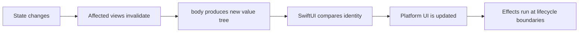
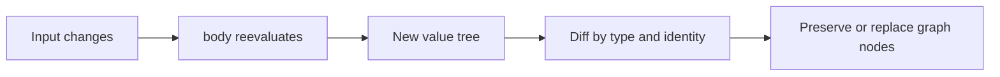
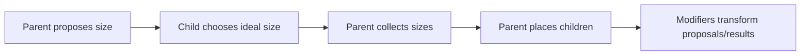
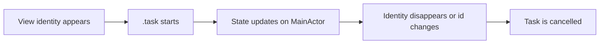
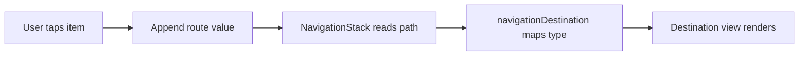
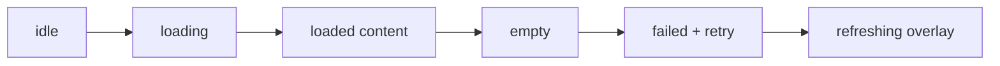
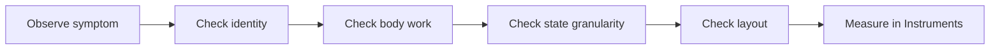
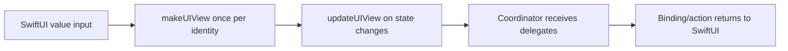
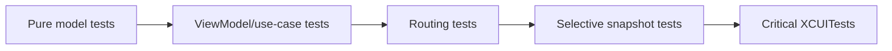

# SwiftUI Foundations: From Fundamentals to Mastery

A deep guide for Swift-experienced iOS engineers who want to understand SwiftUI from first principles: what each concept is, why it exists, how it works conceptually, when to use it, common mistakes, practical examples, best practices, and checkpoints.

> **Reading promise:** After this guide, you should be able to explain why SwiftUI views are structs, how identity preserves state, why body recomputation is normal, how the layout negotiation works, and how to choose the right state-management tool for a production iOS app.

| Field               | Value                                             |
| ------------------- | ------------------------------------------------- |
| Audience            | iOS engineer with Swift experience                |
| Primary target      | Modern SwiftUI with iOS 17+ Observation notes     |
| Compatibility notes | Fallbacks called out for iOS 13-16 where relevant |
| Generated           | 2026-06-25                                        |

## Table of Contents

- [How to Use This Guide](#how-to-use-this-guide)
- [API Availability Quick Reference](#api-availability-quick-reference)
- [1. The Declarative UI Mindset](#1-the-declarative-ui-mindset)
- [2. View Protocol, View Identity, and `body`](#2-view-protocol-view-identity-and-body)
- [3. Value Types, Recomposition, and View Builders](#3-value-types-recomposition-and-view-builders)
- [4. State Management Map](#4-state-management-map)
- [5. Environment, Dependencies, and App Architecture](#5-environment-dependencies-and-app-architecture)
- [6. Layout System: Stacks, Frames, Alignment, and Priority](#6-layout-system-stacks-frames-alignment-and-priority)
- [7. Grids, GeometryReader, Safe Areas, and Custom Layout](#7-grids-geometryreader-safe-areas-and-custom-layout)
- [8. Lifecycle, Tasks, and Concurrency](#8-lifecycle-tasks-and-concurrency)
- [9. NavigationStack and Routing](#9-navigationstack-and-routing)
- [10. Lists, ForEach, Identity, and Diffing](#10-lists-foreach-identity-and-diffing)
- [11. Forms and Inputs](#11-forms-and-inputs)
- [12. Animation and Transitions](#12-animation-and-transitions)
- [13. Data Flow Architecture with MVVM](#13-data-flow-architecture-with-mvvm)
- [14. Loading, Error, and Empty States](#14-loading-error-and-empty-states)
- [15. Accessibility](#15-accessibility)
- [16. Performance and Debugging](#16-performance-and-debugging)
- [17. UIKit Interoperability](#17-uikit-interoperability)
- [18. Testing SwiftUI-Related Logic](#18-testing-swiftui-related-logic)
- [Appendix A. Mental Models to Memorize](#appendix-a-mental-models-to-memorize)
- [Appendix B. Production SwiftUI Checklist](#appendix-b-production-swiftui-checklist)
- [Appendix C. Source References](#appendix-c-source-references)

## How to Use This Guide

Each major chapter follows the same rhythm: definition, motivation, conceptual model, use cases, mistakes, code, best practices, and checkpoints. That repetition is intentional; it trains you to reason from first principles instead of memorizing modifiers.

| If you want to answer...                                   | Read           |
| ---------------------------------------------------------- | -------------- |
| What is a View and why is it a struct?                     | Chapters 1-3   |
| Which state wrapper should I use?                          | Chapters 4-5   |
| Why is my layout weird?                                    | Chapters 6-7   |
| Where do async work and lifecycle effects belong?          | Chapter 8      |
| How should navigation be modeled?                          | Chapter 9      |
| Why did my List row lose state?                            | Chapter 10     |
| How do I build production forms and stateful screens?      | Chapters 11-14 |
| How do I make it polished, accessible, fast, and testable? | Chapters 15-18 |

## API Availability Quick Reference

| Concept/API                                                  | Minimum iOS | Notes                                           |
| ------------------------------------------------------------ | ----------- | ----------------------------------------------- |
| SwiftUI, View, @State, @Binding, @Environment, List, ForEach | 13          | Foundational SwiftUI APIs                       |
| @StateObject                                                 | 14          | Owns Combine `ObservableObject` models          |
| .task and .task(id:)                                         | 15          | Async task tied to view identity                |
| NavigationStack, NavigationPath, Grid, Layout, AnyLayout     | 16          | Modern navigation and custom layout foundations |
| Observation, @Observable, @Bindable                          | 17          | Fine-grained model observation                  |
| Representable sizeThatFits hook                              | 16          | Useful for UIKit sizing integration             |

> **Important compatibility stance:** If your deployment target is iOS 17+, prefer Observation for new SwiftUI view models. If you support iOS 14-16, keep using `ObservableObject`, `@Published`, `@StateObject`, and `@ObservedObject` where needed. The conceptual ownership rules are the same.

## 1. The Declarative UI Mindset

*Think in states, identities, and transformations instead of commands.*

> **Minimum OS note:** SwiftUI itself starts at iOS 13. This chapter applies to every SwiftUI version.

SwiftUI is not UIKit with shorter syntax. UIKit asks you to create objects, keep references to them, and imperatively mutate their properties. SwiftUI asks you to describe what the interface should be for a given state. The framework decides how to reconcile that description with the currently mounted UI.

The practical mindset shift is this: your code owns model state and intent; SwiftUI owns rendering, invalidation, diffing, layout scheduling, and platform view mutation. You write deterministic descriptions. The framework repeatedly asks for those descriptions as state changes.

### Declarative rendering loop



### What it is

Declarative UI means a view is a function of state: for the same inputs, it should describe the same UI. You express relationships, not step-by-step mutations.

A declarative view description is cheap, temporary data. It is closer to a recipe than to the on-screen controls themselves.

### Why it exists

Large UIKit screens often accumulate hidden coupling: an outlet is mutated in one branch, a cell is reused in another, and an async callback updates a view that may no longer be visible. SwiftUI reduces this by making rendering a repeatable projection from state.

Declarative rendering also enables the framework to optimize. If the identity of a subtree has not changed, SwiftUI can preserve state storage and only mutate what is necessary.

### How it works conceptually

SwiftUI maintains an internal graph. Your `body` values are inputs into that graph. Dynamic properties such as `@State` and `@Environment` connect the value tree to persistent storage outside the transient view struct.

When state changes, SwiftUI schedules an update. It re-evaluates the affected body values, compares old and new structure using type plus identity, computes layout, and applies mutations to underlying platform views/layers.

### When to use it

- Use SwiftUI when state can drive the screen and when you benefit from composition, previews, accessibility modifiers, and modern navigation/data-flow APIs.
- Keep UIKit for legacy screens, highly customized UIKit components, or areas where an existing UIKit abstraction is already stable and cheaper to wrap.
- Prefer SwiftUI-first for new iOS 17+ feature surfaces unless the project architecture or component library says otherwise.

### Common mistakes

- Trying to hold references to views and mutate them later. A SwiftUI view value is not the durable rendered object.
- Doing expensive work directly in `body`. Body recomputation is normal; expensive work should live in models, tasks, caches, or derived values with clear invalidation.
- Treating `onAppear` as a one-time constructor. Views can appear multiple times as identity, navigation, and parent state change.
- Using state as a way to force refresh instead of modeling the real domain state.

### Practical code example

The imperative version would keep a label reference and update text when the count changes. The SwiftUI version describes the label as a function of `count`.

```swift
struct CounterView: View {
    @State private var count = 0

    var body: some View {
        VStack(spacing: 12) {
            Text("Count: \(count)")
                .font(.title2)

            Button("Increment") {
                count += 1
            }
        }
        .padding()
    }
}
```

### Best practices

- Name state by domain meaning: `isSaving`, `selectedTrip`, `routePath`, not `shouldReload` unless reload is the actual user-visible state.
- Keep body pure: assemble views, branch on state, and trigger side effects through actions, `.task`, commands, or injected services.
- Design screens around state machines: loading, content, empty, error, editing, saving, completed.

### Exercises or checkpoints

- Pick a UIKit screen you know. List every mutable UI property and rewrite it as state plus derived view output.
- Explain to another engineer why SwiftUI can recreate a view struct without losing `@State`.
- Find one place where you would be tempted to call `reloadData()` and replace it with a state transition.

### Chapter Summary

- SwiftUI code describes UI for current state; it does not directly own the rendered controls.
- Body recomputation is expected. Persistent state lives in SwiftUI-managed storage keyed by identity.
- A good SwiftUI screen starts with a precise state model.

### Practice Task

- Build a small login form with states for idle, validating, failed, and signed in. Do not hide/show controls imperatively; derive the whole UI from the state enum.

## 2. View Protocol, View Identity, and `body`

*Why root views are structs and what SwiftUI really keeps alive.*

> **Minimum OS note:** `View` is available from iOS 13. The public interface shows `View` has an associated `Body` and a `@ViewBuilder` `body` requirement.

The most important answer to master: a SwiftUI `View` is a value that describes UI, not the UI object itself. The rendered hierarchy is owned by SwiftUI. This is why root views are usually structs: they are lightweight descriptions that can be copied, compared structurally, recreated often, and composed without reference identity becoming part of your rendering model.

A class root view would encourage the wrong mental model: that the view instance is a durable screen controller. SwiftUI wants durable identity to come from graph position, explicit IDs, bindings, observable objects, and scene/navigation state, not from arbitrary object references.

### View value versus durable graph state


### What it is

`View` is a protocol whose conforming type declares an associated `Body`. For primitive views, `Body` is effectively `Never` because SwiftUI knows how to render them internally. For your views, `body` returns another view description.

View identity is the stable key SwiftUI uses to decide whether new view values correspond to existing mounted graph nodes. Identity can be structural, such as position and type in the tree, or explicit, such as `id:` in `ForEach` or `.id(...)`.

### Why it exists

The protocol lets SwiftUI compose UI as nested values with static types. A `VStack` containing a `Text` and `Button` has a concrete nested generic type. This gives SwiftUI compile-time structure and lets the framework specialize heavily.

Identity exists because state must survive value recreation. SwiftUI needs to know whether this new `CounterView()` value is the same logical counter as before or a new counter whose state should start from its initial value.

### How it works internally/conceptually

SwiftUI evaluates body into a value tree. It does not retain your old struct as the source of truth. It stores dynamic property storage, layout caches, subscriptions, tasks, and platform view references in an internal graph.

Structural identity comes from the path through the view tree. If a child remains at the same type and position, its state generally remains. If you change branches, reorder children without stable IDs, or apply `.id` with a changing value, SwiftUI may treat it as a different identity and reset local state.

### When to use it

- Use plain `struct View` for almost every SwiftUI view, including root views.
- Use explicit identity when displaying dynamic collections, routing to detail screens, resetting a subtree intentionally, or preserving state across reorder operations.
- Use reference types for models, services, coordinators, and UIKit adapters, not for view descriptions.

### Common mistakes

- Adding stored mutable properties to a view struct and expecting mutation to persist. Use `@State`, bindings, or a model.
- Using `.id(UUID())` in `body`, which creates a new identity every recomputation and destroys state/performance.
- Using `AnyView` broadly to hide type differences. It can be useful at boundaries, but overuse erases structure and makes reasoning harder.
- Assuming `body` is called only when visible. SwiftUI may evaluate for measurement, previews, transitions, and parent updates.

### Practical code example

The following intentionally resets local draft state when a different document is selected. This is a legitimate use of `.id` because the reset maps to domain identity.

```swift
struct DocumentHost: View {
    let document: DocumentSummary

    var body: some View {
        EditorView(documentID: document.id)
            .id(document.id) // reset EditorView @State for a new document
    }
}

struct EditorView: View {
    let documentID: Document.ID
    @State private var draft = ""

    var body: some View {
        TextEditor(text: $draft)
            .task(id: documentID) {
                draft = await loadInitialDraft(for: documentID)
            }
    }
}
```

### Best practices

- Treat `View` values as declarative snapshots. Put ownership in state wrappers or models.
- Prefer stable, domain-backed IDs: database ID, server ID, UUID created once at model creation, not array index or random ID in body.
- Keep view initializers cheap. Pass inputs; do not launch work from `init` unless it is pure setup of value properties.
- Use small subviews to name concepts, not as a performance superstition. SwiftUI is designed for composition.

### Exercises or checkpoints

- Explain why `struct ContentView: View` can be recreated repeatedly while `@State` survives.
- Create a list with editable rows, reorder the rows, and compare behavior with stable IDs versus index IDs.
- Use `.id` to intentionally reset one subtree; then remove it and describe the difference.

### Chapter Summary

- A `View` is a value description. SwiftUI retains graph state separately.
- Identity is what connects a new value description to existing state and rendered output.
- Root views are structs because value semantics match SwiftUI's repeated description model.

### Practice Task

- Build a two-tab editor where each tab preserves its draft. Then add a control that intentionally resets one tab by changing explicit identity.

## 3. Value Types, Recomposition, and View Builders

*Why recomputing body is normal, and how result builders shape the tree.*

> **Minimum OS note:** Core value-composition concepts apply from iOS 13. Some builder ergonomics improved in later Swift releases, but the model is stable.

SwiftUI leans on Swift value types because UI descriptions are frequently created and discarded. A view struct should be cheap enough that recomputation is boring. The real cost is not creating the struct; the cost comes from work you accidentally perform while creating it.

`@ViewBuilder` is the result-builder mechanism that allows `body` to contain multiple child expressions and conditional branches while still producing one concrete view type.

### Body recomputation boundary



### What it is

Recomposition is SwiftUI asking your view for a fresh description. This can happen after state changes, environment changes, parent updates, animations, layout invalidation, and lifecycle events.

A view builder combines child view expressions into compound types like tuples and conditional content. You see simple syntax; Swift sees nested generic types.

### Why it exists

Recomposition keeps your UI synchronized with state without hand-written update methods. It also makes invalidation local: only graph regions affected by a change need to be reconsidered.

View builders let SwiftUI preserve static type information while giving you declarative syntax. Static structure matters for performance and identity.

### How it works internally/conceptually

When a body is evaluated, SwiftUI records dependencies read through dynamic properties. If `@State`, `@Observable` properties, or environment values change, the corresponding graph nodes can invalidate.

Conditional branches are part of identity. Changing `if isEditing { Editor() } else { Summary() }` changes the type at that position. SwiftUI may remove one subtree and mount another. If you need persistence across modes, keep persistent state above the branch.

### When to use it

- Use computed helper properties returning `some View` to organize pure view structure.
- Use plain helper methods for parameterized view fragments when they stay cheap and pure.
- Move expensive derived data into the model, memoized cache, or explicit computation triggered by data changes.

### Common mistakes

- Parsing dates, sorting large arrays, formatting images, or starting network requests directly inside `body`.
- Assuming `let formatter = DateFormatter()` in a view is harmless when it is constructed during every recomposition.
- Putting different state-owning subviews in different conditional branches and expecting state to survive branch changes.
- Overusing `Group` as if it were a layout container. `Group` groups view builder output; it does not create layout.

### Practical code example

The good version computes expensive sorting outside `body`, while `body` stays declarative and cheap.

```swift
@Observable
final class TripsViewModel {
    private(set) var trips: [Trip] = []

    var upcomingTrips: [Trip] {
        trips
            .filter { $0.startDate >= .now }
            .sorted { $0.startDate < $1.startDate }
    }
}

struct TripsView: View {
    @State private var viewModel = TripsViewModel()

    var body: some View {
        List(viewModel.upcomingTrips) { trip in
            TripRow(trip: trip)
        }
    }
}
```

### Best practices

- Make view bodies deterministic and side-effect-free.
- Assume body can run many times. Optimize by moving work, not by trying to prevent recomputation prematurely.
- Keep persistent state above structural branches that can disappear.
- Use `Equatable` models and stable identity to make diffing predictable.

### Exercises or checkpoints

- Add `print(Self.self)` inside several bodies and observe recomputation after unrelated parent state changes.
- Move an expensive sort from body into a view model and verify the visible behavior is unchanged.
- Explain the difference between recomputing a value tree and rebuilding every platform view from scratch.

### Chapter Summary

- SwiftUI recomposes value descriptions often; that is expected.
- The mistake is doing nontrivial work or side effects during recomposition.
- View builders give friendly syntax while preserving typed structure.

### Practice Task

- Refactor a screen so every side effect is triggered by an explicit action or `.task`, and every body fragment is a pure description.

## 4. State Management Map

*Choosing the right wrapper by ownership, lifetime, and write direction.*

> **Minimum OS note:** `@State`, `@Binding`, `@ObservedObject`, `@Environment`, and `@EnvironmentObject` date to iOS 13. `@StateObject` is iOS 14. `@Observable`, Observation, and `@Bindable` are iOS 17.

Most SwiftUI bugs are state ownership bugs. The wrapper is not decoration; it declares who owns the value, how long it should live, who can write to it, and how changes invalidate views.

The modern iOS 17 recommendation is often: use `@Observable` reference models where reference identity is useful, store owned observable models with `@State`, pass them normally, and use `@Bindable` when a child needs bindings into observable properties. For iOS 14-16 compatibility, use `ObservableObject`, `@Published`, `@StateObject`, and `@ObservedObject`.

### State ownership decision path


### What it is

SwiftUI property wrappers are adapters between transient view values and durable graph/model state. `DynamicProperty` wrappers are updated by SwiftUI before body evaluation.

`@State` stores view-owned value state. `@Binding` projects read/write access to someone else's state. `@Observable` marks a model whose property reads can be tracked. `@Environment` reads values supplied by ancestors or the system.

### Why it exists

SwiftUI view structs are recreated. Without wrapper-managed storage, local mutable UI state would disappear on every recomputation.

Wrappers make data flow explicit. You can see whether a view owns state, observes a model, receives a binding, or consumes a dependency.

### How it works internally/conceptually

`@State` stores a value in SwiftUI graph storage associated with view identity. The property inside the struct is a handle to that storage.

`@Binding` stores get/set closures or a location-like reference to another source. It does not own data.

`@Observable` expands through macros into registrar-backed access and mutation hooks. SwiftUI can track which observable properties were read and invalidate views when those properties mutate.

`ObservableObject` uses Combine's `objectWillChange`; it is coarser because object-level change often invalidates observers regardless of which property was read.

### Wrapper decision matrix

| Wrapper            | Owns data?        | Typical lifetime   | Use when                                                | Minimum                                  |
| ------------------ | ----------------- | ------------------ | ------------------------------------------------------- | ---------------------------------------- |
| @State             | Yes               | View identity      | Local value state or owned iOS 17 observable model      | iOS 13; observable object storage iOS 17 |
| @Binding           | No                | Parent source      | Child edits parent-owned state                          | iOS 13                                   |
| @Observable        | Model owns itself | Reference lifetime | Fine-grained observable reference model                 | iOS 17                                   |
| @Bindable          | No                | Observable source  | Need `$model.property` binding into @Observable         | iOS 17                                   |
| @StateObject       | Yes               | View identity      | Own ObservableObject on iOS 14-16 or Combine model      | iOS 14                                   |
| @ObservedObject    | No                | External owner     | Observe ObservableObject passed from parent             | iOS 13                                   |
| @Environment       | No                | Ancestor/system    | Read dependency/config such as locale, dismiss, service | iOS 13                                   |
| @EnvironmentObject | No                | Ancestor object    | Legacy broad shared ObservableObject dependency         | iOS 13                                   |

### When to use it

- Use `@State` for view-private scalar values: selection, draft text, toggles, expansion state, currently focused filter.
- Use `@Binding` when a reusable child edits a value the parent owns.
- Use `@Observable` for view models or stores on iOS 17+ when multiple properties drive SwiftUI.
- Use `@StateObject` for compatibility with `ObservableObject` models that the view creates and owns.
- Use `@Environment` for cross-cutting dependencies, system values, and actions that should be available without plumbing through every initializer.

### Common mistakes

- Creating an `ObservableObject` with `@ObservedObject var vm = VM()` inside a view. It can be recreated. Use `@StateObject` for Combine-era owned models.
- Passing bindings deep through unrelated layers instead of creating an action or view model method.
- Using `@EnvironmentObject` as a service locator. It hides dependencies and crashes at runtime when missing.
- Putting source-of-truth state in two places, then trying to synchronize them manually.

### Practical code example - modern Observation

```swift
import SwiftUI
import Observation

@Observable
final class ProfileViewModel {
    var displayName = ""
    var isSaving = false

    func save() async throws {
        isSaving = true
        defer { isSaving = false }
        try await Task.sleep(for: .milliseconds(300))
    }
}

struct ProfileView: View {
    @State private var viewModel = ProfileViewModel()

    var body: some View {
        ProfileForm(viewModel: viewModel)
    }
}

struct ProfileForm: View {
    @Bindable var viewModel: ProfileViewModel

    var body: some View {
        Form {
            TextField("Display name", text: $viewModel.displayName)
            Button("Save") {
                Task { try? await viewModel.save() }
            }
            .disabled(viewModel.isSaving)
        }
    }
}
```

### Practical code example - iOS 14-16 fallback

```swift
final class ProfileViewModel: ObservableObject {
    @Published var displayName = ""
    @Published var isSaving = false
}

struct ProfileView: View {
    @StateObject private var viewModel = ProfileViewModel()

    var body: some View {
        ProfileForm(viewModel: viewModel)
    }
}

struct ProfileForm: View {
    @ObservedObject var viewModel: ProfileViewModel

    var body: some View {
        TextField("Display name", text: $viewModel.displayName)
    }
}
```

### Best practices

- Start every state decision with ownership: who creates this value, who mutates it, and what identity should preserve it?
- Prefer initializer injection for required dependencies. Use environment for system-like dependencies or values that are intentionally ambient.
- Keep mutable state minimal and derive everything else. Duplicated derived state is a common source of stale UI.
- Use `@MainActor` on UI-facing view models that mutate properties read by SwiftUI.

### Exercises or checkpoints

- For one existing screen, mark every property as source state, derived state, dependency, or UI-only draft.
- Rewrite a child view from `@State` to `@Binding` and explain which view owns the value after the change.
- Create an iOS 17 Observation model and a Combine fallback version. Explain the invalidation differences.

### Chapter Summary

- State wrappers encode ownership and invalidation. Pick them by lifetime and write direction.
- Modern Observation is fine-grained and iOS 17+. Combine-era wrappers remain important for older targets.
- Most state bugs are duplicate source-of-truth or unstable owner bugs.

### Practice Task

- Build a settings screen with three editable fields. Use parent-owned state, a child form with bindings, an environment-provided save service, and a clear loading/error state.

## 5. Environment, Dependencies, and App Architecture

*Ambient values without turning your app into a service locator.*

> **Minimum OS note:** `@Environment` and custom `EnvironmentKey` are iOS 13 foundations. Some typed environment conveniences are newer, but the pattern is stable.

Environment is SwiftUI's scoped dependency/value propagation system. It carries values down the view tree without manually passing every value through every initializer.

Environment is powerful because it is contextual. It is dangerous when used to hide required dependencies. Use it deliberately for values that truly behave like context: locale, color scheme, dismiss action, scene phase, feature flags, and app services that many leaves need.

### Environment lookup


### What it is

`@Environment` reads a value from `EnvironmentValues`. SwiftUI provides many built-in keys, and you can define your own keys for app-level dependencies.

`@EnvironmentObject` is a legacy convenience for reading an `ObservableObject` supplied by an ancestor. It is runtime-checked and crashes if missing.

### Why it exists

Without environment, every low-level view would need to accept dozens of values: color scheme, dynamic type size, locale, dismiss action, model context, accessibility settings, and dependencies. Environment keeps view APIs focused.

It also lets ancestors override context for subtrees. For example, a preview can inject a mock repository, or a sheet can override edit mode.

### How it works internally/conceptually

Environment values flow through the SwiftUI graph. When a view reads an environment value during body evaluation, that read becomes a dependency. If the value changes, SwiftUI can invalidate readers.

The environment is value-like and scoped. An override applies to the modified view's subtree, not globally.

### When to use it

- Use initializer injection for dependencies a view cannot function without and that are specific to a feature.
- Use environment for cross-cutting context, app services shared by many features, and dependencies you need to swap in previews/tests.
- Avoid `@EnvironmentObject` unless your architecture already uses it and you have strong runtime coverage.

### Common mistakes

- Hiding every dependency in environment. This makes views look reusable while secretly requiring app setup.
- Forgetting preview injection. A custom environment key should have a harmless default or previews should explicitly inject mocks.
- Mutating environment values directly. Environment is read through the view; changes come from modifiers or ancestor state.

### Practical code example

```swift
protocol UserRepository: Sendable {
    func currentUser() async throws -> User
}

private struct UserRepositoryKey: EnvironmentKey {
    static let defaultValue: UserRepository = PreviewUserRepository()
}

extension EnvironmentValues {
    var userRepository: UserRepository {
        get { self[UserRepositoryKey.self] }
        set { self[UserRepositoryKey.self] = newValue }
    }
}

struct ProfileScreen: View {
    @Environment(\.userRepository) private var userRepository
    @State private var user: User?

    var body: some View {
        Content(user: user)
            .task {
                user = try? await userRepository.currentUser()
            }
    }
}
```

### Best practices

- Prefer protocol-typed dependencies for testability.
- Keep environment defaults safe for previews, but do not let production accidentally use preview services.
- Document custom environment keys in the feature boundary, especially when they replace constructor parameters.
- Read environment in views; pass concrete dependencies into pure models or use cases explicitly.

### Exercises or checkpoints

- Create a custom environment key for an analytics client and inject a no-op preview client.
- Identify one dependency that should remain an initializer parameter because the view cannot function without it.
- Explain why environment overrides are subtree-scoped rather than global.

### Chapter Summary

- Environment is scoped contextual dependency propagation.
- Use it for ambient values and widely shared services, not as a blanket service locator.
- Initializer injection remains the clearest option for required feature dependencies.

### Practice Task

- Build a feature preview that injects mock repository and analytics services through environment, while the production app injects real services at the feature root.

## 6. Layout System: Stacks, Frames, Alignment, and Priority

*The proposal-measure-place algorithm behind SwiftUI layout.*

> **Minimum OS note:** Stacks, alignment, `GeometryReader`, frames, safe areas, and layout priority are iOS 13 foundations. The custom `Layout` protocol arrives in iOS 16.

SwiftUI layout is not Auto Layout. Parent and child negotiate through proposals. A parent proposes a size, each child reports the size it wants, and the parent places children in final bounds.

Understanding proposal, measurement, and placement explains many confusing layout bugs: why `Spacer` expands, why `.frame(maxWidth: .infinity)` changes a proposal, why modifier order matters, and why `GeometryReader` can consume all offered space.

### SwiftUI layout negotiation



### What it is

Layout is the process that turns a view tree into rectangles. Containers such as `HStack`, `VStack`, `ZStack`, `Grid`, `List`, and custom `Layout` types decide how to propose sizes to children and where to place them.

A modifier is often a layout participant. For example, `.padding()` changes the proposal sent to the child and then expands the reported size; `.frame(width:)` can force a specific reported size.

### Why it exists

SwiftUI needs a layout model that works across Apple platforms, dynamic type, localization, safe areas, split view, watch screens, and animation. Proposal-based layout is compositional and local.

Unlike Auto Layout, most SwiftUI layouts do not solve a global constraint system. This makes common layouts predictable and efficient, but it requires thinking from parent to child.

### How it works internally/conceptually

`VStack` proposes widths and flexible heights to children, measures them, applies spacing/alignment, and reports a size based on children. `HStack` does the same horizontally. `ZStack` overlays children using alignment.

`layoutPriority` affects how extra or scarce space is distributed. Higher priority children resist compression or receive space earlier in stack algorithms.

Alignment guides let child views define custom alignment positions. This is more precise than padding when you need baselines or custom anchors to line up.

### When to use it

- Use stacks for one-dimensional layout. Use grids for two-dimensional repeated structure. Use overlays/backgrounds for decoration tied to a view's size.
- Use `Spacer` for flexible separation inside stacks, not for arbitrary absolute positioning.
- Use `.frame(maxWidth: .infinity, alignment: ...)` when a child should claim available width and align content inside it.
- Use alignment guides when the relationship is semantic, such as aligning labels or baselines.

### Common mistakes

- Applying modifiers in the wrong order. `Text().padding().background(...)` differs from `Text().background(...).padding()`.
- Using `GeometryReader` for simple centering or equal spacing. It often receives the maximum proposal and expands.
- Hard-coding sizes that break with Dynamic Type, localization, or iPad split view.
- Using nested stacks when a custom alignment, grid, or `Layout` would express the relationship more directly.

### Practical code example

```swift
struct MetricRow: View {
    let title: String
    let value: String

    var body: some View {
        HStack(alignment: .firstTextBaseline, spacing: 12) {
            Text(title)
                .font(.body)
                .foregroundStyle(.secondary)
                .frame(maxWidth: .infinity, alignment: .leading)

            Text(value)
                .font(.title3.monospacedDigit())
                .layoutPriority(1)
        }
        .padding(.vertical, 8)
    }
}
```

### Best practices

- Let content define size where possible. Add constraints only when the design requires them.
- Test with long localized strings, large Dynamic Type, landscape, and split view.
- Use semantic layout primitives before absolute coordinates.
- Reach for `ViewThatFits` when you have multiple acceptable layouts for constrained space.

### Exercises or checkpoints

- Explain what size a `GeometryReader` receives inside a `VStack` and why it may push siblings away.
- Create two versions of a padded card and reverse modifier order. Describe the visual difference.
- Build a row that survives accessibility text sizes without clipping.

### Chapter Summary

- SwiftUI layout is proposal, measurement, and placement.
- Modifier order matters because modifiers participate in layout.
- Most layout bugs become understandable when you identify which parent proposed which size.

### Practice Task

- Build a profile header that adapts from horizontal to vertical using `ViewThatFits`, supports large text, and avoids hard-coded heights.

## 7. Grids, GeometryReader, Safe Areas, and Custom Layout

*Advanced foundation layout tools without losing the proposal model.*

> **Minimum OS note:** Lazy grids are iOS 14. `Grid`, `GridRow`, `Layout`, and `AnyLayout` are iOS 16. Some safe-area APIs are iOS 15+.

Once stacks are not enough, SwiftUI gives you grids, geometry, safe-area controls, and the `Layout` protocol. These are foundation tools, not escape hatches.

The key is to use each tool at the right level. Grids arrange repeated cells. Geometry reads container information. Safe-area modifiers negotiate with system chrome. Custom `Layout` lets you encode a reusable layout algorithm.

### Choosing a layout tool


### What it is

`LazyVGrid` and `LazyHGrid` virtualize repeated cell layouts in scroll views. `Grid` gives direct two-dimensional alignment for smaller, non-lazy grids. `GeometryReader` exposes a `GeometryProxy` for size and coordinate-space reads. `Layout` lets you implement measurement and placement yourself.

Safe areas describe regions covered or reserved by system UI such as the home indicator, navigation bars, tab bars, and device cutouts.

### Why it exists

Stacks cannot express every spatial relationship cleanly. Repeated card layouts, dashboard matrices, tag wrapping, custom bars, and adaptive dashboards need richer algorithms.

The `Layout` protocol exists so custom layout can participate in SwiftUI's normal proposal-measure-place system instead of being approximated with fragile `GeometryReader` math.

### How it works internally/conceptually

A custom `Layout` receives subviews. It measures them with proposed sizes in `sizeThatFits`, optionally caches results, then places them in `placeSubviews`. This matches SwiftUI's native layout pipeline.

Lazy grids create views as needed for visible content, but identity remains crucial. If IDs are unstable, cells can lose state or animate incorrectly.

Safe-area modifiers either respect, inset, or ignore safe areas. Ignoring safe areas changes drawing bounds, but controls still need usable tappable positions.

### When to use it

- Use `LazyVGrid` for scrollable repeated cards or thumbnails.
- Use `Grid` for compact dashboard-like alignment where all cells are in memory and cross-row alignment matters.
- Use `GeometryReader` to read size, not to position an entire screen manually.
- Use custom `Layout` when the positioning algorithm is reusable and depends on child sizes.

### Common mistakes

- Using `GeometryReader` as a universal layout container, causing unexpected expansion.
- Ignoring safe areas for full-screen backgrounds and accidentally moving tappable controls under the home indicator.
- Using lazy grids for small fixed matrices where `Grid` would be clearer.
- Forgetting that custom layout may be called often. Cache expensive measurements when appropriate.

### Practical code example - custom tag layout

```swift
@available(iOS 16.0, *)
struct FlowLayout: Layout {
    func sizeThatFits(
        proposal: ProposedViewSize,
        subviews: Subviews,
        cache: inout Void
    ) -> CGSize {
        let maxWidth = proposal.width ?? 0
        var lineWidth: CGFloat = 0
        var totalHeight: CGFloat = 0
        var lineHeight: CGFloat = 0

        for subview in subviews {
            let size = subview.sizeThatFits(.unspecified)
            if lineWidth + size.width > maxWidth, lineWidth > 0 {
                totalHeight += lineHeight + 8
                lineWidth = 0
                lineHeight = 0
            }
            lineWidth += size.width + 8
            lineHeight = max(lineHeight, size.height)
        }

        return CGSize(width: maxWidth, height: totalHeight + lineHeight)
    }

    func placeSubviews(
        in bounds: CGRect,
        proposal: ProposedViewSize,
        subviews: Subviews,
        cache: inout Void
    ) {
        var point = bounds.origin
        var lineHeight: CGFloat = 0

        for subview in subviews {
            let size = subview.sizeThatFits(.unspecified)
            if point.x + size.width > bounds.maxX, point.x > bounds.minX {
                point.x = bounds.minX
                point.y += lineHeight + 8
                lineHeight = 0
            }
            subview.place(at: point, proposal: ProposedViewSize(size))
            point.x += size.width + 8
            lineHeight = max(lineHeight, size.height)
        }
    }
}
```

### Best practices

- Prefer `Layout` over `GeometryReader` when you are really defining child placement.
- Keep custom layouts deterministic and side-effect-free.
- Use safe-area insets to add controls near edges instead of blindly ignoring safe areas.
- Test layouts in Dynamic Type, right-to-left languages, split view, and with real data counts.

### Exercises or checkpoints

- Implement a wrapping chip layout with `Layout`, then add Dynamic Type and long strings.
- Build a full-bleed image header that ignores safe area only for the background, not for buttons.
- Compare `Grid` and `LazyVGrid` for a 3x3 settings matrix. Explain which is simpler and why.

### Chapter Summary

- Advanced layout tools still follow the same proposal and placement model.
- `GeometryReader` is for reading geometry; custom `Layout` is for reusable placement algorithms.
- Safe-area handling must distinguish decorative backgrounds from interactive controls.

### Practice Task

- Create a responsive dashboard that uses `Grid` on iPad-like widths and a vertical stack on compact widths. Keep controls out of unsafe areas.

## 8. Lifecycle, Tasks, and Concurrency

*Where side effects belong in a value-driven UI.*

> **Minimum OS note:** `.task` is iOS 15. `.task(id:)` is also iOS 15. Observation examples in this chapter assume iOS 17; use `ObservableObject` fallbacks for older targets.

SwiftUI views do not have UIKit-style lifecycle ownership. You get lifecycle signals such as `onAppear`, `onDisappear`, `.task`, scene phase, and navigation changes, but they are tied to view identity and rendering, not controller object lifetime.

Concurrency belongs at boundaries: user actions, `.task`, app services, and view models. Avoid starting work during body evaluation or view initialization.

### Task lifecycle



### What it is

`.task` attaches an asynchronous task to a view identity. SwiftUI starts it when the view appears and cancels it when the view disappears. `.task(id:)` restarts when the id changes.

`onAppear` and `onDisappear` are synchronous lifecycle hooks. They can fire multiple times and should not be treated as constructors/destructors.

### Why it exists

Async data loading is common in UI, but it must be cancellation-aware. A user can navigate away, change filters, or replace a route before a request completes.

`.task(id:)` aligns async work with state. When the query changes, SwiftUI cancels the old task and starts the new one.

### How it works internally/conceptually

A task modifier is stored in the view graph. It is associated with identity. Cancellation is cooperative: the task must check cancellation or call APIs that throw `CancellationError`.

UI-facing models should usually be `@MainActor` so mutations that SwiftUI reads happen on the main actor. Network and parsing services can run off-main and return values.

### When to use it

- Use `.task` for initial loading tied to a screen or row identity.
- Use `.task(id:)` for searches, filters, selected IDs, and any async work that should restart when an input changes.
- Use explicit `Task {}` in button actions when the work is user-initiated and not automatically tied to view appearance.
- Use view-model methods for business workflows so logic is testable without rendering a view.

### Common mistakes

- Starting network calls in `body` or `init`.
- Using `onAppear` for async work without cancellation. Prefer `.task` unless you specifically need a synchronous hook.
- Ignoring cancellation and letting stale responses overwrite newer state.
- Updating SwiftUI-read state from a background actor.

### Practical code example

```swift
@MainActor
@Observable
final class SearchViewModel {
    var query = ""
    var state: LoadState<[ResultItem]> = .idle

    private let search: SearchService

    init(search: SearchService) {
        self.search = search
    }

    func load() async {
        guard !query.isEmpty else {
            state = .idle
            return
        }

        state = .loading
        do {
            let results = try await search.results(matching: query)
            try Task.checkCancellation()
            state = results.isEmpty ? .empty : .loaded(results)
        } catch is CancellationError {
            // A newer query replaced this task.
        } catch {
            state = .failed(error.localizedDescription)
        }
    }
}

struct SearchScreen: View {
    @State private var viewModel: SearchViewModel

    var body: some View {
        SearchContent(viewModel: viewModel)
            .task(id: viewModel.query) {
                await viewModel.load()
            }
    }
}
```

### Best practices

- Model loading with an enum instead of multiple loosely related booleans.
- Keep task bodies small; call a view-model or use-case method.
- Check cancellation after slow work and before committing results.
- Use dependency-injected services so async logic can be tested with deterministic fakes.

### Exercises or checkpoints

- Write a debounced search using `.task(id:)` and `Task.sleep`, then ensure cancellation prevents stale updates.
- Explain why `onAppear` can run more than once for a row in a list.
- Add a `@MainActor` annotation to a view model and explain what it guarantees.

### Chapter Summary

- Lifecycle events are tied to view identity, not controller object lifetime.
- `.task` is the default tool for appearance-bound async work and automatic cancellation.
- Concurrency-safe SwiftUI code handles cancellation and updates UI state on the main actor.

### Practice Task

- Build a paginated list that loads the first page with `.task`, loads more from a button, and prevents stale state after cancellation.

## 9. NavigationStack and Routing

*Value-driven navigation instead of pushing controllers.*

> **Minimum OS note:** `NavigationStack` and `NavigationPath` are iOS 16. Use `NavigationView` only for older compatibility or legacy screens.

SwiftUI navigation is state. Instead of asking a navigation controller to push a view controller, you bind a stack path to route values. The visible stack is derived from those values.

This makes deep linking, restoration, testing, and programmatic routing easier, but it requires stable `Hashable` route types and clear ownership of the navigation path.

### Navigation as data



### What it is

`NavigationStack` displays a root view and a stack of destinations represented by values. A route can be a simple model ID, an enum, or any `Hashable` value.

`navigationDestination(for:)` registers how to build a destination for a route type. `NavigationPath` can store heterogeneous hashable route values.

### Why it exists

UIKit navigation is command-driven. That makes restoration and deep links extra work because the current route is implicit in controller stacks. SwiftUI makes route state explicit.

Value-driven navigation also avoids retaining entire destination views as navigation state. You store route data and rebuild descriptions as needed.

### How it works internally/conceptually

The stack binding is part of state. When you append, remove, or replace route values, SwiftUI reconciles the navigation UI. Destination identity follows the route values and destination type mapping.

Route values should be lightweight and stable. Store IDs, not large mutable models. Load detail data inside the destination based on ID.

### When to use it

- Use a typed route enum for feature-level routing with known destinations.
- Use `NavigationPath` for heterogeneous app-level routing or restoration where route types vary.
- Own the path at the feature coordinator/root when multiple child views need to navigate.
- Use sheets for modal workflows and navigation stack for hierarchical drill-down.

### Common mistakes

- Putting destination view instances in the path. Store route values instead.
- Using unstable hashes or mutable route fields. A route's hash/equality should not change while in the path.
- Registering `navigationDestination` too low in the tree so child links cannot find the mapping.
- Mixing many independent navigation states for one stack.

### Practical code example

```swift
enum AppRoute: Hashable {
    case tripDetail(Trip.ID)
    case receipt(Receipt.ID)
}

struct TripsRoot: View {
    @State private var path: [AppRoute] = []

    var body: some View {
        NavigationStack(path: $path) {
            TripsList { trip in
                path.append(.tripDetail(trip.id))
            }
            .navigationDestination(for: AppRoute.self) { route in
                switch route {
                case .tripDetail(let id):
                    TripDetailScreen(tripID: id) { receiptID in
                        path.append(.receipt(receiptID))
                    }
                case .receipt(let id):
                    ReceiptScreen(receiptID: id)
                }
            }
        }
    }
}
```

### Best practices

- Define route enums near feature boundaries and keep cases stable.
- Prefer IDs in routes. Let destination models load or receive dependencies separately.
- Keep path mutation centralized enough to reason about back behavior and deep links.
- Write route tests against pure router/path logic without rendering SwiftUI.

### Exercises or checkpoints

- Add a deep link parser that maps URLs into `[AppRoute]`.
- Explain the difference between `NavigationLink(value:)` and a button that appends to path.
- Build a route enum and test that tapping an item appends the expected route.

### Chapter Summary

- NavigationStack is value-driven. The path is navigation state.
- Routes should be stable, lightweight, and hashable.
- Keep route ownership explicit for deep links and predictable back behavior.

### Practice Task

- Create a three-screen master/detail/receipt flow with a route enum, deep-link initialization, and a test for route mutation.

## 10. Lists, ForEach, Identity, and Diffing

*Stable data identity is the difference between smooth UI and lost state.*

> **Minimum OS note:** `List` and `ForEach` are iOS 13. Binding-based collection editing in `ForEach` is iOS 15+.

SwiftUI collection rendering depends on identity. If SwiftUI can tell which data element is which across updates, it can preserve row state, animate moves, and update only changed rows. If identity is unstable, rows reset or show incorrect data.

The most important rule: never use an array index as identity for mutable, reorderable, insertable, or deletable data.

### Diffing mental model


### What it is

`ForEach` turns a random-access data collection into repeated view content. `List` gives platform list behavior such as rows, selection, deletion, swipe actions, and scrolling.

Diffing is SwiftUI comparing old and new collection identities to decide which children are the same logical rows.

### Why it exists

Lists change often. Efficient updates need stable matching. Without identity, SwiftUI would either rebuild everything or make unsafe guesses.

Identity also preserves row-local state such as expansion, text draft, focus, and animations.

### How it works internally/conceptually

For each element, SwiftUI computes an ID from `Identifiable` or the provided key path. It compares IDs across updates. Equal IDs mean the row is the same logical child.

Structural identity still matters inside each row. If the row's internal conditional tree changes type or explicit IDs, row-local state can reset even when the row ID is stable.

### When to use it

- Use `List` for platform-native collections with row affordances, edit mode, selection, and accessibility.
- Use `ScrollView` plus `LazyVStack` when you need custom non-list visuals and can implement row behaviors yourself.
- Use `ForEach(items)` when elements conform to `Identifiable` with stable domain IDs.
- Use `ForEach($items)` when editing mutable bindings to identifiable collection elements.

### Common mistakes

- Using `id: \.self` for values that can duplicate or mutate.
- Using array indices as IDs and then deleting/reordering.
- Generating `UUID()` in a computed property or body. IDs must be created once and stored.
- Putting heavy work in every row body without considering list virtualization and scrolling.

### Practical code example

```swift
struct Todo: Identifiable, Equatable {
    let id: UUID
    var title: String
    var isDone: Bool
}

struct TodoList: View {
    @State private var todos: [Todo] = []

    var body: some View {
        List {
            ForEach($todos) { $todo in
                Toggle(todo.title, isOn: $todo.isDone)
                    .swipeActions {
                        Button(role: .destructive) {
                            todos.removeAll { $0.id == todo.id }
                        } label: {
                            Label("Delete", systemImage: "trash")
                        }
                    }
            }
        }
    }
}
```

### Best practices

- Make IDs part of your domain model at creation time.
- Keep row views small and pass only the data/actions they need.
- Use `Equatable` where it clarifies model changes, but do not rely on it to solve bad identity.
- Test deletion, insertion at the top, reordering, and duplicate display values.

### Exercises or checkpoints

- Create a list using index IDs, add deletion, and observe incorrect behavior. Then fix it with stable IDs.
- Add row-local `@State` expansion and verify it survives reordering with stable IDs.
- Explain when `id: \.self` is acceptable and when it is dangerous.

### Chapter Summary

- Collection identity drives diffing, state preservation, and animation correctness.
- Stable domain IDs beat indices and generated IDs.
- Rows are still SwiftUI views; keep body work cheap and identity predictable.

### Practice Task

- Build an editable checklist with insert, delete, reorder, and inline toggle editing. Verify row-local expansion state survives moves.

## 11. Forms and Inputs

*Bindings, validation, focus, and edit state.*

> **Minimum OS note:** `Form`, `TextField`, `Toggle`, `Picker`, and basic bindings are iOS 13. `FocusState` is iOS 15. Modern text input APIs continue to evolve, but the fundamentals are stable.

Forms are where SwiftUI's data flow becomes concrete. Inputs need bindings. Validation needs domain rules. Focus and submission need explicit state. Saving needs async state and error handling.

A good form separates draft state from persisted state. Users edit a draft, validation explains what is wrong, and save commits the draft through a repository or use case.

### Form data flow


### What it is

`Form` is a platform-styled container for input rows. SwiftUI controls such as `TextField`, `Toggle`, `DatePicker`, `Picker`, and `Stepper` usually receive bindings.

Validation can be represented as derived values, field-specific errors, or a form-level state machine.

### Why it exists

Forms are a common place where imperative UI code becomes tangled. SwiftUI makes each input a projection of a binding, and each error message a projection of validation state.

Focus state and submit handling let you model keyboard navigation instead of manually coordinating first responders.

### How it works internally/conceptually

A bound input reads from a `Binding<Value>` and writes changes through it. The write updates source state, which invalidates the view and redraws validation/results.

A form should not write directly to a server-backed model on every keystroke unless that is the product requirement. Draft state avoids partial persisted values.

### When to use it

- Use `Form` for settings, profile fields, preferences, and platform-standard data entry.
- Use custom stacks for heavily branded forms, but keep the binding/validation model the same.
- Use `FocusState` for multi-field keyboard flow and submission.
- Use a draft type when cancellation, validation, or transactional save matters.

### Common mistakes

- Binding text fields directly to server models and then struggling with cancel/revert behavior.
- Keeping validation booleans in state when they can be derived from the draft.
- Showing errors before the user has interacted unless the product calls for immediate validation.
- Forgetting accessibility labels/hints for custom input rows.

### Practical code example

```swift
struct ProfileDraft: Equatable {
    var name = ""
    var email = ""

    var emailError: String? {
        email.contains("@") ? nil : "Enter a valid email address."
    }

    var canSave: Bool {
        !name.isEmpty && emailError == nil
    }
}

struct ProfileForm: View {
    enum Field { case name, email }

    @State private var draft = ProfileDraft()
    @FocusState private var focusedField: Field?

    var body: some View {
        Form {
            TextField("Name", text: $draft.name)
                .focused($focusedField, equals: .name)
                .submitLabel(.next)

            TextField("Email", text: $draft.email)
                .keyboardType(.emailAddress)
                .textInputAutocapitalization(.never)
                .focused($focusedField, equals: .email)

            if let emailError = draft.emailError {
                Text(emailError)
                    .foregroundStyle(.red)
                    .font(.footnote)
            }

            Button("Save") { save() }
                .disabled(!draft.canSave)
        }
        .onSubmit { focusedField = .email }
    }
}
```

### Best practices

- Use draft models for transactional edits.
- Derive validation from draft state when possible.
- Represent field focus explicitly with `FocusState`.
- Make disabled save buttons explainable through visible validation.
- Test validation logic outside the view.

### Exercises or checkpoints

- Build a form with a draft model, cancel, save, and validation summary.
- Add focus movement from one field to the next.
- Write tests for the draft validation without rendering SwiftUI.

### Chapter Summary

- Inputs write through bindings. Forms should usually edit draft state.
- Validation is best modeled as derived domain logic.
- Focus and submission are state, not hidden UIKit first-responder commands.

### Practice Task

- Create a profile-edit form with draft/cancel/save, field-level validation, and `FocusState` keyboard flow.

## 12. Animation and Transitions

*Animating state changes, not manually moving pixels.*

> **Minimum OS note:** Basic animation and transitions are iOS 13. Modern APIs such as phase/keyframe animation are iOS 17, but this chapter focuses on foundation concepts.

SwiftUI animation is a transaction applied to state changes. You do not usually animate a view directly; you change state, and SwiftUI interpolates animatable properties between old and new values.

Transitions are about insertion and removal. Animations are about changing animatable values. Keeping that distinction clear prevents many confusing effects.

### Animation pipeline


### What it is

An animation describes timing. A transaction carries animation context. A transition describes how a view enters or exits when identity inserts/removes it.

Many SwiftUI types expose `animatableData`, which SwiftUI interpolates over time. Layout can also animate when animatable values affect size or position.

### Why it exists

State-driven animation keeps visual motion synchronized with model changes. Instead of manually calculating frames, you define before and after state.

Transitions make conditional views feel connected to user intent instead of popping in/out abruptly.

### How it works internally/conceptually

`withAnimation` creates a transaction for mutations inside its closure. `.animation(_:value:)` attaches animation to changes of a specific value in a subtree.

A transition only applies when a view is inserted or removed from the hierarchy. Toggling opacity on an always-present view is an animation, not a transition.

### When to use it

- Use `withAnimation` for user actions where mutation and motion belong together.
- Use `.animation(_:value:)` for localized animation of a particular state value.
- Use transitions when conditional content appears/disappears.
- Disable or simplify animations for accessibility reduce-motion contexts.

### Common mistakes

- Applying `.animation(.default)` without a value, which historically caused broad unintended animations.
- Expecting `.transition` to run when the view remains in the tree.
- Animating layout with hard-coded sizes that clip at large Dynamic Type.
- Ignoring `accessibilityReduceMotion`.

### Practical code example

```swift
struct SaveBanner: View {
    @Environment(\.accessibilityReduceMotion) private var reduceMotion
    @State private var isVisible = false

    var body: some View {
        VStack {
            Button("Save") {
                withAnimation(reduceMotion ? nil : .spring(response: 0.3)) {
                    isVisible = true
                }
            }

            if isVisible {
                Text("Saved")
                    .padding()
                    .background(.green.opacity(0.15), in: Capsule())
                    .transition(.move(edge: .top).combined(with: .opacity))
            }
        }
    }
}
```

### Best practices

- Animate meaningful state changes, not decoration for its own sake.
- Scope animations narrowly with `value:` or `withAnimation` around specific mutations.
- Test transition identity. If a transition does not run, confirm the view is actually inserted/removed.
- Respect Reduce Motion and avoid critical information conveyed only by animation.

### Exercises or checkpoints

- Build an expandable card with animated height and a transition for extra details.
- Create a bug where transition does not run, then fix it by changing identity/conditional structure.
- Add Reduce Motion handling to an animation.

### Chapter Summary

- SwiftUI animates state changes through transactions.
- Transitions are for insertion/removal; animations are for value changes.
- Scope animation deliberately and respect accessibility settings.

### Practice Task

- Build a loading-to-content transition for a card list, with no motion when Reduce Motion is enabled.

## 13. Data Flow Architecture with MVVM

*Where business logic lives, and how views stay declarative.*

> **Minimum OS note:** MVVM works on all SwiftUI versions. Observation-based view models require iOS 17; Combine-based view models support older targets.

SwiftUI does not require MVVM, but MVVM remains useful for iOS apps because it keeps async workflows, validation, state machines, and service calls testable outside views.

The view model should own presentation state and expose intent methods. The view should bind to state, render branches, and call intents. The repository/use-case layer should own data access and business operations.

### MVVM data flow


### What it is

MVVM splits a feature into a View, ViewModel, Model/domain entities, and services/repositories. In SwiftUI, the view model is usually `@MainActor` because it publishes UI-read state.

Clean Architecture adds boundaries: domain protocols and use cases do not depend on SwiftUI; data implementations satisfy those protocols.

### Why it exists

Views are poor places for complex logic because body recomputation and UI concerns obscure business rules. View models make flows testable and reusable.

Architecture also prevents SwiftUI details from leaking into networking, persistence, and domain rules.

### How it works internally/conceptually

The view reads view-model properties during body evaluation. Observation or Combine invalidates the view when those properties change. Actions call methods that mutate state through a controlled state machine.

A repository is injected through the initializer, which keeps dependencies explicit and testable.

### When to use it

- Use a view model when a screen has async loading, validation, navigation decisions, analytics, or nontrivial state transitions.
- Use a plain view with `@State` for small self-contained UI components.
- Use use cases when workflows cross repositories or contain domain rules.

### Common mistakes

- Creating massive view models that contain networking, parsing, persistence, formatting, and navigation all together.
- Making view models depend on SwiftUI types unnecessarily.
- Duplicating state between view and view model.
- Calling view-model methods from `body` instead of actions/tasks.

### Practical code example

```swift
enum LoadState<Value>: Equatable where Value: Equatable {
    case idle
    case loading
    case loaded(Value)
    case empty
    case failed(String)
}

@MainActor
@Observable
final class TripsViewModel {
    private let repository: TripRepository
    var state: LoadState<[Trip]> = .idle

    init(repository: TripRepository) {
        self.repository = repository
    }

    func load() async {
        state = .loading
        do {
            let trips = try await repository.upcomingTrips()
            state = trips.isEmpty ? .empty : .loaded(trips)
        } catch {
            state = .failed(error.localizedDescription)
        }
    }
}

struct TripsScreen: View {
    @State private var viewModel: TripsViewModel

    var body: some View {
        TripsContent(state: viewModel.state)
            .task { await viewModel.load() }
    }
}
```

### Best practices

- Use one source of truth for each piece of presentation state.
- Represent screen modes with enums instead of unrelated booleans.
- Inject repositories/use cases through initializers.
- Keep navigation either as route state or as explicit output actions from the view model, depending on feature complexity.
- Keep UI formatting close to presentation, but keep business rules in domain/use-case layers.

### Exercises or checkpoints

- Take a screen with `isLoading`, `items`, and `error` booleans/optionals; rewrite it as one `LoadState` enum.
- Write a fake repository and test all view-model state transitions.
- Explain what logic should stay in a view and what should move to a view model.

### Chapter Summary

- SwiftUI views render state; view models coordinate intent and state transitions.
- MVVM is useful when logic needs tests, isolation, and dependency injection.
- Clean boundaries keep SwiftUI out of domain/data layers.

### Practice Task

- Build a trips feature with repository protocol, fake repository, `@MainActor` view model, and tests for success, empty, and failure states.

## 14. Loading, Error, and Empty States

*Make screen states explicit and recoverable.*

> **Minimum OS note:** These are architecture patterns, not OS-specific APIs.

A mature SwiftUI screen does not only show happy-path content. It has explicit loading, empty, error, refreshing, saving, and permission states. Those states are part of the UI contract.

If you model states explicitly, the view becomes a straightforward switch. If you model them with independent booleans and optionals, impossible combinations appear.

### State-machine rendering



### What it is

A load state enum models the mutually exclusive modes of a screen or subregion. It usually carries associated values such as loaded data or error message.

A recoverable error state includes a user-understandable message and a retry/action path.

### Why it exists

Users need feedback when data is not ready, unavailable, or failed. Engineers need state models that prevent contradictory UI, such as showing both spinner and error.

Explicit states improve tests because each case can be rendered and verified independently.

### How it works internally/conceptually

The view switches over state. Each case returns a separate view subtree. State transitions happen in the view model or use case after actions/tasks.

Loading can be blocking or non-blocking. Initial loading may replace content; refresh loading may overlay existing content.

### When to use it

- Use a state enum for every async screen with more than one meaningful mode.
- Use empty states when success with zero content needs different messaging/actions than failure.
- Use retry actions for transient failures and settings/deep-link actions for permission failures.

### Common mistakes

- Using `items.isEmpty` as both loading and empty state.
- Showing raw technical errors to users.
- Removing previous content during refresh when a non-blocking refresh would be better.
- Treating empty state as error. Empty can be successful and actionable.

### Practical code example

```swift
struct AsyncContent<Value, Content: View>: View {
    let state: LoadState<Value>
    let retry: () -> Void
    @ViewBuilder var content: (Value) -> Content

    var body: some View {
        switch state {
        case .idle, .loading:
            ProgressView()
                .frame(maxWidth: .infinity, maxHeight: .infinity)
        case .empty:
            ContentUnavailableView(
                "Nothing here yet",
                systemImage: "tray",
                description: Text("New items will appear here.")
            )
        case .failed(let message):
            ContentUnavailableView {
                Label("Could not load", systemImage: "exclamationmark.triangle")
            } description: {
                Text(message)
            } actions: {
                Button("Try Again", action: retry)
            }
        case .loaded(let value):
            content(value)
        }
    }
}
```

### Best practices

- Define state enums close to the feature if states are feature-specific; define generic helpers only when repeated.
- Make retry idempotent and cancellation-aware.
- Keep last known content visible during non-blocking refresh when it improves user experience.
- Design empty states with the next useful action, not just a message.

### Exercises or checkpoints

- List all possible states for a screen you own and remove impossible boolean combinations.
- Add a retry path to a failure state and test the state transition.
- Design separate first-load loading and pull-to-refresh states.

### Chapter Summary

- Screen states are part of the architecture, not visual afterthoughts.
- Enums prevent impossible combinations and make rendering direct.
- Good empty/error states explain what happened and what the user can do next.

### Practice Task

- Build an `AsyncContent` wrapper for your app style and use it in two screens with different loaded content.

## 15. Accessibility

*SwiftUI accessibility is semantic composition, not a final pass.*

> **Minimum OS note:** Core accessibility modifiers are iOS 13. Some newer modifiers and behaviors vary by platform release; always test on target OS versions.

SwiftUI gives you many accessibility defaults because views are semantic. A `Button` is a button. A `Toggle` has state. A `TextField` has editable text. You lose those benefits when you build custom controls without restoring semantics.

Accessibility should be designed with the state model. Loading, errors, dynamic type, focus order, labels, hints, traits, and reduce-motion behavior all change how users experience the feature.

### Accessibility layers


### What it is

Accessibility in SwiftUI is the information and behavior exposed to assistive technologies such as VoiceOver, Switch Control, Dynamic Type, Reduce Motion, and increased contrast.

Modifiers such as `.accessibilityLabel`, `.accessibilityHint`, `.accessibilityValue`, `.accessibilityElement(children:)`, and accessibility environment values refine the generated accessibility tree.

### Why it exists

Accessible UI is not only compliance. It makes interfaces usable across vision, motor, cognitive, language, and situational constraints.

SwiftUI's declarative model helps because accessibility can be derived from the same state as the visual UI.

### How it works internally/conceptually

SwiftUI builds an accessibility representation from semantic views and modifiers. Grouping controls changes how child elements are exposed.

Environment values such as dynamic type size and reduce motion are inputs to body. If you read them, your view can adapt layout and motion.

### When to use it

- Use native controls whenever possible; they carry semantics automatically.
- Add labels when visual-only content, icons, or custom controls do not communicate enough.
- Use grouping for rows where multiple visual pieces form one logical element.
- Use environment values to adapt animations, density, and layout for accessibility settings.

### Common mistakes

- Labeling an icon button only visually and leaving VoiceOver with a system image name.
- Combining unrelated row controls into one accessibility element, making them impossible to operate separately.
- Hard-coding font sizes instead of using text styles.
- Conveying error state only through color.

### Practical code example

```swift
struct RatingView: View {
    let rating: Int
    let maxRating = 5

    var body: some View {
        HStack(spacing: 2) {
            ForEach(1...maxRating, id: \.self) { index in
                Image(systemName: index <= rating ? "star.fill" : "star")
                    .foregroundStyle(index <= rating ? .yellow : .secondary)
            }
        }
        .accessibilityElement(children: .ignore)
        .accessibilityLabel("Rating")
        .accessibilityValue("\(rating) out of \(maxRating)")
    }
}
```

### Best practices

- Prefer semantic controls over gesture-only custom views.
- Use system text styles and verify Dynamic Type layouts.
- Keep accessibility labels short, values stateful, and hints action-oriented.
- Test with VoiceOver, Reduce Motion, Bold Text, Increased Contrast, and large text sizes.
- Do not rely on color alone. Pair color with text, symbols, or layout.

### Exercises or checkpoints

- Turn on VoiceOver and navigate one of your SwiftUI screens without looking.
- Increase Dynamic Type to accessibility sizes and fix any clipped text.
- Create a custom icon button and add label, hint, and trait intentionally.

### Chapter Summary

- SwiftUI accessibility starts with semantic views and state-driven labels.
- Custom controls must restore semantics manually.
- Accessibility settings are part of the input state your view should handle.

### Practice Task

- Audit a form with VoiceOver and Dynamic Type. Record every unlabeled control, confusing announcement, and clipped layout, then fix them.

## 16. Performance and Debugging

*Measure invalidation, identity, layout, and work placement.*

> **Minimum OS note:** The principles apply across SwiftUI versions. Specific Instruments templates and debug overlays vary by Xcode version.

SwiftUI performance problems usually come from one of four sources: unstable identity, too much work during body/layout, broad invalidation from state structure, or expensive platform interoperability.

Do not start by fighting body recomputation. Start by asking what work happens during recomputation, how much of the tree invalidates, and whether identity is stable.

### Performance diagnosis path



### What it is

SwiftUI performance is the cost of invalidating, recomputing descriptions, diffing, measuring layout, rendering, and bridging to platform views.

Debugging is the process of identifying which layer causes the symptom: state model, view identity, layout, async tasks, rendering, or UIKit interop.

### Why it exists

Declarative frameworks hide platform mutation. That improves productivity, but it means performance bugs require a different mental model than UIKit.

Fine-grained state and stable identity let SwiftUI do less work. Poor state design forces large subtrees to update.

### How it works internally/conceptually

When observed state changes, SwiftUI invalidates dependent graph nodes. It evaluates body, diffs by type/identity, runs layout, and commits updates.

Observation can be more fine-grained than `ObservableObject` because property reads can be tracked. Combine-era `objectWillChange` is often object-level.

### When to use it

- Use print/debug helpers for quick local investigation, then Instruments for real performance claims.
- Use stable IDs and smaller observable models when broad invalidation causes churn.
- Use lazy containers for large scrollable collections.
- Use caching or precomputation for expensive formatting, image processing, and sorting.

### Common mistakes

- Using random IDs or index IDs and then blaming SwiftUI animations.
- Performing date formatting, sorting, filtering, or image decoding in row bodies.
- Wrapping everything in `AnyView` and hiding structural information.
- Assuming previews or simulator debug builds reflect release performance.

### Practical code example - lightweight recomposition tracing

```swift
extension View {
    func debugBody(_ name: String) -> some View {
        #if DEBUG
        print("Recomputed:", name)
        #endif
        return self
    }
}

struct Row: View {
    let item: Item

    var body: some View {
        Text(item.title)
            .debugBody("Row \(item.id)")
    }
}
```

### Best practices

- Make identity stable before optimizing anything else.
- Move heavy work out of body and row rendering paths.
- Break broad observable models into feature-scoped models when invalidation is too wide.
- Use `LazyVStack`/`LazyVGrid` for custom large scrolling layouts.
- Measure on device, in release-like configuration, with realistic data.

### Exercises or checkpoints

- Instrument a slow list and identify whether body work, image loading, or identity causes the issue.
- Replace index identity with domain IDs and observe state/animation changes.
- Move a formatter out of a row body and measure the difference.

### Chapter Summary

- Performance follows identity, invalidation granularity, body work, layout, and rendering.
- Do not optimize recomposition itself; optimize what recomposition does.
- Use Instruments for claims, not intuition.

### Practice Task

- Create a list of 1,000 rows with images and formatted dates. Make it smooth by stabilizing identity, caching formatting, and lazy-loading images.

## 17. UIKit Interoperability

*Wrap UIKit deliberately and keep ownership boundaries clear.*

> **Minimum OS note:** `UIViewRepresentable` and `UIViewControllerRepresentable` are available from iOS 13. Some sizing hooks are newer, such as representable `sizeThatFits` in iOS 16.

UIKit interoperability is a strength of SwiftUI. You can wrap mature UIKit controls, host SwiftUI in UIKit, and migrate feature by feature.

Interop bugs usually come from unclear ownership: SwiftUI owns value updates; UIKit owns object lifecycle; the coordinator bridges delegates and imperative callbacks.

### Representable bridge



### What it is

`UIViewRepresentable` adapts a UIKit view into SwiftUI. `UIViewControllerRepresentable` adapts a UIKit view controller. `UIHostingController` hosts SwiftUI inside UIKit.

A coordinator is a reference object you create to act as delegate, data source, target/action bridge, or imperative adapter.

### Why it exists

Real apps have existing UIKit components, SDK views, maps, cameras, web views, and complex controls. Rewriting everything at once is risky.

Interop lets SwiftUI and UIKit coexist while keeping the SwiftUI surface declarative.

### How it works internally/conceptually

SwiftUI calls `makeUIView` to create the UIKit object for a given identity, then calls `updateUIView` whenever SwiftUI inputs change. It may call dismantle when removing the representable.

Do not recreate the UIKit view in `updateUIView`. Mutate the existing view to match SwiftUI state. Use the coordinator to avoid closure cycles and to translate delegate callbacks.

### When to use it

- Wrap UIKit when a needed control does not exist in SwiftUI or an existing component is proven and costly to rewrite.
- Use `UIHostingController` to embed new SwiftUI screens in an existing UIKit navigation/app shell.
- Use coordinator for delegates, long-lived objects, and callback bridging.

### Common mistakes

- Creating the UIKit view in `updateUIView` instead of `makeUIView`.
- Forgetting to keep UIKit state synchronized when SwiftUI inputs change.
- Creating retain cycles between coordinator, UIKit delegate, and closures.
- Letting UIKit mutate source-of-truth state behind SwiftUI's back without a binding/action.

### Practical code example

```swift
struct SearchTextField: UIViewRepresentable {
    @Binding var text: String

    func makeCoordinator() -> Coordinator {
        Coordinator(text: $text)
    }

    func makeUIView(context: Context) -> UITextField {
        let field = UITextField()
        field.placeholder = "Search"
        field.borderStyle = .roundedRect
        field.delegate = context.coordinator
        return field
    }

    func updateUIView(_ uiView: UITextField, context: Context) {
        if uiView.text != text {
            uiView.text = text
        }
    }

    final class Coordinator: NSObject, UITextFieldDelegate {
        private var text: Binding<String>

        init(text: Binding<String>) {
            self.text = text
        }

        func textFieldDidChangeSelection(_ textField: UITextField) {
            text.wrappedValue = textField.text ?? ""
        }
    }
}
```

### Best practices

- Keep representables thin. Put complex UIKit configuration in a dedicated UIKit component when needed.
- Make SwiftUI inputs the source of truth; use bindings/actions for callbacks.
- Avoid unnecessary UIKit updates by comparing current UIKit state before assigning.
- Use `[weak self]` in UIKit callback closures where coordinators or controllers can cycle.

### Exercises or checkpoints

- Wrap a UIKit text field or map view and synchronize it with SwiftUI state.
- Host a SwiftUI view inside a UIKit view controller using `UIHostingController`.
- Draw an ownership diagram for a coordinator and identify possible retain cycles.

### Chapter Summary

- Interop is a bridge between SwiftUI value updates and UIKit object lifecycle.
- `makeUIView` creates; `updateUIView` synchronizes; coordinator bridges delegates.
- Keep ownership and data flow explicit to avoid lifecycle bugs.

### Practice Task

- Wrap one UIKit component your app already uses. Add a binding, a delegate callback, and a teardown path if needed.

## 18. Testing SwiftUI-Related Logic

*Test state machines and dependencies; keep view testing selective.*

> **Minimum OS note:** XCTest works across supported iOS targets. Swift Testing is modern Swift tooling; use it when your project/toolchain supports it. XCUITest remains the UI automation layer.

Most SwiftUI logic should be testable without rendering views. Test view models, reducers/state machines, repositories, route builders, validators, and formatting logic directly.

UI tests are still valuable, but they should cover critical user journeys rather than every view branch. Snapshot tests can help when your project already has infrastructure.

### Testing pyramid for SwiftUI features



### What it is

SwiftUI-related testing means verifying the state and behavior that SwiftUI renders: view models, load states, validation, routes, side effects, and accessibility identifiers for UI automation.

View rendering tests are harder because SwiftUI views are value descriptions backed by framework internals. Prefer testing logic below the view unless visual behavior is the requirement.

### Why it exists

Declarative UI makes logic easier to isolate. If the view is a function of state, tests can focus on the state machine and a few end-to-end flows.

Testing every visual branch through XCUITest is slow and brittle. Testing the view model is fast and precise.

### How it works internally/conceptually

A view-model test injects fake dependencies, calls an intent method, awaits async work, and asserts state transitions. UI tests launch the app and interact through accessibility.

Navigation tests can assert route arrays or router outputs without presenting a `NavigationStack`.

### When to use it

- Unit test validation, reducers, load states, route parsing, and view-model async flows.
- Use XCUITest for critical business journeys, accessibility smoke tests, and regressions that involve system UI.
- Use preview data for manual visual checks, but do not treat previews as automated tests.

### Common mistakes

- Skipping view-model tests because the UI looks simple.
- Testing implementation details such as exact body recomputation counts.
- Making tests rely on real network/persistence services.
- Using UI tests for logic that could be unit-tested in milliseconds.

### Practical code example - XCTest

```swift
@MainActor
final class TripsViewModelTests: XCTestCase {
    func testLoadSuccessShowsTrips() async {
        let trips = [Trip(id: UUID(), title: "Airport")]
        let repository = FakeTripRepository(result: .success(trips))
        let viewModel = TripsViewModel(repository: repository)

        await viewModel.load()

        XCTAssertEqual(viewModel.state, .loaded(trips))
    }

    func testLoadFailureShowsError() async {
        let repository = FakeTripRepository(result: .failure(TestError()))
        let viewModel = TripsViewModel(repository: repository)

        await viewModel.load()

        if case .failed = viewModel.state {
            // expected
        } else {
            XCTFail("Expected failed state")
        }
    }
}
```

### Best practices

- Design dependencies as protocols and inject fakes.
- Keep view models `@MainActor` and run tests on the main actor when asserting UI-read state.
- Assert state transitions and side effects, not private implementation details.
- Give UI elements stable accessibility identifiers only where automation needs them.
- Run UI tests for critical flows and accessibility, not as a substitute for unit tests.

### Exercises or checkpoints

- Write tests for success, empty, failure, and cancellation states of one async view model.
- Test that a deep link maps to the expected navigation path.
- Add accessibility identifiers to a critical flow and automate it with XCUITest.

### Chapter Summary

- Most SwiftUI behavior should be tested below the view layer.
- Use unit tests for state machines and XCUITest for critical integrated flows.
- Dependency injection is what makes SwiftUI feature logic testable.

### Practice Task

- Choose one SwiftUI feature and write: validator tests, view-model async tests, route tests, and one XCUITest happy path.

## Appendix A. Mental Models to Memorize

| Question            | Answer you should be able to give confidently                                                                                  |
| ------------------- | ------------------------------------------------------------------------------------------------------------------------------ |
| What is `View`?     | A value description of UI with an associated `Body`; SwiftUI owns the durable render graph.                                    |
| Why structs?        | Views are cheap transient descriptions. Durable identity/state belongs to SwiftUI graph storage, not arbitrary class identity. |
| What is identity?   | The key SwiftUI uses to match a new value-tree node to an existing graph node and preserve state.                              |
| What is `@State`?   | View-owned storage kept by SwiftUI for the lifetime of the view identity.                                                      |
| What is a binding?  | A read/write projection into state owned elsewhere.                                                                            |
| What is layout?     | Parent proposes a size, child reports a size, parent places the child.                                                         |
| What is `.task`?    | Async work tied to a view identity and automatically cancelled when identity disappears or task ID changes.                    |
| What is navigation? | A route/path state model rendered by `NavigationStack`, not a push command.                                                    |

## Appendix B. Production SwiftUI Checklist

- Every dynamic collection has stable domain identity.
- Every screen has explicit loading, empty, error, and content states where applicable.
- View bodies are side-effect-free and do not perform expensive work.
- Async work is tied to user action or `.task`, handles cancellation, and updates UI state on the main actor.
- State ownership is clear: local state, parent binding, owned model, observed model, or environment dependency.
- Navigation is represented as route values, not stored destination views.
- Layouts pass Dynamic Type, localization, small screen, landscape, and split-view checks.
- Custom controls expose accessibility labels, values, traits, and actions.
- UIKit bridges create views in `makeUIView`, synchronize in `updateUIView`, and avoid coordinator retain cycles.
- View-model and domain logic have unit tests with fake dependencies.

## Appendix C. Source References

The API availability notes were checked against the installed Xcode 26.1.1 iPhoneOS/iPhoneSimulator 26.1 SDK Swift interfaces. The public API topics below are useful official references for deeper reading.

| Topic                        | URL                                                                   |
| ---------------------------- | --------------------------------------------------------------------- |
| SwiftUI View                 | https://developer.apple.com/documentation/swiftui/view                |
| State                        | https://developer.apple.com/documentation/swiftui/state               |
| Binding                      | https://developer.apple.com/documentation/swiftui/binding             |
| Observation Observable macro | https://developer.apple.com/documentation/observation/observable()    |
| NavigationStack              | https://developer.apple.com/documentation/swiftui/navigationstack     |
| NavigationPath               | https://developer.apple.com/documentation/swiftui/navigationpath      |
| Layout protocol              | https://developer.apple.com/documentation/swiftui/layout              |
| Grid                         | https://developer.apple.com/documentation/swiftui/grid                |
| ForEach                      | https://developer.apple.com/documentation/swiftui/foreach             |
| UIViewRepresentable          | https://developer.apple.com/documentation/swiftui/uiviewrepresentable |

---
*Generated with AI coding assistant*
